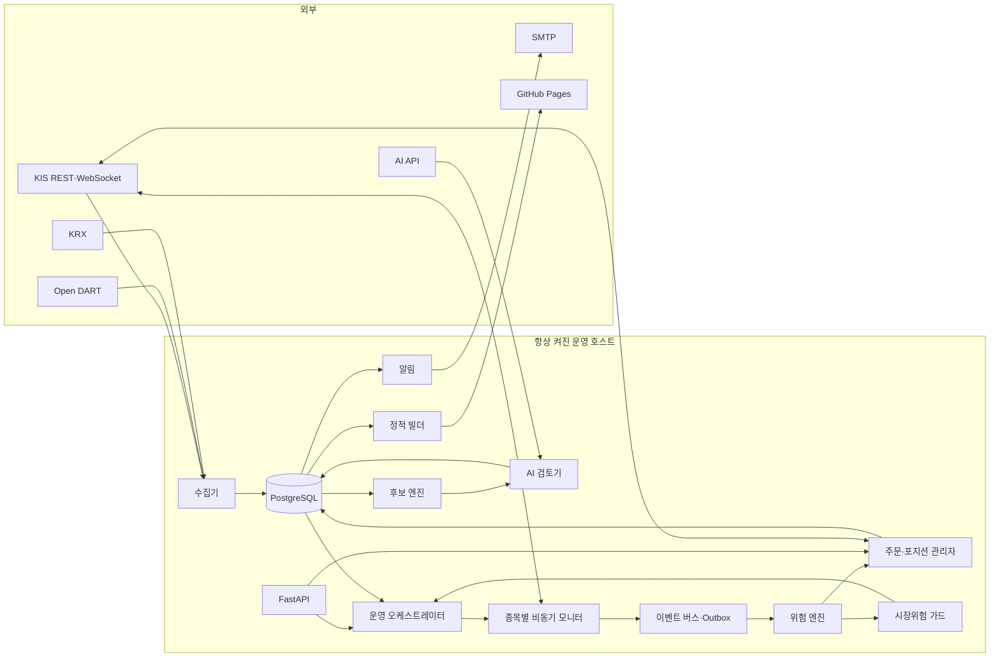
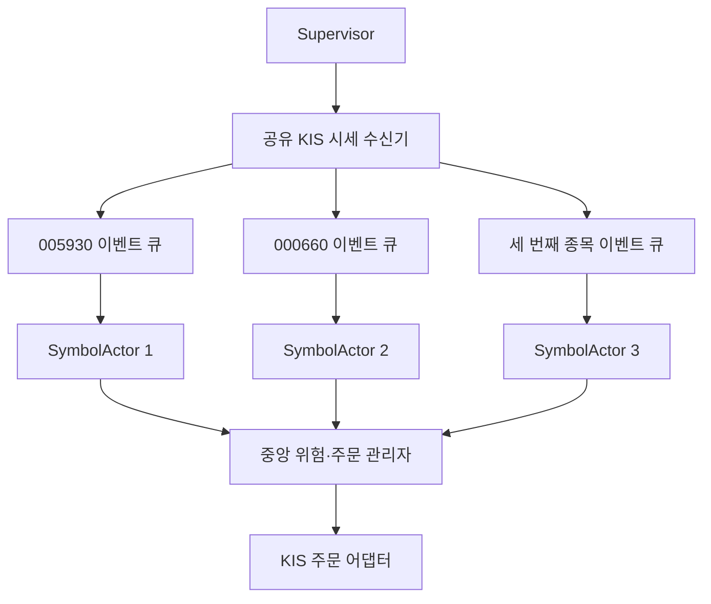
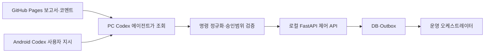

# 시스템 아키텍처와 데이터 계약

## 1. 목표

- 일별 후보 배치와 실시간 주문 경로를 분리한다.
- 외부 AI 지연이 손절·익절을 막지 않게 한다.
- AI 에이전트는 감독·분석·정책 제안 역할을 맡고, 상시 실행과 보호 주문은 로컬 결정 엔진이 맡는다.
- 재시작 후 KIS 잔고·주문·체결 조회에서 상태를 복구한다.
- GitHub Pages와 실계좌 인프라를 보안 경계로 분리한다.
- KIS 필드·TR ID·환경별 한도 변경을 어댑터에 격리한다.



## 2. 서비스 책임

| 서비스 | 책임 |
| --- | --- |
| `provider-doctor` | KIS 실전·모의 인증, 계좌, REST, WebSocket, TR·호출한도 진단 |
| 시장데이터 수집기 | 종목·수급·공시·일봉 보조자료와 정규장 1분봉 원본의 증분 수집·품질 검사 |
| 봉 집계기 | 1분봉 원본에서 재현 가능한 5·10·30·60분봉 OHLCV 생성 |
| 후보·AI 엔진 | 공개 검토군 50개 전체의 기간별 AI 등급·설명·위험·버전과 자격 게이트 통과·미달 사유 저장 |
| 운영 오케스트레이터 | 종목별 상태머신 생성·복구·중지, 진입/보호 작업 분리 |
| 실시간 모니터 | 지정 1~3개 체결·호가·1분/5분 상태를 비동기 태스크로 계산 |
| 승인 게이트웨이 | 사용자 진입 위임 검증과 일회용·만료형 주문 범위 |
| 주문 관리자 | 주문·정정·취소·체결·잔고 대조 |
| 위험 엔진 | -7% 손절, 적응형 익절, 시간·계좌 한도 |
| 시장위험 가드 | 손절 후 종목·업종·시장·시스템 원인을 분류하고 진입 회로 차단 |
| 이벤트 버스·Outbox | 워커·AI·대시보드 간 내구성 있는 이벤트 전달과 재처리 |
| 알림·대시보드 | SMTP 큐와 정제된 정적 페이지 |
| 정적 리포트 빌더 | +10% 자격 게이트를 통과한 공식 후보 최대 30개 공개 DTO 검증, 7·14·21일 지표와 자체 차트 생성 |

권장 스택은 Python 3.11+, FastAPI, Pydantic, SQLAlchemy 2, Alembic, PostgreSQL, asyncio/httpx/WebSocket, pytest/hypothesis, 구조화 로그다.

## 3. 배포 경계

- 개발: 현재 노트북, KIS 모의투자, 로컬 DB
- 실전: 상시가동 호스트와 안정적인 네트워크 권장
- GitHub: 코드와 정제된 후보 정적 데이터만
- `.secrets/`: 키·메일·계좌 매핑, Git 제외

GitHub Actions 예약 작업은 시장 감시와 주문에 사용하지 않는다. 운영 호스트가 배치를 실행하고 GitHub는 정적 배포만 담당한다.

## 4. 의존성

```text
domain <- application <- adapters <- entrypoints
```

- 손절·익절은 KIS TR ID·응답 코드에 의존하지 않는 순수 도메인 로직이다.
- KIS 응답은 `KisBrokerAdapter`에서 내부 모델로 변환한다.
- 주문 의도와 브로커 결과를 별도 이벤트로 저장한다.
- 이메일·GitHub 장애는 주문 엔진을 중단시키지 않는다.
- AI 프로세스가 종료돼도 열린 포지션의 손절·익절·잔고대조는 계속 실행된다.

## 5. 핵심 데이터

| 테이블 | 역할 |
| --- | --- |
| `instruments`, `daily_bars`, `intraday_bars` | 종목·일봉 보조자료·정규장 1분봉 원본과 파생 5/10/30/60분봉 |
| `ticks`, `orderbooks` | 체결·호가 원본 또는 보존본 |
| `investor_flows`, `disclosures` | 수급·공시 |
| `box_features` | 박스·일중 변동성·다중 목표 상승 탄력성·하단 방향 버전형 특징 |
| `candidate_runs`, `candidates` | 정량·AI 후보와 근거 |
| `universe_memberships`, `intraday_coverage` | 사전필터 편입·이탈 이력, 공통 수집 시작일, 종목별 목표·완료·누락 거래일과 체크포인트 |
| `candidate_window_metrics` | 후보별 7·14·21일 박스·진폭·위치·수급·차트 입력 |
| `candidate_publications` | 정제된 공개 DTO 해시·생성시각·배포상태·Pages URL |
| `user_comments`, `remote_directives`, `watch_selections` | 대시보드 코멘트, Codex 지시 ID, 사용자 지정 1~3개 |
| `entry_mandates` | 종목·목표가·사용자 배정률·계좌모드·박스 유효조건·정책버전 승인 |
| `ai_policy_decisions` | 유효기간이 있는 AI `ALLOW/BLOCK`·근거·입력 해시 |
| `order_intents`, `broker_orders`, `fills` | 주문 의도·KIS 주문·체결 |
| `positions`, `risk_events` | 포지션 세대와 손절·익절 판단 |
| `ai_usage_snapshots`, `ai_invocations` | Codex 잔여량 수기 스냅샷과 API 토큰·비용 |
| `assurance_runs`, `assurance_checks` | 일일 품질 실행·개별 체크 판정·증거·신규매수 허용 상태 |
| `strategy_versions`, `promotion_decisions` | 실전 안정판·모의 그림자·개선판 버전과 승격·롤백 승인 |
| `live_paper_divergences` | 실전·모의 신호·주문·체결·슬리피지 차이 |
| `notifications`, `audit_log` | 발송 상태와 감사 |

## 6. 이벤트

주요 이벤트는 다음과 같다.

```text
DAILY_DATA_READY, QUANT_CANDIDATES_CREATED, AI_REVIEW_COMPLETED,
DASHBOARD_PUBLISHED, USER_COMMENTED, CODEX_USER_DIRECTIVE_RECEIVED,
UNIVERSE_MEMBER_ADDED, INTRADAY_CATCHUP_REQUESTED,
INTRADAY_CATCHUP_COMPLETED, INTRADAY_CATCHUP_FAILED,
COMMAND_NORMALIZED, WATCHLIST_SELECTED,
ENTRY_MANDATE_APPROVED, LOWER_BOUND_APPROACHED, REVERSAL_CONFIRMED,
ENTRY_SIGNAL_CONFIRMED, BUY_ORDER_SUBMITTED,
ORDER_PARTIALLY_FILLED, POSITION_OPENED, HARD_STOP_TRIGGERED,
PROFIT_MODE_ARMED, PROFIT_FLOOR_RAISED, PROFIT_EXIT_TRIGGERED,
TIME_EXIT_TRIGGERED, POSITION_CLOSED, PROVIDER_DEGRADED,
STOP_CONTEXT_ASSESSMENT_REQUESTED, SYMBOL_QUARANTINED,
MARKET_RISK_OFF_ENTERED, ACCOUNT_RECONCILIATION_FAILED,
AI_BUDGET_YELLOW, AI_BUDGET_RED, AI_REVIEW_QUOTA_DEGRADED,
ASSURANCE_RUN_STARTED, ASSURANCE_CHECK_FAILED,
ASSURANCE_REPORT_CREATED, DAILY_ASSURANCE_SENT,
LIVE_PAPER_DIVERGENCE_DETECTED, CHALLENGER_PROMOTION_PROPOSED,
STRATEGY_VERSION_APPROVED, STRATEGY_VERSION_ROLLED_BACK
```

모든 이벤트는 `event_id`, 종류, 발생·기록시각, 상관·원인 ID, 계좌 별칭, 종목, 스키마 버전, payload를 가진다.

## 7. 멱등성·시간·정밀도

- 청산 후 재진입은 새 `position_generation`을 만든다.
- 주문 키는 `account + symbol + generation + action + cause`로 만든다.
- 타임아웃 시 재전송 전에 KIS 주문·미체결·체결을 조회한다.
- 가격·금액은 정수 원 또는 `Decimal`을 사용한다.
- 거래소 시각과 수신 시각을 모두 보존한다.
- 모든 피처에 `as_of`, `data_version`, `calculation_version`을 둔다.
- 구조 피처에는 `source_bar_interval`, `analysis_bar_interval`, 원본 해시, 집계 버전, 세션 완성도와 결측 수를 추가한다.
- 후보 실행에는 `prefilter_version`, 종목별 `available_trading_days`, 활성 기간 목록과 백필 체크포인트를 기록한다.
- 기간 버튼 가용성과 구조 필드 가용성을 분리한다. 일별 참고 지표는 표시할 수 있어도 분봉 구조 지표의 `WARMING_UP` 상태는 해제하지 않는다.
- 파생봉은 별도 공급자의 서로 다른 원본으로 섞지 않고 같은 1분봉에서 재생성할 수 있어야 한다.
- 구조 피처의 기본 `analysis_bar_interval`은 60분이며 30분·10분은 별도 실험 버전으로 격리한다.

## 8. 공개와 보존

- 주문·체결·위험·감사 로그는 장기 보존한다.
- 틱·호가는 용량과 데이터 라이선스에 따라 보존기간을 정한다.
- GitHub Pages에는 정제된 후보 공개 필드만 보낸다.
- 계좌·승인·주문·포지션은 정적 산출물에 포함하지 않는다.

## 9. 동시성 모델

종목 3개를 위해 OS 스레드를 종목마다 무조건 생성하지 않는다. 기본은 하나의 `asyncio` 이벤트 루프, 공유 KIS WebSocket, 중앙 REST 제한기와 다음 비동기 태스크다.



- `SymbolActor`는 종목별 순차 상태머신이라 같은 종목의 틱 순서와 상태 변경을 보장한다.
- 중앙 주문 관리자는 모든 종목의 현금·동시 포지션·호출한도·멱등성을 단일 기준으로 판단한다.
- CPU가 무거운 백테스트·특징 계산만 별도 프로세스 풀로 보낸다.
- 블로킹 라이브러리는 제한된 스레드 풀로 격리한다.
- 태스크 실패는 Supervisor가 감지하고 재시작하되 DB 이벤트와 KIS 잔고로 상태를 복구한다.
- 한 종목 진입 워커를 멈춰도 다른 보유종목의 보호 워커와 중앙 위험 엔진은 계속 실행한다.

## 10. AI와 자동화 워커의 통신

AI와 워커는 채팅 메모리나 직접 함수 호출만으로 상태를 공유하지 않는다.

- 워커는 구조화 이벤트와 상태 스냅샷을 DB·Outbox에 저장한다.
- AI는 읽기 전용 시장 스냅샷을 검토하고 버전·만료가 있는 정책 결정을 기록한다.
- 오케스트레이터는 사용자 진입 위임, AI 정책, 정량 신호의 교집합만 주문 관리자에 전달한다.
- 명령에는 `command_id`, 사용자 ID, nonce, 만료시각, 대상 종목, 범위, 정책 버전을 둔다.
- 모든 소비자는 이벤트 ID와 명령 ID로 멱등 처리한다.
- 외부 AI나 대시보드가 끊겨도 기존 포지션 보호는 로컬에서 계속된다.
- Codex Plus와 OpenAI API는 인증·한도·과금이 다른 자원으로 계측한다.

GitHub Pages는 보고서와 분석 코멘트 화면만 맡는다. 권위 있는 원격 지시는 사용자가 Android Codex 앱의 현재 프로젝트 대화로 보낸다. PC 에이전트는 사용자 지시를 받은 뒤 대시보드 코멘트를 조회하고, 필요한 필드를 정규화해 로컬 FastAPI 제어 API에 기록한다.



- 대시보드 코멘트만으로는 `WATCH_SELECT`나 `ENTRY_MANDATE`를 만들지 않는다.
- Android Codex 메시지의 사용자 지시가 있어야 에이전트가 작업을 시작한다.
- Codex 연결이 끊겨도 기존 포지션 보호는 로컬 위험 엔진이 계속한다.
- 코멘트 저장소는 후보·분석 메모만 보관하며 계좌·주문·비밀정보를 받지 않는다.
- 코멘트 저장 방식은 GitHub 기반 주석 저장소 또는 별도 최소 백엔드 중 Phase 2에서 결정한다.
