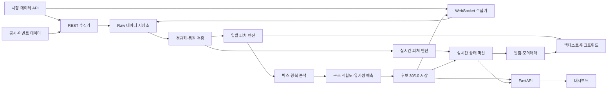
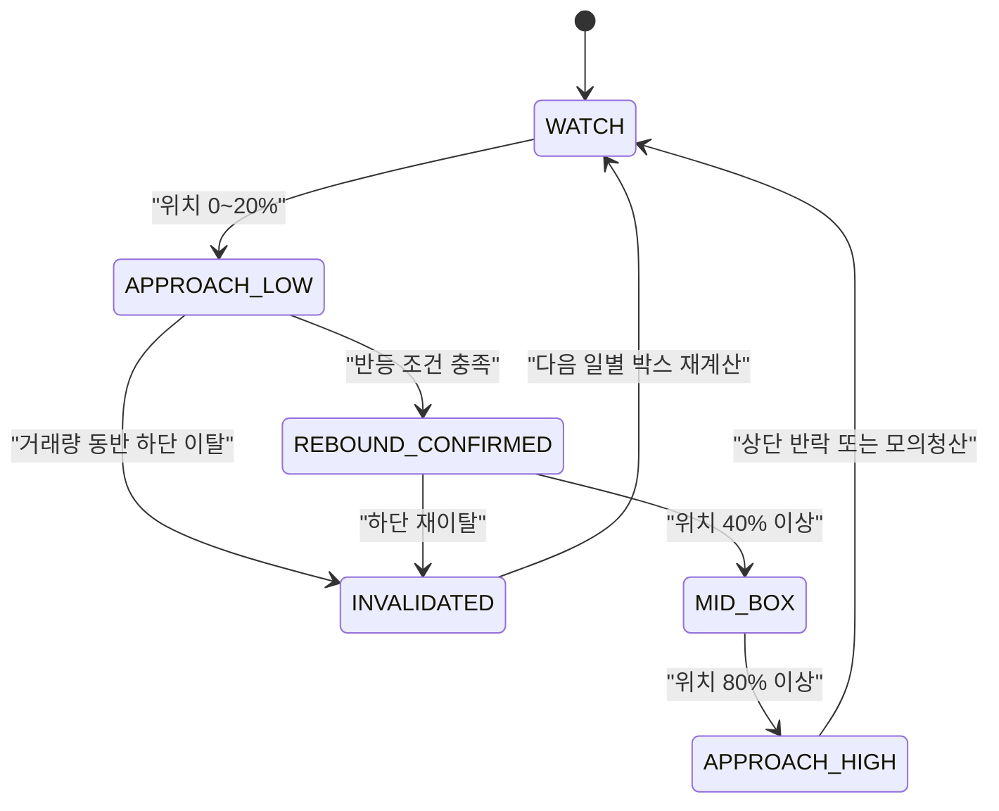

# KOSPI 왕복형 박스권 단타 모니터링 시스템

## AI 개발 에이전트용 제품·기술 설계 명세서

- 문서 상태: 구현 기준안 v1.0
- 대상 시장: 한국거래소 유가증권시장(KOSPI)
- 구현 언어: Python 3.11 이상
- 1차 제품 범위: 종목 선별, 실시간 관찰, 유지성 예측, 알림, 모의매매, 사용자 승인형 매수 실행, 자동 손절·익절
- 제외 범위: 사용자 승인 없는 자율 매수와 검증되지 않은 실계좌 주문 전략

> 이 문서는 AI 개발 에이전트가 저장소 생성부터 테스트 가능한 MVP 완성까지 자율적으로 수행할 수 있도록 작성된 구현 명세다. 모호한 값은 숨겨진 상수로 만들지 말고 설정 파일과 산식으로 노출해야 한다.

> 손절·적응형 익절·계좌 위험의 활성 기준은 [`EXIT_AND_RISK.md`](EXIT_AND_RISK.md)다. 이 문서는 세부 구현 참고이며 충돌 시 활성 위험 기준을 따른다.

---

## 1. 프로젝트 정의

### 1.1 한 문장 목표

코스피 전 종목 중 **충분한 유동성**, **큰 박스 진폭**, **상단과 하단 사이의 잦은 왕복**, **향후에도 박스가 유지될 가능성**을 가진 종목을 매일 자동 선별하고, 장중에는 후보 종목이 박스 하단에 접근하거나 반등하고 상단에 접근하는 상황을 실시간 감시하는 자동화 시스템을 구축한다.

### 1.2 사용 시나리오

1. 장 마감 후 코스피 전 종목을 분석한다.
2. 단방향 급등·급락 종목을 제외하고 왕복형 박스 구조를 가진 후보를 찾는다.
3. 구조적 적합도가 높은 후보 30개를 생성하고 AI가 30개 전부에 4단계 등급과 근거를 부여한다.
4. 다음 거래일에 최종 후보만 실시간 체결·호가·분봉으로 감시한다.
5. 박스 유지 가능성, 현재 위치, 반등 확인 여부, 붕괴 위험을 계속 갱신한다.
6. 하단 접근, 반등 확인, 상단 접근, 하단 붕괴 시 설명 가능한 알림을 발생시킨다.
7. 신호 결과를 모의매매로 기록하고 워크포워드 방식으로 성능을 검증한다.

### 1.3 제품 원칙

- 변동성이 크다는 이유만으로 후보로 선정하지 않는다.
- 박스 하단 도달은 매수 확정 신호가 아니다.
- 사용자는 종목·진입 목표가·주문가능현금 배정률·알고리즘 버전·박스 유효조건을 `ENTRY_MANDATE`로 승인한다. 시스템은 현재 잠긴 계좌 모드와 그 범위 안에서 정량 신호를 결합해 진입 시점을 결정하고 매수 주문을 실행한다. 종목 선택만으로는 매수 승인이 성립하지 않는다.
- 사용자 승인 없는 자율 매수는 금지한다.
- 신규 단기매매 계좌에서 사용자가 매수한 포지션은 평균 체결가 대비 손실률이 7%에 도달하는 즉시 시스템이 별도 승인 없이 매도 가능 수량 전부를 자동 손절한다.
- 자동 손절은 사용자 확인, 알림 수신 또는 다른 분석 결과를 기다리지 않는 최상위 위험 통제 규칙이다.
- 손실 포지션의 물타기, 손절 취소, 장기투자 포지션 전환을 시스템 기능으로 제공하지 않는다.
- 박스 상단 또는 사용자 지정 목표수익률 도달은 기본적으로 즉시 매도 조건이 아니라 적응형 수익관리 모드의 시작 조건으로 사용한다.
- 수익관리 모드에서는 체결강도, 순매수 체결대금, 호가 불균형, 거래량 가속, VWAP, 1분·5분 추세를 종합해 보유 연장 또는 전량 익절을 결정한다.
- 적응형 익절 엔진이 한번 올린 수익보호선은 다시 낮출 수 없다.
- 구조적 박스 적합도와 오늘의 진입 매력도를 분리한다.
- 점수뿐 아니라 산식, 근거, 무효화 조건을 함께 제공한다.
- 미래 데이터 누수 없이 모든 결과를 재현할 수 있어야 한다.
- 데이터 결측이나 연결 장애를 정상값으로 간주하지 않는다.
- 사용자 승인 없는 매수는 제외한다. 승인형 매수 실행과 그 이후의 `-7%` 보호 손절·적응형 익절 엔진은 모의투자 검증 후 실계좌에 적용한다.
- 시스템 출력은 분석·관찰 보조 정보이며 수익을 보장하지 않는다.

### 1.3.1 최상위 불변 주문 규칙: 사용자 승인형 매수·자동 -7% 전량 손절

이 절의 규칙은 다른 전략 신호, 박스 유지 예측, 사용자 알림 설정 및 일반 킬스위치보다 우선한다.

| 항목 | 구현 규칙 |
| --- | --- |
| 적용 계좌 | 설정에 지정된 신규 단기매매 계좌만 적용한다. 기존 장기보유 계좌에는 적용하지 않는다. |
| 매수 권한 | 사용자가 진입 위임 범위를 승인한다. 시스템은 범위 안의 타이밍만 자동 결정한다. `BUY_REQUIRES_USER_APPROVAL=true`, `UNATTENDED_AUTO_BUY_ENABLED=false`는 승인 없는 자율매수를 막는 변경 불가능한 운영 원칙이다. |
| 매수 실행 | 승인 메시지에서 종목·목표가·사용자 배정률·박스 유효조건을 검증하고 KIS 주문가능현금을 조회한 뒤 최대 정수 수량 주문을 제출한다. |
| 포지션 인식 | 브로커 체결·잔고 이벤트를 수신해 승인형 매수 체결을 자동 감지한다. |
| 기준 가격 | 해당 포지션의 브로커 제공 평균 매입가 또는 체결 내역으로 계산한 수량가중 평균 체결가를 사용한다. |
| 손절 기준가 | `stop_price = average_entry_price × (1 - 0.07)`로 계산하고 호가 단위에 맞춰 보수적으로 정규화한다. |
| 발동 조건 | 실시간 체결가 또는 즉시 매도 가능한 최우선 매수호가가 손절 기준가 이하가 되면 발동한다. 브로커 평가손익률이 `-7.00%` 이하인 경우도 동일하게 발동한다. |
| 주문 | 사용자 재확인 없이 매도 가능 수량 전부에 대해 시장가 매도 주문을 즉시 제출한다. |
| 우선순위 | 익절·박스 유지·반등 예상·수급 개선 신호가 있어도 손절을 취소하거나 지연하지 않는다. |
| 체결 관리 | 미체결·부분 체결 수량을 계속 추적하고 매도 가능 잔량이 0이 될 때까지 허용된 범위에서 재조회·재주문한다. |
| 중복 방지 | `(account, symbol, position_generation)` 단위 멱등키와 분산 잠금으로 중복 매도 주문을 막는다. |
| 장애 대응 | WebSocket 단절 시 REST 잔고·현재가 폴링으로 전환한다. 주문 실패 시 제한된 간격으로 재시도하고 동시에 긴급 이메일을 발송한다. |
| 감사 기록 | 기준가, 감지 가격, 손실률, 주문 요청·응답, 체결, 재시도 및 알림을 변경 불가능한 감사 로그로 남긴다. |

`-7%`는 주문 발동 임계값이지 체결가 보장이 아니다. 갭 하락, 하한가, 거래정지, 유동성 부족, 브로커 또는 네트워크 장애가 발생하면 실제 손실률은 7%를 초과할 수 있다. 이 경우 시스템은 거래가 가능한 첫 시점과 가격에 전량 청산을 계속 시도한다.

### 1.4 성공 기준

시스템 성공은 단기 수익률 하나가 아니라 다음 조건으로 평가한다.

- 매일 정해진 시간 안에 코스피 전 종목 분석이 완료된다.
- 동일 데이터와 설정으로 동일 후보와 점수가 생성된다.
- 상위 후보군의 향후 왕복 유지율이 전체 유동성 종목군보다 높다.
- 후보의 접촉·왕복 수치와 차트 마커가 일치한다.
- 실시간 신호마다 최소 3개의 근거와 무효화 조건이 기록된다.
- 호출 제한, 결측, WebSocket 재연결 상황에서도 서비스가 복구된다.

---

## 2. 범위와 우선순위

| 우선순위 | 범위 | 산출물 |
| --- | --- | --- |
| P0 | API 연결과 데이터 적합성 검증 | 공급자별 지원 필드·기간·호출 제한 보고서 |
| P0 | 일별 코스피 전체 스크리닝 | 7·14·21일 박스 지표, 후보 30개 전체 AI 등급 |
| P0 | 분석 API와 기본 대시보드 | 후보 목록, 상세 차트, 점수 근거, 위험 표시 |
| P1 | 실시간 후보 감시 | 체결·호가·분봉·VWAP 기반 상태 갱신 |
| P1 | 설명 가능한 알림 | 하단 접근, 반등 확인, 상단 접근, 붕괴 경고 |
| P1 | 적응형 익절·수익보호 | 상단 도달 후 돌파 지속성 판단, 불변 수익보호선, 전량 익절 |
| P1 | 박스 유지성 예측 | 규칙 기반 확률, 이후 통계·ML 모델 교체 가능 구조 |
| P1 | 백테스트·워크포워드 | 후보 품질, 붕괴율, 모의 손익, MDD 보고서 |
| P2 | 모의매매 | 주문 체결 가정, 비용·슬리피지 포함 거래 기록 |
| P3 | 실계좌 주문 | 모의투자·소액 검증 후 사용자 승인형 매수와 -7% 손절·적응형 익절만 활성화 |

### 2.1 MVP에서 제외할 기능

- 강화학습 또는 복잡한 딥러닝
- 뉴스 문장의 자동 매수·매도 해석
- 사용자 승인 없는 매수 및 정의된 손절·익절 이외의 무인 실계좌 주문
- 코스닥·ETF·ETN·해외주식
- 초저지연 HFT 수준의 주문 실행
- 수익률 보장 문구 또는 확정적 매수 추천

---

## 3. 핵심 용어

| 용어 | 정의 |
| --- | --- |
| 박스 | 일정 기간 가격이 반복적으로 머무는 하단과 상단 사이의 가격 구간 |
| 하단·상단 | 단순 최저·최고가가 아닌 분위값과 반복 접촉을 반영한 지지·저항 구역 |
| 박스 진폭 | `(상단 - 하단) / 중앙 × 100` |
| 박스 위치 | `(현재가 - 하단) / (상단 - 하단) × 100` |
| 하단 접촉 | 가격이 하단 구역에 진입한 뒤 최소 반등 조건을 만족한 사건 |
| 상단 접촉 | 가격이 상단 구역에 진입한 뒤 최소 하락 조건을 만족한 사건 |
| 완전 왕복 | 유효 하단 접촉 후 상단을 거쳐 다시 하단으로 돌아오거나, 상단 접촉 후 하단을 거쳐 다시 상단으로 돌아온 사건 |
| ER | 순이동거리 ÷ 누적 절대 이동거리. 낮을수록 왕복형 |
| 구조 적합도 | 해당 종목이 반복 박스매매 관찰 대상에 적합한 정도 |
| 유지 확률 | 현재 박스가 다음 예측 기간에도 붕괴하지 않고 왕복 구조를 유지할 추정 확률 |
| 진입 매력도 | 현재 위치와 실시간 반등·수급·호가를 반영한 당일 관찰 점수 |
| 붕괴 | 거래량을 동반해 하단을 이탈하거나 박스 구조가 단방향 추세로 전환된 상태 |

---

## 4. 시스템 아키텍처



### 4.1 배포 단위

초기에는 하나의 저장소와 하나의 배포 환경을 사용하되 프로세스를 분리한다.

| 프로세스 | 역할 | 실행 방식 |
| --- | --- | --- |
| `daily-worker` | 일봉·수급 수집, 전체 스크리닝 | 장 마감 후 스케줄 실행 |
| `realtime-worker` | 후보 WebSocket 구독, 실시간 계산 | 장중 상시 실행 |
| `api-server` | 조회 API, 상태·헬스체크 | FastAPI |
| `dashboard` | 목록·상세 화면 | MVP는 Streamlit 권장 |
| `backtest-worker` | 백테스트·워크포워드 | 수동 또는 야간 배치 |

### 4.2 기술 스택

| 계층 | 기술 |
| --- | --- |
| 언어 | Python 3.11 이상 |
| 패키지 관리 | `uv` 또는 `poetry`; 하나만 선택 |
| HTTP | `httpx` 비동기 클라이언트 |
| 실시간 | 공급자 공식 WebSocket 예제 또는 `websockets` |
| 분석 | `polars` 우선, 호환이 필요하면 `pandas` |
| 수치 계산 | NumPy, SciPy |
| API | FastAPI, Pydantic v2 |
| DB | PostgreSQL; 시계열 증가 시 TimescaleDB 확장 |
| 마이그레이션 | SQLAlchemy 2, Alembic |
| 캐시·큐 | MVP는 DB 기반, 필요 시 Redis 추가 |
| 대시보드 | Streamlit MVP, 장기적으로 React 선택 가능 |
| 스케줄 | APScheduler 또는 운영체제 스케줄러 |
| 테스트 | pytest, pytest-asyncio, Hypothesis |
| 품질 | Ruff, mypy, pre-commit |
| 관측성 | 구조화 JSON 로그, Prometheus 선택 |

---

## 5. 외부 데이터와 공급자 추상화

### 5.1 공급자 원칙

- 특정 증권사 응답 형식을 도메인 모델에 직접 노출하지 않는다.
- 모든 외부 데이터는 `ProviderAdapter`에서 내부 표준 스키마로 변환한다.
- API 키가 있어도 실제 지원 필드, 과거 기간, 실시간 구독 수, 호출 제한을 자동 진단한다.
- 공급자 응답 원본을 최소 기간 보존해 파싱 오류를 재현할 수 있게 한다.
- 크롤링은 이용약관과 재사용 조건이 확인된 경우에만 보조 수단으로 사용한다.

### 5.2 필수 데이터

| 영역 | 필수 필드 | 빈도·기간 | 비고 |
| --- | --- | --- | --- |
| 종목 마스터 | 코드, 종목명, 시장, 업종, 상장상태 | 일 1회 | KOSPI 보통주 식별 필요 |
| 일봉 | 일자, 시가, 고가, 저가, 종가, 수정종가, 거래량, 거래대금 | 최소 3년 | 액면분할·배당 조정 정책 기록 |
| 수급 | 외국인·기관·연기금·개인 순매수 금액·수량 | 최소 1년 | 공급자 지원 범위 기록 |
| 기업 상태 | 시가총액, 관리, 거래정지, 투자경고 | 일 1회 | 후보 제외 필터 |
| 공매도 | 거래량·대금·잔고 | 가능한 전체 | P1, 결측 허용 |
| 이벤트 | 실적, 증자, 수주, 보호예수, 중요 공시 | 최소 1년 | P1 위험 플래그 |
| 체결 | 가격, 수량, 시각, 체결 방향 관련 필드 | 틱 | 후보만 구독 |
| 호가 | 매도·매수 10호가와 잔량 | 실시간 | 후보만 구독 |
| 분봉 | 1분 OHLCV | 장중 | 3분·5분은 내부 집계 |
| 시장 | KOSPI 지수, 업종지수 | 실시간·일봉 | 시장 동조 필터 |

### 5.3 데이터 적합성 진단 명령

첫 구현 산출물로 아래 명령을 제공한다.

```bash
python -m app.cli provider-doctor --provider kis
```

출력에는 다음이 포함되어야 한다.

- 인증 성공 여부와 서버 시각
- 종목 마스터 건수
- 대표 종목 일봉 최초·최종 일자
- 수정주가 제공 여부
- 투자자·프로그램·공매도 필드 지원 여부
- 실시간 체결·호가 구독 성공 여부
- 측정된 호출 제한과 재시도 정책
- 모의·실전 환경 차이
- 누락된 필수 기능과 대체 공급자 필요 여부

### 5.4 호출 제한 처리

- 모든 REST 호출은 중앙 `RateLimiter`를 통과한다.
- `429`, 공급자 제한 오류, `5xx`는 지수 백오프와 지터를 적용한다.
- 인증 오류는 무한 재시도하지 않고 작업을 실패 처리한다.
- 종목별 작업 진행 상태를 저장하고 실패한 종목만 재실행한다.
- 전체 시장 조회 시 가능한 경우 종목별 반복 호출보다 시장 단위 대량 응답을 우선한다.
- 원시 응답과 정규화 데이터에 `provider`, `requested_at`, `received_at`을 기록한다.

---

## 6. 저장소 구조

```text
.
├─ pyproject.toml
├─ README.md
├─ .env.example
├─ config/
│  ├─ default.yaml
│  ├─ development.yaml
│  └─ production.yaml
├─ src/app/
│  ├─ api/
│  │  ├─ main.py
│  │  ├─ dependencies.py
│  │  └─ routes/
│  ├─ collectors/
│  │  ├─ base.py
│  │  ├─ kis_rest.py
│  │  ├─ kis_websocket.py
│  │  └─ disclosures.py
│  ├─ domain/
│  │  ├─ models.py
│  │  ├─ enums.py
│  │  └─ events.py
│  ├─ features/
│  │  ├─ box.py
│  │  ├─ roundtrip.py
│  │  ├─ flow.py
│  │  ├─ liquidity.py
│  │  ├─ persistence.py
│  │  └─ risk.py
│  ├─ scoring/
│  │  ├─ range_score.py
│  │  └─ entry_score.py
│  ├─ services/
│  │  ├─ daily_screening.py
│  │  ├─ realtime_monitor.py
│  │  ├─ alert_service.py
│  │  └─ paper_trading.py
│  ├─ backtest/
│  │  ├─ engine.py
│  │  ├─ walk_forward.py
│  │  └─ metrics.py
│  ├─ db/
│  │  ├─ models.py
│  │  ├─ repositories.py
│  │  └─ migrations/
│  ├─ providers/
│  ├─ dashboard/
│  ├─ cli.py
│  ├─ settings.py
│  └─ observability.py
├─ tests/
│  ├─ unit/
│  ├─ integration/
│  ├─ contract/
│  ├─ fixtures/
│  └─ golden/
├─ scripts/
└─ DOCS/
```

### 6.1 의존성 방향

- `domain`은 외부 API, DB, 웹 프레임워크를 import하지 않는다.
- `features`와 `scoring`은 가능한 한 순수 함수로 구현한다.
- `collectors`는 공급자 응답을 내부 모델로 변환하는 책임만 가진다.
- `services`가 수집기, 저장소, 계산 엔진을 조합한다.
- API와 대시보드는 계산 로직을 재구현하지 않는다.

---

## 7. 데이터 모델

### 7.1 핵심 테이블

| 테이블 | 핵심 키 | 역할 |
| --- | --- | --- |
| `symbols` | `symbol`, `valid_from` | 종목 이력과 시장 상태 |
| `daily_bars` | `symbol`, `trade_date` | 수정 전·후 일봉과 거래대금 |
| `minute_bars` | `symbol`, `ts`, `interval` | 1·3·5분봉 |
| `trades` | `symbol`, `ts`, `sequence` | 후보 실시간 체결 |
| `orderbook_snapshots` | `symbol`, `ts` | 후보 10호가 스냅샷 |
| `investor_flows` | `symbol`, `trade_date`, `actor` | 투자자별 순매수 |
| `corporate_events` | `symbol`, `event_at`, `event_type` | 공시·위험 이벤트 |
| `box_features` | `symbol`, `as_of`, `window` | 박스 산출 결과 |
| `candidate_runs` | `run_id`, `as_of` | 스크리닝 실행 메타데이터 |
| `candidates` | `run_id`, `symbol` | 순위·점수·근거 |
| `realtime_states` | `symbol`, `ts` | 현재 상태와 진입 점수 |
| `signals` | `signal_id` | 발생 신호와 근거·무효화 조건 |
| `paper_trades` | `trade_id` | 모의 진입·청산·비용 |
| `model_versions` | `model_version` | 산식·모델·피처 버전 |
| `job_runs` | `job_id` | 배치 실행과 실패 정보 |

### 7.2 `box_features` 필수 필드

```text
symbol
as_of
window_days                 # 7 또는 14
box_low
box_high
box_mid
box_width_pct
box_position_pct
touch_low_count
touch_high_count
round_trip_count
efficiency_ratio
containment_ratio
outlier_ratio
box_confidence
persistence_probability
calculation_version
data_cutoff_at
created_at
```

### 7.3 가격 정밀도

- DB에는 가격을 정수 원 단위 또는 `NUMERIC`으로 저장한다.
- 금액 계산에 binary float를 사용하지 않는다.
- 지표 계산 중에는 `float64`를 사용할 수 있으나 저장 전 유효 범위를 검사한다.
- 모든 시각은 `Asia/Seoul` timezone-aware 값으로 저장하고 API에서 ISO 8601로 반환한다.

### 7.4 보존 정책

| 데이터 | 기본 보존 |
| --- | --- |
| 일봉·종목 마스터·후보·신호 | 영구 |
| 1분봉 | 최소 3년 |
| 원시 체결 | 6개월 후 압축 또는 집계 |
| 호가 스냅샷 | 3개월 원본, 이후 1초·10초 집계 |
| API 원시 응답 | 성공 30일, 오류 180일 |
| 작업 로그 | 90일 |

---

## 8. 일별 사전 필터

박스 계산 전에 거래가 현실적으로 어려운 종목을 제거한다.

### 8.1 기본 포함 조건

- 시장이 KOSPI다.
- 보통주를 기본 대상으로 한다.
- 최근 20거래일 중 거래일이 18일 이상이다.
- 최근 20일 평균 거래대금이 기본 500억 원 이상이다.
- 현재가가 설정된 최소 가격 이상이다.
- 신규 상장 종목은 최소 이력 길이를 충족해야 한다.

### 8.2 기본 제외 조건

- 거래정지, 정리매매, 관리종목
- 투자위험 상태 중 정책상 제외 대상으로 설정된 종목
- 최근 데이터 누락률이 허용치를 초과한 종목
- 액면분할 등 기업행동 조정이 확인되지 않은 종목
- 평균 스프레드 또는 예상 슬리피지가 과도한 종목
- 단일 이벤트 갭으로 박스 폭이 형성된 종목

### 8.3 설정 기본값

```yaml
universe:
  market: KOSPI
  common_stock_only: true
  min_history_days: 60
  min_price_krw: 5000
  min_avg_trading_value_20d_krw: 50000000000
  max_missing_ratio: 0.02
```

---

## 9. 박스 산출 알고리즘

### 9.1 계산 창

- 주 계산 창: 7거래일, 14거래일
- 보조 레짐 창: 20거래일
- 각 창은 독립적으로 계산한다.
- 일별 스크리닝에서는 확정된 전일 데이터까지만 사용한다.
- 장중에는 전일 확정 박스를 기준으로 현재 위치만 갱신하며, 박스 경계 자체는 기본적으로 장중 변경하지 않는다.

### 9.2 초기 경계값

기본 구현은 다음 산식을 사용한다.

```text
raw_low  = quantile(low_prices, 0.15)
raw_high = quantile(high_prices, 0.85)
box_mid  = (raw_low + raw_high) / 2
box_width_pct = (raw_high - raw_low) / box_mid * 100
```

설정:

```yaml
box:
  windows: [7, 14]
  lower_quantile: 0.15
  upper_quantile: 0.85
  zone_ratio: 0.20
  min_width_pct: 8.0
  max_width_pct: 35.0
```

### 9.3 경계 보정

MVP-1에서는 분위값을 그대로 사용하되 다음 검사를 수행한다.

1. `raw_high > raw_low`가 아니면 계산 실패다.
2. 단일 일봉의 고가·저가만으로 전체 폭의 40% 이상이 생성되면 이상치 감점을 부여한다.
3. 수정주가 불연속 또는 기업행동 플래그가 있으면 후보 생성을 보류한다.
4. 분봉 거래량 프로파일을 사용할 수 있는 경우 P1에서 고밀도 가격대로 경계를 최대 박스 폭의 10% 범위 안에서 보정한다.
5. 보정 전·후 값과 근거를 모두 저장한다.

### 9.4 구역 정의

`width = box_high - box_low`일 때:

```text
lower_zone = [box_low, box_low + width × zone_ratio]
upper_zone = [box_high - width × zone_ratio, box_high]
middle_zone = 그 사이 구간
```

박스 위치:

```text
box_position_pct = (price - box_low) / width × 100
```

- 0% 미만: 하단 이탈
- 0~20%: 하단 구역
- 20~40%: 하단 위
- 40~60%: 중앙
- 60~80%: 상단 아래
- 80~100%: 상단 구역
- 100% 초과: 상단 돌파

---

## 10. 접촉과 왕복 판별

### 10.1 일봉 접촉

하단 접촉은 다음을 모두 만족할 때 인정한다.

1. 당일 저가가 하단 구역 안에 진입한다.
2. 당일 종가 또는 이후 설정된 확인 기간의 종가가 접촉 최저가보다 `width × min_reversal_ratio` 이상 반등한다.
3. 직전 인정 접촉과 최소 간격을 만족한다.

상단 접촉은 반대 방향으로 동일하게 계산한다.

```yaml
touch:
  min_reversal_ratio: 0.08
  min_separation_daily_bars: 1
  min_separation_intraday_minutes: 30
```

### 10.2 완전 왕복 상태 머신

상태는 최초 유효 접촉 구역과 이후 반대편 경계 교차 횟수를 추적한다. 경계 교차 한 번은 편도이고 두 번이 완전 왕복 한 번이다.

```text
NONE + 유효 하단 접촉  -> previous_zone = LOW
NONE + 유효 상단 접촉  -> previous_zone = HIGH
previous_zone과 다른 유효 구역 접촉 -> boundary_crossing += 1, previous_zone 갱신
round_trip_count = floor(boundary_crossing / 2)
```

- `하단→상단`과 `상단→하단`은 각각 편도이므로 `round_trip_count`를 올리지 않는다.
- `하단→상단→하단`과 `상단→하단→상단`에서 각각 완전 왕복 1회를 인정한다.
- 동일 일봉에서 고가와 저가가 모두 구역에 닿아도 시간 순서를 알 수 없으므로 일봉 기준 완전 왕복으로 계산하지 않는다.
- 분봉이나 틱 순서가 있을 때만 동일 거래일 왕복을 인정한다.
- 동일 구역 안의 반복 틱은 하나의 접촉으로 묶는다.

### 10.3 방향 효율성

종가 시계열 `p`에 대해:

```text
ER = abs(p_last - p_first) / sum(abs(p_t - p_(t-1)))
```

- 분모가 0이면 ER은 1로 처리하지 말고 계산 불가 상태로 둔다.
- 기본 허용 상한은 0.45, 우수 기준은 0.35다.
- ER이 높아지는 종목은 왕복형에서 추세형으로 전환될 가능성이 있으므로 감점한다.

---

## 11. 박스 신뢰도

모든 하위 점수는 0~1로 정규화한다.

```text
touch_balance = min(min(touch_low, touch_high) / 2, 1)
roundtrip_norm = min(round_trip_count / target_roundtrips, 1)
containment = 박스 안에 종가가 존재한 비율
er_quality = 1 - clip(ER / max_allowed_er, 0, 1)
outlier_quality = 1 - outlier_ratio

box_confidence = 100 × (
    0.30 × touch_balance
  + 0.25 × roundtrip_norm
  + 0.20 × containment
  + 0.15 × er_quality
  + 0.10 × outlier_quality
)
```

`target_roundtrips` 기본값은 7일 창 1회, 14일 창 2회다.

다음 경우 신뢰도 계산 결과와 별도로 강제 플래그를 남긴다.

- 데이터 부족
- 기업행동 의심
- 갭 이상치
- 하단 연속 하향
- 상단 연속 하향
- 박스 폭 급확대

---

## 12. 박스 유지성 예측

### 12.1 예측 정의

`as_of` 시점에 계산한 박스가 다음 5거래일 동안 유지될 확률을 예측한다.

학습·평가용 정답 `box_persisted_5d`는 다음을 모두 만족하면 1이다.

1. 다음 5일 종가의 70% 이상이 확장 박스 안에 있다.
2. `box_low - width × 0.10` 아래에서 2거래일 연속 마감하지 않는다.
3. 다음 5일 ER이 0.55 이하이거나 반대편 구역을 향한 유효 이동이 발생한다.

확장 박스:

```text
[box_low - width × 0.10, box_high + width × 0.10]
```

### 12.2 MVP 규칙 기반 모델

충분한 학습 데이터가 쌓이기 전에는 다음 피처로 0~100 유지 점수를 계산하고 0~1 확률 형태로 제공하되 `model_type=RULE_BASED`라고 명시한다.

| 피처 | 방향 |
| --- | --- |
| 7일·14일 경계 일치도 | 높을수록 긍정 |
| 박스 신뢰도 | 높을수록 긍정 |
| 최근 완전 왕복 횟수 | 많을수록 긍정, 상한 적용 |
| ER | 낮을수록 긍정 |
| 박스 경계 기울기 | 급격한 하향이면 부정 |
| ATR 대비 박스 폭 | 지나치게 작거나 크면 부정 |
| 거래대금 안정성 | 안정적이면 긍정 |
| 외국인·기관 동반 이탈 | 부정 |
| 시장·업종 급락 | 부정 |
| 악재 이벤트 | 강한 부정 |

### 12.3 통계·ML 모델 전환

최소 2년 이상의 누수 없는 피처 스냅샷과 라벨을 확보한 후 Logistic Regression을 기준 모델로 사용한다. 이후 LightGBM 등을 후보로 비교할 수 있다.

필수 조건:

- 시간 순서 기반 train/validation/test 분리
- 종목 현재 생존 여부를 이용한 과거 유니버스 필터 금지
- 스케일러와 피처 생성기를 학습 구간에만 fit
- walk-forward 검증
- 확률 보정과 Brier score 측정
- 기준 모델보다 개선되지 않으면 복잡한 모델을 채택하지 않음
- SHAP 또는 계수 기반으로 주요 근거를 저장

### 12.4 출력

```json
{
  "probability": 0.72,
  "model_type": "RULE_BASED",
  "model_version": "persistence-v1",
  "horizon_days": 5,
  "top_reasons": [
    "14일 박스 내 종가 포함률 92%",
    "최근 완전 왕복 2회",
    "외국인·기관 동반 이탈 없음"
  ],
  "risk_reasons": [
    "7일 하단이 2일 연속 하향"
  ]
}
```

---

## 13. 구조 적합도

구조 적합도는 장 마감 후 고정되며 실시간 가격에 따라 바뀌지 않는다.

| 구성 요소 | 비중 |
| --- | ---: |
| 7일·14일 박스 진폭 품질 | 15 |
| 완전 왕복 횟수 | 20 |
| 박스 신뢰도 | 15 |
| 낮은 ER | 10 |
| 유동성·슬리피지 | 15 |
| 수급 안정성 | 10 |
| 박스 유지 확률 | 15 |
| 붕괴·이벤트 위험 | 최대 -30 |

### 13.1 정규화 원칙

- 모든 양의 구성 요소는 0~100으로 변환한 뒤 가중 합산한다.
- 종목 간 백분위와 절대 기준을 혼합할 경우 두 값을 각각 저장한다.
- 결측값을 0이나 평균으로 조용히 대체하지 않는다.
- 선택 항목이 결측이면 사용 가능한 비중을 재정규화하고 `partial_score=true`를 기록한다.
- 점수와 함께 구성 요소별 값과 감점 사유를 API로 반환한다.

### 13.2 후보 생성

1. 강제 제외 조건 적용
2. 7일 또는 14일 최소 박스 진폭 8% 확인
3. ER 0.45 이하 확인
4. 상·하단 접촉 각각 2회 이상 확인
5. 7일 1회 또는 14일 2회 완전 왕복 확인
6. 구조 적합도 순으로 상위 30개 생성
7. 붕괴 위험, 결측, 이벤트 위험을 반영해 후보 30개 전부의 AI 등급·코멘트 생성
8. 동점이면 유동성, 유지 확률, 낮은 ER 순으로 정렬

---

## 14. 실시간 상태와 진입 매력도

### 14.1 실시간 상태 머신



### 14.2 반등 확인 기본 조건

하단 접근 후 아래 조건 중 설정된 최소 개수를 충족해야 `REBOUND_CONFIRMED`가 된다.

- 3분봉 종가가 직전 저점보다 상승
- 가격이 하단에서 박스 폭의 5% 이상 회복
- 최근 60초 체결강도가 기준치 이상으로 회복
- 매수 1~5호가 잔량 대비 매도 잔량 불균형이 개선
- VWAP 이격이 축소되거나 VWAP를 재돌파
- 시장·업종 지수가 동시에 신저가를 만들지 않음

기본값은 6개 중 3개이며, 가격 회복 조건은 필수다.

### 14.3 진입 매력도

| 구성 요소 | 비중 |
| --- | ---: |
| 박스 내 현재 위치 | 25 |
| 저점 상승·가격 회복 | 20 |
| 체결강도·체결속도 | 15 |
| 호가 불균형·매물 흡수 | 15 |
| 당일 프로그램·외국인 수급 | 10 |
| 시장·업종 동조 | 10 |
| 유지 확률 | 5 |
| 하단 붕괴 위험 | 최대 -40 |

- 하단 구역이 아니면 높은 진입 점수를 생성하지 않는다.
- 상단 구역에서는 구조 적합도가 높더라도 신규 진입 상태를 `WAIT`로 둔다.
- 데이터가 오래됐거나 WebSocket이 끊기면 진입 점수를 무효화한다.

### 14.4 붕괴 판정

다음 중 하나를 만족하면 즉시 위험 플래그를 만든다.

- 가격이 `box_low - width × 0.05` 아래에 있고 거래량이 최근 동시간 평균의 1.5배 이상
- 3분봉 2개가 연속으로 하단 아래에서 마감
- 하단 이탈과 함께 시장·업종 급락이 발생
- 중요한 악재 이벤트가 확인됨
- 실시간 데이터가 신뢰할 수 없어 기존 신호를 유지할 수 없음

붕괴 시 기존 `APPROACH_LOW`와 `REBOUND_CONFIRMED` 신호를 무효화하고 알림을 발생시킨다.

---

## 15. 수급과 유동성

### 15.1 수급 정규화

```text
flow_by_market_cap = net_buy_amount / market_cap × 100
flow_by_trading_value = net_buy_amount / trading_value × 100
```

- 외국인, 기관, 연기금, 개인, 프로그램을 가능한 범위에서 분리한다.
- 공급자가 제공하지 않는 세부 주체는 추정하지 않는다.
- 1일·5일·10일 누적값과 연속 순매수 일수를 계산한다.
- 절대 금액만으로 대형주와 중형주를 비교하지 않는다.

### 15.2 유동성 지표

- 20일 평균 거래대금
- 최근 5일 거래대금 증가율
- 평균 스프레드와 현재 스프레드
- 상위 5·10호가 누적 잔량
- 1,000만 원 기준 예상 슬리피지
- 10초·30초·60초 체결 속도
- 시가총액 대비 회전율

### 15.3 예상 슬리피지

호가창을 최우선 가격부터 순서대로 소진하는 가상 시장가 주문으로 계산한다. 호가 데이터가 없을 경우 과거 변동성만으로 정밀 슬리피지를 가장하지 말고 `unavailable`로 표시한다.

---

## 16. 장 마감 배치

### 16.1 작업 순서

```text
15:40 종목 마스터와 시장 상태 갱신
15:45 일봉·거래대금·수급 수집
16:10 데이터 품질 검사와 수정주가 검증
16:20 사전 필터
16:25 7일·14일 박스·왕복·ER 계산
16:35 수급·유동성·위험 피처 계산
16:45 유지 확률과 구조 적합도 계산
16:50 후보 30개와 전체 AI 등급·코멘트 저장
16:55 정적 리포트·대시보드 갱신
17:00 작업 결과 알림
```

시간은 설정 가능해야 하며 실제 데이터 확정 시각에 맞춰 조정한다.

### 16.2 원자성

- `candidate_run`은 `RUNNING`, `SUCCEEDED`, `FAILED`, `PARTIAL` 상태를 가진다.
- 모든 계산이 완료되기 전에는 새로운 후보 세트를 활성화하지 않는다.
- 실패 시 직전 성공 후보를 유지하되 화면에 데이터 기준일과 지연 경고를 표시한다.
- 활성 후보 전환은 하나의 DB 트랜잭션으로 처리한다.

---

## 17. 장중 실시간 처리

### 17.1 구독 대상

- 전일 후보 30개와 AI 등급
- 사용자가 고정한 관심 종목
- 최대 구독 수는 공급자 제한보다 작게 설정
- 후보가 바뀌면 안전하게 구독을 교체

### 17.2 이벤트 흐름

```text
WebSocket 메시지
-> 스키마 검증
-> 중복·순서 검사
-> 원시 저장 또는 버퍼
-> 1분봉 집계
-> 실시간 피처 갱신
-> 상태 머신 평가
-> 진입 매력도 계산
-> 신호 중복 억제
-> DB 저장
-> API/SSE 또는 WebSocket 전파
-> 알림 전송
```

### 17.3 연결 복구

- heartbeat와 마지막 수신 시각을 감시한다.
- 지수 백오프로 재연결한다.
- 재연결 후 기존 구독을 자동 복원한다.
- 메시지 식별자가 있으면 중복 제거한다.
- 순서 공백이 감지되면 REST 스냅샷으로 상태를 재동기화한다.
- 데이터가 설정 시간 이상 오래되면 모든 실시간 신호를 `STALE` 처리한다.

---

## 18. 알림과 모의매매

### 18.1 알림 종류

| 이벤트 | 조건 | 심각도 |
| --- | --- | --- |
| `LOW_APPROACH` | 위치 0~20% | 정보 |
| `REBOUND_CONFIRMED` | 하단 반등 조건 충족 | 관찰 |
| `HIGH_APPROACH` | 위치 80~100% | 관찰 |
| `BOX_BREAKDOWN` | 거래량 동반 하단 이탈 | 긴급 |
| `BOX_SHIFT` | 7일 경계가 14일 대비 의미 있게 이동 | 경고 |
| `FLOW_REVERSAL` | 외국인·기관 방향 동시 전환 | 경고 |
| `DATA_STALE` | 실시간 데이터 지연·연결 장애 | 긴급 |

### 18.2 알림 본문 필수 항목

- 종목명과 코드
- 현재가와 박스 위치
- 7일·14일 박스 경계
- 구조 적합도, 유지 확률, 진입 매력도
- 발생 근거 최소 3개
- 무효화 조건
- 데이터 기준 시각
- 모델·계산 버전

### 18.3 중복 억제

- 동일 종목·동일 이벤트는 기본 15분 cooldown을 적용한다.
- 심각도가 상승하거나 가격 상태가 크게 바뀌면 cooldown 중에도 재전송할 수 있다.
- 붕괴 경고는 중복 억제보다 안전을 우선한다.

### 18.4 모의매매

- 초기에는 신호만 기록하고 주문을 실행하지 않는다.
- P2에서 `REBOUND_CONFIRMED`를 가상 진입 후보로 기록한다.
- 실제 체결 가능 가격은 다음 호가 또는 다음 봉 시가를 사용한다.
- 수수료, 세금, 스프레드, 슬리피지를 포함한다.
- 상단 접근, 목표 가격, 붕괴, 시간 종료를 각각 청산 사유로 기록한다.
- 체결되지 않은 주문을 유리한 가격으로 임의 체결하지 않는다.

---

## 19. 내부 API

### 19.1 후보 목록

```http
GET /api/v1/candidates?as_of=YYYY-MM-DD&limit=30
```

주요 응답 필드:

```json
{
  "as_of": "2026-07-22",
  "data_status": "FRESH",
  "items": [
    {
      "rank": 1,
      "symbol": "000000",
      "name": "예시종목",
      "current_price": 100000,
      "box_7d": {},
      "box_14d": {},
      "range_score": 88.2,
      "persistence_probability": 0.74,
      "entry_score": 31.0,
      "realtime_state": "WATCH",
      "risk_flags": [],
      "score_reasons": []
    }
  ]
}
```

### 19.2 종목 상세

```http
GET /api/v1/stocks/{symbol}/analysis?as_of=YYYY-MM-DD
```

반환 항목:

- 일봉과 1·3·5분봉
- 7일·14일 박스 경계와 구역
- 접촉·완전 왕복 마커
- ER·ATR·거래대금·수급
- 박스 신뢰도와 유지 확률
- 구조 적합도와 진입 매력도 구성 요소
- 실시간 상태와 최근 신호
- 위험 플래그와 데이터 품질 상태

### 19.3 운영 API

```http
GET  /health/live
GET  /health/ready
GET  /api/v1/jobs/latest
POST /api/v1/jobs/daily-screening
GET  /api/v1/models/active
GET  /api/v1/config/effective
GET  /api/v1/signals
GET  /api/v1/paper-trades
```

수동 배치 실행 API는 인증된 운영자만 사용할 수 있어야 한다.

### 19.4 오류 형식

```json
{
  "error": {
    "code": "DATA_NOT_READY",
    "message": "2026-07-22 일봉 수집이 완료되지 않았습니다.",
    "trace_id": "...",
    "retryable": true
  }
}
```

---

## 20. 대시보드 요구사항

### 20.1 메인 화면

열:

- 순위
- 종목명·코드
- 현재가·등락률
- 7일·14일 박스와 현재 위치
- 완전 왕복 횟수
- ER
- 구조 적합도
- 유지 확률
- 진입 매력도
- 실시간 상태
- 수급 라벨
- 유동성
- 위험 플래그
- 데이터 기준 시각

필터:

- 구조 적합도 하한
- 유지 확률 하한
- 박스 위치 구역
- 박스 진폭
- ER
- 거래대금
- 위험 플래그 제외
- 실시간 상태

### 20.2 상세 화면

- 일봉과 분봉 차트
- 7일·14일 상단·하단·중앙선
- 하단·상단 접촉과 왕복 마커
- 현재 위치 범위바
- 거래량과 VWAP
- 외국인·기관·연기금·프로그램 누적 수급
- 호가 불균형과 체결 속도
- 점수 구성 요소 막대
- 유지 확률의 긍정·부정 근거
- 최근 신호 타임라인
- 데이터 품질과 계산 버전

### 20.3 표현 규칙

- 점수만 표시하지 않고 근거를 펼쳐볼 수 있어야 한다.
- 오래된 데이터는 명확한 경고색과 기준 시각을 표시한다.
- 하단 접근을 확정 매수로 표현하지 않는다.
- 상단 접근과 돌파를 구분한다.
- 붕괴된 박스는 기존 경계를 흐리게 표시하고 무효 상태를 표시한다.

---

## 21. 설정 관리

모든 전략 파라미터는 버전 관리 가능한 YAML에 둔다.

```yaml
strategy:
  version: box-strategy-v1
  windows: [7, 14]
  lower_quantile: 0.15
  upper_quantile: 0.85
  zone_ratio: 0.20
  min_box_width_pct: 8.0
  preferred_er: 0.35
  max_er: 0.45
  min_touch_each_side: 2
  min_roundtrips_7d: 1
  min_roundtrips_14d: 2
  candidate_pool_size: 30
  realtime_candidate_size: 3

realtime:
  stale_after_seconds: 10
  alert_cooldown_minutes: 15
  breakdown_buffer_ratio: 0.05
  breakdown_volume_multiple: 1.5

persistence:
  horizon_days: 5
  expanded_box_ratio: 0.10
  min_containment_ratio: 0.70

paper_trading:
  enabled: false
  nominal_order_krw: 10000000
  include_fees: true
  include_tax: true
  slippage_model: orderbook
```

- 실행마다 설정 전체의 해시를 저장한다.
- API 키와 계좌정보는 YAML이나 Git에 저장하지 않는다.
- 운영 중 설정 변경은 새 버전을 생성하며 과거 결과를 소급 변경하지 않는다.

---

## 22. 테스트 전략

### 22.1 단위 테스트

반드시 포함할 테스트:

- 일정한 가격에서 박스 계산 실패 또는 정의된 결과 처리
- 단일 긴 꼬리가 분위 경계를 과도하게 바꾸지 않음
- ER 계산의 상승 추세·왕복 시계열 비교
- 같은 구역 반복 틱이 한 번의 접촉으로 합쳐짐
- 일봉에서 동일일 상·하단 접촉을 왕복으로 세지 않음
- 분봉에서 시간 순서에 따라 왕복이 계산됨
- 경계값에서 박스 위치가 정확히 0·20·80·100%가 됨
- 결측 점수 재정규화와 `partial_score` 처리
- 붕괴 발생 시 기존 진입 신호 무효화
- 미래 데이터를 전달하지 않아도 모든 피처가 계산됨

### 22.2 속성 기반 테스트

- `box_high > box_low`이면 폭은 항상 양수다.
- 박스 안 가격의 위치는 0~100 범위다.
- 구성 점수는 설정 범위를 벗어나지 않는다.
- 같은 입력·설정·버전은 항상 같은 출력이다.
- 미래 행을 추가해도 과거 `as_of` 결과가 변하지 않는다.

### 22.3 계약 테스트

- 실제 API 응답을 익명화한 fixture로 파서 계약을 고정한다.
- 공급자 필드가 사라지거나 타입이 바뀌면 테스트가 실패해야 한다.
- 실 API를 호출하는 smoke test는 키가 있을 때만 별도 실행한다.
- 테스트 로그에 키, 토큰, 계좌번호를 출력하지 않는다.

### 22.4 골든 테스트

대표 시계열 fixture를 만든다.

- 이상적인 왕복형
- 단방향 급등형
- 단방향 급락형
- 긴 꼬리 이상치형
- 갭 붕괴형
- 거래량 부족형
- 상향 이동 박스
- 하향 이동 박스

각 fixture의 경계, 접촉, 왕복, ER, 점수, 플래그 예상값을 저장한다.

### 22.5 백테스트 검증

- `as_of` 이후 데이터는 라벨 계산 외 피처에 사용하지 않는다.
- 현재 상장 종목 목록으로 과거 유니버스를 재구성하지 않는다.
- 수정주가와 당시 실제 거래 가능 가격을 구분한다.
- 거래 비용과 슬리피지를 포함한다.
- 파라미터 선택 구간과 최종 평가 구간을 분리한다.
- 시장 상승·하락·횡보 국면별 결과를 나눈다.

---

## 23. 성과 지표

### 23.1 후보 품질

| 지표 | 정의 |
| --- | --- |
| Grade precision | AI 등급별 다음 5일 박스 유지·반등 비율 |
| Lift@10 | Precision@10 ÷ 전체 비교군 유지율 |
| 평균 완전 왕복 | 후보군의 다음 기간 왕복 횟수 |
| 붕괴율 | 하단 접근 후 설정 기간 안에 박스가 붕괴된 비율 |
| 유지 확률 Brier score | 예측 확률의 보정 품질 |

### 23.2 모의매매

- 비용 포함 총수익률
- 거래당 평균 손익
- 승률과 손익비
- 최대 낙폭(MDD)
- Profit Factor
- 평균 보유 시간
- 미체결률
- 신호 발생 대비 실제 가상 체결률
- 시장 국면별 성과

수익률이 높아도 샘플 수가 적거나 특정 종목·기간에 편중되면 성공으로 판정하지 않는다.

---

## 24. 보안과 운영

### 24.1 비밀정보

- `.env.example`에는 변수 이름만 제공한다.
- 실제 키는 환경변수, OS 보안 저장소 또는 Secret Manager에서 읽는다.
- 저장소, 로그, 예외 메시지, 테스트 fixture에 키를 남기지 않는다.
- 읽기 전용 데이터 키와 주문 권한을 분리한다.
- 실전·모의 환경을 명시적으로 구분하고 기본값은 모의 환경으로 한다.

### 24.2 로그

모든 로그는 다음 필드를 포함하는 구조화 JSON을 권장한다.

```text
timestamp, level, service, event, trace_id, job_id,
symbol, provider, data_cutoff_at, calculation_version, message
```

다음은 마스킹한다.

- API key와 secret
- access token
- 계좌번호
- 개인 식별정보

### 24.3 운영 지표

- REST 성공률과 지연시간
- 호출 제한 오류 수
- WebSocket 연결 상태와 재연결 횟수
- 마지막 체결·호가 수신 시각
- 수집 종목 수와 결측 종목 수
- 배치 소요시간
- 활성 후보 기준일
- 신호 발생 수와 중복 억제 수

### 24.4 장애 원칙

- 잘못된 실시간 데이터보다 오래된 데이터 경고가 낫다.
- 데이터 수집이 부분 실패하면 후보 순위를 조용히 생성하지 않는다.
- 신호 계산에 필요한 필드가 없으면 `UNKNOWN` 또는 `STALE`로 처리한다.
- 장애 복구 후 누락 구간을 보충하고 재계산 여부를 기록한다.

---

## 25. 개발 단계

### Phase 0: 공급자 검증과 프로젝트 골격

산출물:

- Python 프로젝트 골격과 CI
- 설정·비밀정보 구조
- `provider-doctor`
- 종목 마스터·대표 일봉·실시간 체결·호가 smoke test
- 데이터 지원 범위 문서

완료 조건:

- 키가 있는 환경에서 인증과 대표 데이터 호출이 재현된다.
- 지원되지 않는 필드가 명시된다.
- 비밀정보가 로그와 Git에 남지 않는다.

### Phase 1: 일별 데이터와 계산 엔진

산출물:

- DB 마이그레이션
- 코스피 종목·일봉·수급 수집
- 박스·접촉·왕복·ER·신뢰도 계산
- 골든 fixture와 단위 테스트

완료 조건:

- 동일 입력에서 동일 결과가 나온다.
- 대표 100개 차트에 대한 수동 검토 자료를 생성할 수 있다.

### Phase 2: 스크리너와 대시보드

산출물:

- 구조 적합도와 규칙 기반 유지 확률
- 후보 30개 전체 AI 등급 배치
- FastAPI 조회 API
- Streamlit 후보 목록·상세 화면

완료 조건:

- 장 마감 배치가 제한 시간 안에 완료된다.
- 점수와 근거·감점·데이터 시각이 화면에 표시된다.

### Phase 3: 실시간 감시와 알림

산출물:

- 후보 WebSocket 구독
- 분봉·VWAP·호가 불균형·체결 속도
- 상태 머신과 진입 매력도
- 알림과 재연결 처리

완료 조건:

- 연결 중단·복구 테스트를 통과한다.
- 하단 접근·반등·상단·붕괴 fixture의 상태 전이가 정확하다.

### Phase 4: 백테스트와 모의매매

산출물:

- 누수 방지 백테스트
- 워크포워드 보고서
- 비용·슬리피지 포함 모의매매
- 성과 대시보드

완료 조건:

- 시장 국면별 결과와 실패 사례가 보고된다.
- 신호부터 가상 체결·청산까지 감사 로그가 남는다.

### Phase 5: 유지성 모델 고도화

산출물:

- 피처 스냅샷과 5일 라벨 데이터셋
- Logistic Regression 기준 모델
- 후보 ML 모델 비교
- 확률 보정·해석 보고서

완료 조건:

- 기준 규칙 모델보다 외부 평가 구간에서 개선된다.
- 개선되지 않으면 규칙 기반 모델을 유지한다.

---

## 26. 최종 인수 기준

### 데이터

- 코스피 대상 종목 수와 제외 사유가 매일 기록된다.
- 일봉·수급 수집의 기준일과 결측률을 조회할 수 있다.
- 모든 실시간 값에 수신 시각과 stale 판정이 존재한다.

### 계산

- 7일·14일 박스 상·하단·중앙·폭·위치가 계산된다.
- 접촉 및 왕복 횟수가 차트 이벤트와 일치한다.
- ER, 신뢰도, 유지 확률, 구조 적합도가 버전과 함께 저장된다.
- 단방향 급등·급락과 갭 이상치가 우선 후보에서 감점된다.

### 후보

- 장 마감 후 후보 30개와 각 종목의 AI 4단계 등급·코멘트가 자동 생성된다.
- 후보마다 선정 근거와 제외·감점 사유를 확인할 수 있다.
- 후보 생성이 부분 실패했을 때 이전 결과를 새 결과로 위장하지 않는다.

### 실시간

- 최종 후보만 실시간 구독한다.
- 하단 접근, 반등 확인, 상단 접근, 붕괴 상태가 갱신된다.
- 연결 장애 시 신호가 stale 처리되고 복구 후 구독이 복원된다.
- 신규 단기매매 계좌의 승인형 매수 체결을 감지하고 평균 체결가와 -7% 손절 기준가를 즉시 생성한다.
- 손절 발동 후 매도 가능 잔량이 0이 될 때까지 주문·체결 상태를 추적한다.

### 검증

- 단위·계약·통합·골든 테스트가 자동 실행된다.
- 미래 데이터 누수 검사 테스트가 존재한다.
- 비용과 슬리피지를 포함한 워크포워드 보고서를 생성한다.
- 동일 버전과 입력으로 결과를 재현할 수 있다.

### 보안

- 키와 계좌정보가 Git·로그·fixture에 없다.
- 실계좌 주문은 모의투자 검증 전까지 비활성화하고, 운영 승인 후에도 사용자 승인 없는 자율 매수는 항상 비활성화한다.
- 주문 권한을 추가하더라도 분석 키와 분리할 수 있다.

---

## 27. AI 개발 에이전트 실행 규칙

### 27.1 작업 순서

AI 에이전트는 반드시 다음 순서로 작업한다.

1. 기존 저장소와 설정을 검사한다.
2. Phase 0의 공급자 진단을 먼저 구현한다.
3. 데이터 계약과 fixture를 확정한다.
4. 순수 계산 함수와 단위 테스트를 구현한다.
5. DB와 배치 서비스를 연결한다.
6. API와 화면을 연결한다.
7. 실시간 수집과 상태 머신을 구현한다.
8. 백테스트와 모의매매를 구현한다.
9. 실제 운영 데이터로 결과를 검증한다.

### 27.2 금지 사항

- API 키를 코드에 직접 입력하지 않는다.
- 제공되지 않는 데이터를 추정값으로 가장하지 않는다.
- 결측값을 임의의 0으로 바꾸지 않는다.
- 미래 데이터를 피처 계산에 사용하지 않는다.
- 점수 산식을 코드 내부에만 숨기지 않는다.
- 테스트 없이 전략 파라미터를 변경하지 않는다.
- 실패한 배치를 성공으로 표시하지 않는다.
- 모의 검증 전에 실계좌 주문을 활성화하지 않는다.
- 대시보드에서 분석 신호를 수익 보장 표현으로 표시하지 않는다.

### 27.3 구현 단위 완료 정의

각 기능은 다음을 모두 만족해야 완료다.

- 타입이 정의되어 있다.
- 설정 항목이 문서화되어 있다.
- 정상·경계·실패 테스트가 있다.
- 오류 메시지가 사용자가 조치할 수 있는 형태다.
- 구조화 로그와 trace ID가 있다.
- README 또는 관련 문서가 갱신되어 있다.
- 실제 또는 fixture 데이터로 실행 검증이 완료되었다.

### 27.4 모호한 요구 처리

- 안전하고 되돌릴 수 있는 기본값을 설정 파일로 추가한다.
- 선택한 기본값과 이유를 ADR 또는 변경 기록에 남긴다.
- 결과를 크게 바꾸는 모호성은 임의 결정하지 말고 사용자 확인 항목으로 보고한다.
- 산식 변경 시 `calculation_version`을 올리고 과거 결과와 혼합하지 않는다.

### 27.5 첫 번째 구현 요청

에이전트가 가장 먼저 수행할 작업은 다음과 같다.

```text
1. Python 3.11+ 프로젝트를 생성한다.
2. config, domain, collectors, features, services, api, db, tests 구조를 만든다.
3. 비밀정보가 없는 .env.example을 만든다.
4. 한국투자증권 Open API(KIS)에 대한 provider-doctor를 구현한다.
5. 삼성전자 등 대표 종목으로 일봉·현재가·체결·호가 지원 여부를 검증한다.
6. 지원 필드, 과거 기간, 호출 제한, WebSocket 제한을 `DOCS/KIS_AND_EXTERNAL_APIS.md`에 기록한다.
7. 그 결과를 바탕으로 Phase 1 구현 가능 범위와 누락 데이터 대안을 보고한다.
```

Phase 0 검증이 끝나기 전에는 전체 스크리너를 성급하게 구현하지 않는다.

---

## 28. 초기 결정 사항과 확인 필요 사항

### 확정된 초기 결정

- 대상 시장은 KOSPI다.
- 7일·14일 박스를 독립 계산한다.
- 일별 전체 스크리닝 후 후보만 실시간 감시한다.
- 구조 적합도와 진입 매력도를 분리한다.
- 유지성 예측은 규칙 기반으로 시작한다.
- 사용자가 진입 위임 범위를 승인하며 시스템은 명시적 범위 안에서만 진입 시점을 자동 결정하고 주문을 실행한다.
- 사용자 승인 없는 자율 매수는 금지한다.
- 승인형 매수 포지션의 평균 체결가 대비 -7% 전량 자동 손절은 최상위 위험 통제로 구현한다.
- 보호 손절은 모의투자와 소액 실전 검증 후 운영 계좌에 활성화한다.
- 모든 산식과 파라미터는 버전 관리한다.

### Phase 0에서 확인할 사항

- 사용 가능한 데이터 공급자와 각각의 키 종류
- 일봉 수정주가와 과거 제공 기간
- 투자자·연기금·프로그램·공매도 데이터 범위
- 실시간 체결·호가 구독 한도
- 실제 REST 호출 제한
- 과거 분봉과 호가 데이터 가용성
- 대시보드 실행 환경: 로컬 PC, VPS 또는 클라우드
- 알림 채널 우선순위

---

## 부록 A. 기본 파라미터

| 설정 | 초기값 |
| --- | --- |
| 분석 시장 | KOSPI |
| 박스 기간 | 7·14거래일 |
| 하단·상단 분위 | 15·85 분위 |
| 하단·상단 구역 | 각 박스 폭의 20% |
| 최소 박스 진폭 | 8% |
| 최대 기본 박스 진폭 | 35% |
| 우수 ER | 0.35 이하 |
| 허용 ER 상한 | 0.45 |
| 상·하단 최소 접촉 | 각각 2회 |
| 7일 최소 완전 왕복 | 1회 |
| 14일 최소 완전 왕복 | 2회 |
| 20일 평균 거래대금 | 500억 원 이상 |
| 1차 후보 | 30개 |
| 실시간 집중 감시 | 사용자가 지정한 1~3개 |
| 유지성 예측 기간 | 다음 5거래일 |
| 실시간 stale 기준 | 10초 |
| 알림 cooldown | 15분 |
| 모의 주문 기준 금액 | 1,000만 원 |

## 부록 B. 후보 출력 예시

| 종목 | 현재가 | 7일 박스 | 14일 박스 | 위치 | 왕복 | ER | 적합도 | 유지확률 | 진입 | 상태 | 위험 |
| --- | ---: | --- | --- | ---: | --- | ---: | ---: | ---: | ---: | --- | --- |
| 예시 A | 174,000 | 168~187천 | 164~191천 | 32% | 2/4 | 0.28 | 92 | 78% | 64 | WATCH | 낮음 |
| 예시 B | 82,000 | 79~89천 | 76~91천 | 10% | 2/3 | 0.34 | 88 | 69% | 76 | APPROACH_LOW | 중간 |
| 예시 C | 241,000 | 225~258천 | 219~263천 | -3% | 3/4 | 0.41 | 85 | 38% | 0 | INVALIDATED | 높음 |

## 부록 C. 권장 공식 자료

- KIS Developers 포털: <https://apiportal.koreainvestment.com/>
- 한국투자증권 공식 Open API GitHub: <https://github.com/koreainvestment/open-trading-api>
- KRX 정보데이터시스템: <https://data.krx.co.kr/contents/MDC/MAIN/main.jspx>
- 금융감독원 OpenDART: <https://opendart.fss.or.kr/>
