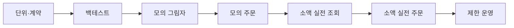

# 개발·설정·테스트·배포 가이드

## 0. 현재 구현 상태

2026-07-26 기준 Phase 0A 기본 골격을 구현했다.

- `src/danta`: FastAPI, 설정, 도메인, 포트, KIS 어댑터, 서비스, DB
- `config/app.json`: 모의투자 기본 환경과 불변 안전정책
- `.secrets/kis/paper.json`: 사용자가 직접 입력하는 모의 자격증명
- `.secrets/kis/prod.json`: 실전 자격증명 보관용이며 실행은 잠금
- `KisProviderDoctor`: 설정·토큰·현재가·잔고·WebSocket 접속키 진단
- 모의 REST `EGW00201` 방지를 위한 요청 직렬화·최소 간격 제한
- Alembic 초기 스키마: 승인·주문의도·브로커주문·체결·포지션·위험·감사
- 사용자 승인 범위 검증과 -7% 손절 도메인 함수
- 단위·계약·API 테스트
- 후보 30개 공개 DTO 검증과 GitHub Pages용 단일 HTML 대시보드 빌더
- 7·14·21일 전역 전환: 순위·AI 30개 코멘트·수익률·박스·차트·거래대금·수급 동기화
- `SmtpNotifier`와 `notify-report`: 비밀 SMTP 설정을 사용한 Pages 배포 알림
- `sungha-uu/danta` 코드 저장소와 `sungha-uu/danta_report` 정적 Pages 배포

Phase 0B KIS 모의계좌 live doctor는 2026-07-26 통과했다. 토큰, 삼성전자 현재가, 잔고, WebSocket 접속키를 확인했고 주문은 호출하지 않았다. 비민감 결과는 `data/provider_capability_snapshot.json`에 저장한다.

현재 주문 실행 포트는 정의했지만 실제 매수·매도 제출은 의도적으로 연결하지 않았다. 모의 주문도 승인·멱등성·잔고복구 구현과 테스트가 끝난 뒤 활성화한다.

현재 대시보드는 결정적 데모 데이터로 UI·스키마·기간 전환을 검증하는 단계다. 실제 KIS·KRX·뉴스·수급 수집기와 연결되기 전에는 화면에 `DEMO DATA`를 표시한다.

## 1. 구현 단계

### Phase 0: 골격과 KIS 진단

- Python 프로젝트, FastAPI, SQLAlchemy, Alembic, PostgreSQL
- KIS `provider-doctor`, 모의 토큰·계좌·현재가·WebSocket 접속키
- SMTP 테스트, CI 단위·정적검사

### Phase 1: 일별 데이터와 후보 30개

- KOSPI 종목·거래대금·수급·공시와 정규장 1분봉 원본
- 1분봉 품질·수정주가와 재현 가능한 60분봉, 7·14·21일 박스·왕복·유동성·붕괴
- 미래 데이터 누수 방지와 재현성

### Phase 2: 후보 30개 전체 AI 등급과 Pages

- 후보 30개 전부의 구조화 AI 4단계 등급·코멘트와 모델·프롬프트 버전
- 외국인·기관·뉴스 근거가 포함된 정적 읽기 대시보드
- 비밀 검사, 후보 이메일, AI 실패 시 정량 폴백
- Codex Plus 스냅샷·API 토큰·비용 계측과 AI 예산 상태머신

### Phase 3: 코멘트 연계와 실시간 감시

- GitHub Pages 코멘트 저장·조회와 Android Codex 지시 연계
- PC 에이전트 명령 정규화, loopback 제어 API와 감사 로그
- 사용자 지정 1~3개, 공유 KIS WebSocket과 종목별 `asyncio` 상태머신
- 1분·5분봉, 하단·반등·붕괴 상태
- 중앙 Supervisor·이벤트 Outbox·이메일 중복 억제·REST 전환

### Phase 4: 모의 승인형 매수·손절

- `ENTRY_MANDATE`, AI 정책·정량신호 교집합, 모의 주문·체결
- 중앙 주문 관리자, 호출 제한기, 주문 멱등성
- 평균가·포지션 세대·-7% 손절
- 부분체결·타임아웃·재시작·대조

### Phase 5: 익절·시간청산

- `PROFIT_ARMED`, `BREAKOUT_HOLD`, 수익보호선
- 손절 후 `MarketRegimeGuard`와 관망·업종·종목 격리 모드
- 고정 익절 대비 백테스트·그림자 비교
- [`PROFITABILITY_IMPROVEMENT.md`](PROFITABILITY_IMPROVEMENT.md)의 개선 포인트 등록부와 실험·승격 증거 연결

### Phase 6~7: 소액 실전과 제한 운영

- 상시가동 호스트, 소액 조회·주문, 장애 훈련
- 사용자 위험 한도, 버전 승격, 주·월간 검토
- 실전 안정판, 모의 그림자, 모의 개선판의 계정·DB·프로세스 분리
- `DailyAssuranceRunner`와 일일 품질 이메일

### Phase 8: 지속 검증과 개선

- `LIVE_CHAMPION`은 승인된 안정판으로 고정 운용
- `PAPER_SHADOW`는 실전판과 동일 신호를 매 거래일 재현해 차이를 대조
- `PAPER_CHALLENGER`는 신규 알고리즘을 상시 검증하되 실전 주문 권한은 부여하지 않음
- 주간 이상 추세 검토, 월간 승격 심사, 분기 및 사건 기반 전면 감사

## 2. 설정 원칙

- 비밀은 `.env.example`에 넣지 않는다.
- 모의·실전 키·계좌·DB 상태를 분리한다.
- 임계값은 코드에 숨기지 않고 버전과 설정으로 관리한다.
- TBD 위험 한도가 남으면 실계좌 신규매수를 거부한다.

불변 정책:

```text
BUY_REQUIRES_USER_APPROVAL=true
UNATTENDED_AUTO_BUY_ENABLED=false
AUTO_STOP_SELL_ENABLED=true
STOP_LOSS_PCT=7.0
STOP_SELL_REQUIRE_CONFIRMATION=false
```

환경변수가 불변 정책과 다르면 프로세스 시작을 거부한다. 위험·전략 변경은 변경 전후, 승인자, 이유, 적용시각, 검증 결과와 버전을 기록하며 열린 포지션에는 소급 적용하지 않는다.

## 3. 테스트

### 단위·속성

- 박스·접촉·왕복·효율성
- 평균가·호가 단위·비용
- -7% 경계와 수익보호선 단조 증가
- 승인 박스 유효조건·사용자 배정률·목표가·위험 한도
- 사용자 승인 없는 매수 의도 0건
- 동일 포지션 청산 중복 0건
- 미래 데이터 제거 시 과거 결과 불변

### 계약·통합·장애

- KIS 토큰·계좌·시세·WebSocket·주문 TR 및 응답 스키마
- DART, SMTP, AI JSON, Pages 공개 필드
- WebSocket 단절·중복·순서 역전
- 호출제한, 토큰 만료, 실전/모의 자격증명 혼용
- 주문 응답 유실, 부분체결, 정정·취소
- 재시작·잔고복구, SMTP·GitHub 장애 격리

## 4. 전략 검증

세부 성과 지표, 실험 등록과 운영 주기는 [`PROFITABILITY_IMPROVEMENT.md`](PROFITABILITY_IMPROVEMENT.md)를 따른다.

- 수수료·세금·슬리피지 포함
- 개발·검증·최종평가 분리와 워크포워드
- 후보 시점 이후 데이터만 사용
- 기대값, 최대낙폭, 연속손실, 최고수익 반납률 평가
- AI 등급별 성과와 정량 순위 구간별 성과 비교
- 적응형 익절 대 고정 익절 비교
- 손절 후 시장위험 가드의 오탐·미탐과 거래기회 비용

## 5. 승격



실계좌 전 필수:

- 주문 멱등성·잔고 대조·재시작 복구
- -7% 경계·갭·부분체결·장애 테스트
- 모의 승인부터 청산까지 반복 검증
- SMTP·WebSocket 장애 훈련
- 사용자 위험 한도 확정
- 상시가동·모의/실전 키·계좌·DB 분리
- 긴급 킬스위치와 수동 전량 매도
- 코드·설정 체크섬 기록

신규 익절 버전은 과거 검증 → 워크포워드·미사용 평가 → 모의 개선판 → 모의 그림자 → 소액 실전 → 사용자 승인 순으로 승격한다. 일일 성과에 따른 자동 재학습·자동 승격은 금지한다.

## 6. 롤백과 완료 정의

- 코드·설정·프롬프트·모델·스키마 버전을 함께 기록한다.
- 롤백 중 신규매수는 차단하고 보호 매도는 유지한다.
- 열린 포지션 평균가·손절가·수익보호선을 잃지 않는다.
- 기능은 코드, 정상·경계·장애 테스트, 로그·메트릭, 설정 예시, 관련 문서, 모의 검증과 [`QUALITY_AND_VALIDATION.md`](QUALITY_AND_VALIDATION.md)의 체크 증거가 함께 있어야 완료다.

세부 구현 산식과 초기 저장소 설계는 [`DETAILED_SYSTEM_SPEC.md`](DETAILED_SYSTEM_SPEC.md)를 보조 참고한다.

## 7. 로컬 실행

PowerShell 기준:

```powershell
.\.venv\Scripts\python.exe -m pytest
.\.venv\Scripts\python.exe -m ruff check .
.\.venv\Scripts\python.exe -m mypy src
.\.venv\Scripts\alembic.exe upgrade head
```

KIS 모의 자격증명을 `.secrets/kis/paper.json`에 직접 입력한 뒤:

```powershell
.\.venv\Scripts\danta.exe doctor
.\.venv\Scripts\danta.exe doctor --live --symbol 005930
.\.venv\Scripts\danta.exe serve
.\.venv\Scripts\danta.exe dashboard --demo --output dashboard\dist
.\.venv\Scripts\danta.exe dashboard --input data\candidate_public_report.json --output dashboard\dist
.\.venv\Scripts\danta.exe daily-report
.\.venv\Scripts\danta.exe intraday-report
```

- 첫 번째 doctor는 자격증명 형식과 안전정책만 검사한다.
- `--live`는 토큰·현재가·잔고·WebSocket 접속키를 실제 KIS 모의 서버에서 확인한다.
- API 상태는 `http://127.0.0.1:8000/api/v1/health`에서 확인한다.
- API 문서는 `http://127.0.0.1:8000/docs`에서 확인한다.
- 실전 주문은 `real_order_execution_enabled=false`와 Phase 0 정책 검증으로 차단되어 있다.
- 대시보드 `--demo`와 `--input`은 동시에 사용할 수 없으며, 입력 JSON은 후보 30개 전부의 기간별 AI 4단계 등급과 코멘트를 반드시 가져야 한다.
- `daily-report`는 KRX 자격정보를 Git 제외 파일에서 읽고 KOSPI 실제 후보 JSON과 정적 대시보드를 함께 원자적으로 생성한다. 기본 동작으로 후보 30개의 KIS 현재가를 교차검증하며 2% 초과 불일치, 수급 그룹 누락, 일별 전 종목 스냅샷 불완전 시 이전 보고서를 덮어쓰지 않는다. 데이터 공급자 장애 조사 때만 `--skip-kis-validation`으로 명시적인 미검증 오프라인 보고서를 만들 수 있다.
- `intraday-report`는 `prefilter-balanced-v1`을 적용하고 최근 7거래일 KIS 1분봉을 종목·거래일 파일로 원자 저장한다. 재실행 시 정규장 커버리지 검증을 통과한 파일을 건너뛰고 미완료 구간부터 재개하며, 완료 후 60분봉 연구용 후보 30 JSON과 정적 대시보드를 생성한다. 14일·21일 구조는 실제 누적 전까지 `WARMING_UP`이다.

기본 로컬 DB는 빠른 테스트를 위해 SQLite를 사용한다. PostgreSQL 통합 검증은 `docker compose up -d postgres` 후 `DANTA_DATABASE_URL`을 주입해서 수행한다.

## 8. 실제 데이터 구현 순서

1. KRX 일괄 자료와 `box-quant-v1` 데이터 연결 기준선 완료 — `RESEARCH_ONLY`
2. 버전된 KOSPI 사전필터, 거래일 기반 커버리지 계획과 통과 종목 7거래일 1분봉 백필
3. KIS 1분봉 일일 증분 수집·캐시·재시작 복구와 60분봉 집계기
4. `box-intraday-v2-60m` 후보 엔진과 데이터 누적에 따른 7·14·21일 순차 활성화
5. 실제 KOSPI 후보 30개 공개 JSON·정적 대시보드 생성
6. 뉴스·공시·AI 30개 전수 리뷰
7. 사용자 선택 1~3개 집중 감시
8. 모의계좌 승인 매수·재시작 복구·-7% 강제 손절
9. 적응형 익절과 60·30·10분봉·사전필터 개선 실험

단계가 뒤로 진행되어도 앞 단계의 데이터 품질 검사를 생략하지 않는다. 실제 데이터가 일부만 채워진 보고서는 데모가 아니더라도 해당 공급자 미연결 상태를 명시한다.

KIS 주문 어댑터 계약은 주문가능조회와 현금주문까지 미리 구현할 수 있지만, 기본 생성자는 주문 제출을 거부한다. `paper_order_execution_enabled`, 검증된 `ENTRY_MANDATE`, 영속 멱등키, 활성 관찰 종목, 박스 유효성 검사를 모두 통과한 전용 실행기만 주문 제출이 허용된 KIS 클라이언트를 만들 수 있다. 실전 환경 주문은 Phase 0 잠금이 해제되기 전에는 클라이언트 수준에서도 거부한다.
