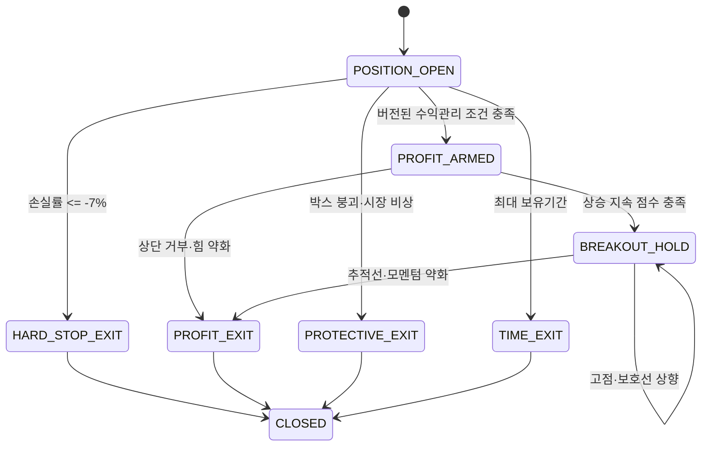

# 손절·익절·계좌 위험 통합 정책

- 문서 등급: 최상위 위험 기준
- 적용 계좌: 신규 1,000만 원 단기매매 계좌만

## 1. 정책 우선순위

1. 평균 체결가 대비 -7% 강제 손절
2. 사용자의 조기 전량 매도
3. 계좌 손실·장애 한도
4. 적응형 익절과 수익보호
5. 최대 보유기간 시간청산

익절·AI·박스·반등 예상은 -7% 손절을 취소하거나 지연할 수 없다. 일반 신규매수 킬스위치도 보호 매도를 막지 않는다.

## 2. -7% 강제 손절

```text
average_entry_price = sum(fill_price × fill_qty) / sum(fill_qty)
hard_stop_price = normalize_to_tick(average_entry_price × 0.93, conservative=true)
```

실시간 체결가, 즉시 매도 가능한 최우선 매수호가 또는 KIS 잔고 기준 평가손익률 중 하나가 -7% 임계값에 도달하면 사용자 재확인 없이 매도 가능 수량 전부를 시장가로 매도한다.

### 실행

1. KIS 잔고에서 포지션과 매도 가능 수량을 확인한다.
2. `(account, symbol, position_generation, HARD_STOP)` 멱등키를 잠근다.
3. 전량 시장가 매도를 제출한다.
4. 주문·체결·부분체결을 추적한다.
5. 잔고가 0이 될 때까지 허용된 재조회·재주문을 수행한다.
6. 실제 손익과 실패·재시도를 감사 로그와 긴급 이메일에 남긴다.

`-7%`는 발동 기준이지 체결가 보장이 아니다. 갭 하락, 하한가, 거래정지, 유동성, 네트워크·KIS 장애로 실제 손실이 더 커질 수 있으며 시스템은 가능한 첫 시점에 계속 청산한다.

## 3. 단계형 자동매도 개선판

고정 `-7%` 절대 손절 앞에 시장·종목의 하락 강도를 사용하는 조기 보호 구간을 둔다. 이 구간은 손절을 늦추는 장치가 아니라 더 이른 청산 가능성을 검증하는 `PAPER_CHALLENGER`다. 초기 정책 버전명은 `protective-exit-v0`이며 충분한 재생·모의 검증과 사용자 승격 승인 전에는 실전 안정판에 적용하지 않는다.

| 구간 | 상태 | 기본 동작 |
| --- | --- | --- |
| 손실 `0~-3%` | `NORMAL_MONITORING` | 정상 감시 |
| 손실 `-3% 이하` | `EARLY_DEFENSE` | 종목 자체 매도압력·약세 또는 시장 비상 신호가 임계값을 충족하면 전량 시장가 청산 |
| 손실 `-5% 이하` | `HARD_DEFENSE_MINUS_5` | 다른 신호를 기다리지 않고 매도 가능 수량 전부를 시장가 청산 |
| 손실 `-7% 이하` | `HARD_STOP` | 다른 모든 판단을 무시하고 매도 가능 수량 전부를 시장가 청산 |

모의 정책 `exit-defense-profit-paper-v2-minus5-floor`에서는 `-5%`를 절대 방어선으로
고정한다. `-3%` 조기 방어의 신호·임계값은 종목별 변동성, 거래비용, 오탐 청산과
추가 손실 방지 효과를 같은 데이터로 비교해 버전 관리한다. 어떤 개선판도 `-5%`
방어선이나 `-7%` 최종 손절을 취소하거나 확인 시간을 추가할 수 없다.

### 조기 방어 입력

- 손익: 평균 체결가, 최우선 매수호가, 현재가, 당일·보유기간 MAE
- 체결: 최근 10초·30초·1분·3분 매수·매도 주도 체결대금, 체결강도, 매도 가속
- 호가: 1~5호가 잔량 불균형, 매수호가 소진·보강, 스프레드와 예상 슬리피지
- 추세: 1분·5분 고점·저점, VWAP 이탈·회복, 거래량 증가 대비 가격 전진 여부
- 시장: KOSPI·업종 수익률, 하락 종목 비율, 프로그램 매도 사이드카, 서킷브레이커, 선물·환율 등 가용 스트레스 지표
- 시스템: WebSocket·REST 신선도, 주문·잔고 대조, 거래정지와 데이터 이상

투자자별 외국인·기관 일별 수급은 후보와 사후 분석에는 사용하지만 긴급 청산의 초단기 단독 신호로 사용하지 않는다. 실시간 조기 청산에는 체결 주도 방향과 호가를 우선한다.

### 결정 규칙

```text
if loss_pct <= -7:
    HARD_STOP_MARKET
elif loss_pct <= -5:
    HARD_DEFENSE_MARKET
elif loss_pct <= -3 and (
    mean(symbol_sell_pressure, symbol_weakness) >= local_threshold
    or symbol_sell_pressure >= strong_sell_threshold
    or market_stress >= panic_threshold
    or market_risk_off
):
    PROTECTIVE_EXIT_MARKET
else:
    HOLD
```

- `EARLY_DEFENSE`의 로컬 점수는 종목 자체의 매도압력과 약세만 사용한다. 시장
  스트레스가 아직 수집되지 않아 `0`이어도 조기 방어가 수학적으로 불가능해지지 않는다.
- 모의 v2의 로컬 조기 방어 임계값은 `0.62`, 강한 개별 매도압력은 `0.72`,
  시장 패닉은 `0.75`다.
- `MARKET_PANIC`, 사이드카·서킷브레이커, 호가 공백, 급격한 갭 하락에서는 지속시간을 생략할 수 있다.
- 시장 비상상태는 신규매수를 즉시 차단하지만 기존 보유종목의 보호 감시를 중단하지 않는다.
- 여러 매도 신호가 동시에 발생하면 `-7% HARD_STOP` → `-5% HARD_DEFENSE` →
  `-3% EARLY_DEFENSE` 순으로 감사 사유를 기록한다.
- 주문 실행기는 정책 판단을 다시 해석하지 않고 멱등한 `ExitIntent`를 전량 시장가 주문으로 변환한다.
- WebSocket이 끊겨 종목 신호를 만들 수 없는 경우에도 독립 REST 가격 감시가
  `-5%`와 `-7%` 가격 방어선을 실행한다.
- `EARLY_DEFENSE`, `HARD_DEFENSE_MINUS_5`, `HARD_STOP_MINUS_7`의 최종 체결은
  모두 로컬 SMTP 큐로 자동손절 체결 메일을 발송한다.
- `ADAPTIVE_PROFIT_FLOOR`를 포함한 수익 보호·익절·시간 청산도 최종 전량
  체결을 확인하면 로컬 SMTP 큐로 `자동매도 체결완료.` 메일을 한 번
  발송한다. 매도 원인과 평균 체결가·실현수익률을 포함하고 부분체결
  중간 상태에서는 발송하지 않는다.

### 갭 하락

전일 보유 포지션이 시초가부터 `-7%` 아래면 조기 방어 판단 시간이 없으므로 첫 주문 가능 시점에 절대 손절한다. `-3%·-5%` 개선은 장중 연속 하락의 피해를 줄일 수 있지만 야간 갭 자체를 막지 못한다. 장전 예상체결가와 시장 스트레스에 따른 동시호가 청산은 KIS 주문 가능 시간·주문유형을 공식 계약 테스트로 확인한 뒤 별도 버전으로 검증한다.

## 4. 적응형 익절

익절에는 `+7%` 같은 고정 불변 활성 기준을 두지 않는다. `-7%` 손절만 절대 규칙이며, 수익 중이거나 손절선에 도달하기 전이라도 박스 붕괴, 상승 힘 약화, 시간 초과, 시장 비상, 데이터·주문 보호 조건이 발생하면 전량 청산할 수 있다.

AI 에이전트는 장 마감 후 모의투자 결과를 분석해 익절 후보 로직과 임계값을 제안한다. 장중에는 외부 LLM 응답을 기다리지 않고 사용자 승인과 검증을 거친 `profit_engine_version`의 결정적 로컬 엔진이 실행한다. 개선·검증·승격 절차는 [`PROFITABILITY_IMPROVEMENT.md`](PROFITABILITY_IMPROVEMENT.md)를 따른다.



### 입력

- 체결강도, 매수·매도 주도 체결, 순매수 체결대금
- 1~5호가 잔량 불균형, 매수호가 보강·소진, 스프레드
- 거래량·거래대금 가속
- 1분봉·5분봉 고저점, EMA 기울기, VWAP, ATR
- 시장·업종 방향과 급락 상태
- 평균 체결가, 현재 수익률, 최고가, 보유시간, 비용 차감 손익

```text
continuation_score = execution + aggressive_buy_flow + orderbook
                     + volume_acceleration + trend_1m + trend_5m
                     + vwap_hold + market_regime
                     - upper_rejection - liquidity_penalty - stale_penalty
```

점수 가중치, 활성 조건과 임계값은 `profit_engine_version`으로 관리한다. 단일 틱으로 상태를 바꾸지 않되 급락과 수익보호선 이탈은 확인 시간을 기다리지 않는다. 수익률 하나만으로 보유 또는 청산을 결정하지 않는다.

### 상단 돌파 보유

- 상단 위 체결과 1분봉 종가 유지
- 매수 주도 체결대금과 거래대금 동반 증가
- 매도잔량 실제 흡수와 매수호가 보강
- VWAP 위에서 1분·5분 추세 동시 상승
- 고점과 저점 동반 상승

### 상단 거부·청산

- 돌파 후 1분봉 종가가 박스 안으로 복귀
- 큰 거래량에도 전진하지 못하고 윗꼬리 반복
- 체결강도·순매수 체결대금 급감 또는 반전
- 매수호가 소진과 스프레드 확대
- 1분 하락과 5분 둔화 동시 확인
- 시장·업종 급락 전환

## 5. 수익보호선

```text
trail_distance = clamp(ATR_1m × atr_multiplier, minimum_trail, maximum_trail)
candidate_floor = highest_price_since_armed - trail_distance
profit_floor = max(previous_profit_floor, break_even_after_cost, candidate_floor)
```

- 한번 올라간 수익보호선은 절대 낮아지지 않는다.
- 왕복 수수료·세금·예상 슬리피지를 포함한다.
- 현재가 또는 최우선 매수호가가 보호선 이하이면 전량 청산한다.
- 강한 상단 거부는 보호선 전에도 청산할 수 있다.
- 외부 LLM 응답을 실시간 주문 경로에서 기다리지 않는다.

AI는 장 마감 후 거래와 최고수익 반납폭을 분석하고 개선안을 제안한다. 신규 버전은 백테스트·모의·그림자 비교 후에만 승격한다.

## 6. 계좌 위험 규칙

### 확정

- 동시 관찰 1~3개
- 사용자 `ENTRY_MANDATE` 범위 밖 매수 금지
- 동일 종목 추가매수·물타기 금지
- 주문가능현금은 사용자 승인 비율로 분할하고 각 몫을 체결·취소까지 예약하며 균등 분할은 UI 기본값
- 부분체결 수량도 즉시 -7% 손절과 보호 감시 적용
- 손절 후 같은 종목 당일 재진입 금지
- 주문 승인 시 최대 보유기간 설정, 초기 제안 3거래일
- 신용·미수·대주·레버리지 별도 결정 전 금지
- 기존 계좌 자금이체 자동화 금지

### 실계좌 전 사용자 확정 필요

| 설정 | 상태 |
| --- | --- |
| 종목당 최대 매수금액 | 주문가능현금 × 사용자 승인 배정률 |
| 전체 동시 투입금액 | KIS 주문가능현금의 최대 100%, 정수 수량·비용 잔액 허용 |
| 일일 실현손실 중단 한도 | TBD |
| 주간 실현손실 검토 한도 | TBD |
| 월간 최대낙폭 중단 기준 | TBD |
| 하루 최대 거래 횟수 | TBD |
| 기본 최대 보유기간 | 초기 제안 3거래일 |

TBD가 남아 있으면 실전 신규매수를 활성화하지 않는다.

## 7. 손절 후 시장위험 가드

`-7%` 손절 체결 직후 `PostStopRiskAssessor`를 실행한다. 사용자가 말한 손절 사이드킥의 공식 명칭은 `시장위험 가드(MarketRegimeGuard)`로 한다.

즉시 수행:

1. 손절 종목을 당일 `SYMBOL_QUARANTINED`로 전환해 재진입을 금지한다.
2. 원인 판별 동안 계좌 전체 신규 진입을 `NEW_BUY_DISABLED`로 일시 차단한다.
3. 다른 보유종목의 시세 수신, -7% 손절, 익절, 잔고대조는 계속 실행한다.
4. 종목·업종·시장·시스템 상태 스냅샷을 저장하고 AI 분석을 요청한다.

판별 입력:

- 손절 종목의 공시·뉴스·거래량·호가·동종업종 대비 상대수익률
- KOSPI와 업종지수 수익률·하락 종목 비율·거래대금·변동성
- 외국인·기관·프로그램 수급과 지수선물 흐름
- 원/달러, 글로벌 선물 등 사용 가능한 시장 스트레스 지표
- 다른 관찰·보유종목의 동시 하락과 손절 군집
- WebSocket 지연, 가격 이상치, 잔고 불일치 등 시스템 건전성

결과 상태:

| 판정 | 진입 동작 | 보유 포지션 |
| --- | --- | --- |
| `IDIOSYNCRATIC_DROP` | 해당 종목만 당일 금지, 계좌 재개는 냉각시간·정책 충족 후 | 기존 보호 규칙 유지 |
| `SECTOR_RISK_OFF` | 해당 업종 신규진입 차단 | 보호 규칙 유지 |
| `MARKET_RISK_OFF` | 모든 신규진입 차단·관망 모드 | 보호 규칙 유지, 승인된 규칙만 보수화 |
| `SYSTEM_FAULT` | 모든 신규진입 차단·`SYSTEM_DEGRADED` | 대체 시세와 잔고대조, 보호 매도 유지 |
| `INCONCLUSIVE` | 신규진입 차단 유지 | 보호 규칙 유지 |

AI는 원인 분류와 설명을 돕지만 회로 차단 자체는 로컬 결정 엔진이 집행한다. AI 실패·지연의 기본값은 `INCONCLUSIVE`다. 단일 종목 손절만으로 다른 보유종목을 자동 전량매도하지 않으며, 계좌 전체 청산은 별도 사전 규칙 또는 사용자 명시 승인 없이 실행하지 않는다.

시장·업종 판정 임계값, 냉각시간, 재개조건은 `market_regime_version`으로 관리하고 백테스트·모의 검증 전에는 `TBD`다. `TBD` 상태에서는 손절 후 당일 신규진입 차단을 보수적 기본값으로 사용한다.

## 8. 신규매수 차단

- 일·주·월 손실 한도 도달
- KIS 토큰·계좌·실전/모의 환경 이상
- 잔고·주문 상태 불일치
- WebSocket과 REST 모두 신선도 초과
- 후보·AI 결과 `STALE`
- 시장 비정상 상태
- 동일 종목 보유 또는 재진입 금지
- 승인 만료·최대가격·주문금액 초과

이 상태에서도 기존 포지션 보호 매도는 유지한다.

## 9. 장애와 재시작

- WebSocket 단절 시 REST 현재가·잔고 폴링으로 전환한다.
- 주문 타임아웃 시 재주문 전에 주문·체결 내역을 조회한다.
- 프로세스 재시작 시 KIS 잔고·주문·체결을 기준으로 포지션 세대·평균가·손절가·최고가·보호선을 복구한다.
- 핵심 데이터가 복구되지 않으면 신규 보유 연장을 금지하고 설정된 유예 후 보수적으로 청산한다.
- KIS와 내부 원장이 다르면 신규매수를 차단하고 KIS 상태로 재구축한다.

## 10. 실제 시장 사례 재생과 지속 개선

실제 급락일을 `risk_case_id`가 있는 불변 재생 사례로 보존한다. 원시 체결·호가를 확보하지 못한 과거 사례는 1분봉만으로 체결강도를 추정하지 않고 `PARTIAL_EVIDENCE`로 표시한다.

각 사례에는 다음을 기록한다.

- 종목, 평균 체결가 가정, 시세·체결·호가·시장 이벤트와 공급자 시각
- 기존 `-7%` 청산 시점과 `-3%·-5%` 개선판 청산 시점
- 실제 또는 보수적 다음 체결가, 슬리피지, 비용 차감 손익
- 조기 청산 뒤 최대 추가 하락과 최대 반등
- 피한 손실, 불필요한 조기 청산, 재진입 기회비용
- 사용한 `risk_policy_version`, 데이터 완성도와 결과 해시

### CASE-20260728-KOSPI-PANIC

- 상태: `PARTIAL_EVIDENCE`, 오전 KIS 1분봉과 공식 시장 이벤트 확인
- 시장: 09:06 프로그램 매도 사이드카, 10:13:43 KOSPI 서킷브레이커
- 시장 이벤트 출처: [연합뉴스 2026-07-28](https://en.yna.co.kr/view/AEN20260728003200320), [뉴스1 2026-07-28](https://v.daum.net/v/20260728103243281)
- SK하이닉스: 전일 대비 약 `-8.5%`로 시작해 오전 저점 약 `-13.2%`; 전일 보유자는 시초가부터 절대 손절 구간
- 삼성전자: 전일 대비 약 `-6.1%`로 시작해 09:08~09:10경 `-7%`, 오전 저점 약 `-11.4%`; 시장위험 결합 `-5%` 청산의 비교 사례
- LG전자: 전일 대비 약 `-4.2%`로 시작해 09:12경 `-5%`, 10:53경 `-7%`; `-3%` 조기 감시와 `-5%` 강한 방어의 비교 사례
- 한계: 당시 보유자의 실제 평균 체결가와 실시간 매수·매도 주도 체결·호가 원본이 없으므로 수익 개선을 확정하지 않는다.

일일 사례가 들어와도 실전 임계값을 자동 변경하지 않는다. 사례 등록 → 재생 비교 → 모의 그림자 → 충분한 표본 검토 → 사용자 승인 순서로만 승격한다.

## 11. 필수 검증

- -7% 경계, 갭, 하한가, 부분체결, 중복 틱, 재시작
- 손절과 익절 동시 신호 시 손절 우선
- 수익보호선 단조 증가
- 고정 익절 대비 순이익·최대낙폭·최고수익 반납률
- 데이터 단절과 주문 응답 유실
- 기존 장기계좌 비적용
- 사용자 승인 없는 매수 0건
- 한 종목 손절 뒤 신규진입은 차단되지만 다른 보유종목의 보호 감시는 계속됨
- 종목 고유 하락·업종 하락·시장 급락·시스템 오류 분류 시나리오
- AI 시장판단 실패 시 `INCONCLUSIVE`와 보수적 진입 차단
- `-3%·-5%` 조기 청산 개선판과 `-7%` 기준판의 비용 차감 손익·MAE·오탐 청산 비교
- 사이드카·서킷브레이커 전후 거래 공백과 재개 시 슬리피지
- 체결·호가 데이터 결측 시 조기 방어는 보수적으로 비활성화하되 `-7%` 절대 손절은 유지
# 2026-07-28 익일 장전 보호 연결

전일 보유 포지션의 NXT 장전 감시와 KRX 예상 시초가 보호 판단은
[`NXT_OVERNIGHT_PROTECTION.md`](NXT_OVERNIGHT_PROTECTION.md)를 단일 기준으로
사용한다. 이 기능은 현재 `PAPER_CHALLENGER`이며 실제 KIS 모의 장전·시초가
계약 테스트가 끝나기 전에는 실전 승격하지 않는다.
# KOSPI 시장 전체 위험 게이트

시장 전체 위험은 종목 자체의 손익·체결강도와 별도로 계산한다.

| 상태 | 의미 | 신규매수 | 열린 포지션 |
| --- | --- | --- | --- |
| `NORMAL` | 정상 | 허용 | 기존 보호 로직 |
| `CAUTION` | 시장 스트레스 상승 | 진입 조건 강화·대기 | 기존 보호 로직 |
| `RISK_OFF` | 광범위 하락 또는 수급 악화 확인 | 차단·미체결 매수 취소 대상 | 감시·매도 유지 |
| `PANIC` | 서킷브레이커급 급락 또는 극단적 시장 폭 붕괴 | 즉시 차단 | 조기 방어와 -7% 강제손절 유지 |

초기 모의 정책 `kospi-market-guard-paper-v2`는 KOSPI 등락률, 하락 종목 비율, 전체 거래대금 대비 외국인 순매수 비율, 프로그램 순매수 가속을 결합한다. 일반 `RISK_OFF`는 3회 연속 표본으로 확인하지만 `PANIC`과 공급자 데이터 불완전은 지연 없이 신규매수를 차단한다.

시장 이메일은 위험 단계가 실제로 상향될 때만 발송한다. `NORMAL →
CAUTION`, `CAUTION → RISK_OFF`, `RISK_OFF → PANIC` 같은 악화는 알리되,
시장 상태전환은 대시보드·DB에 기록하지만 사용자 요청에 따라 이메일을
보내지 않는다. 시장 위험 판단과 신규매수 차단·열린 포지션 보호는 메일
활성 여부와 무관하게 계속 동작한다.

외국인 순매도와 연기금 등 순매수의 동시는 시장 방어 의도를 증명하지 않는다. 이 조합은 `FOREIGN_OUTFLOW_PENSION_ABSORPTION_PROXY`라는 관찰 근거로만 기록하고, 지수 하락·시장 폭·프로그램 매도와 함께 악화될 때 위험도를 높인다.
