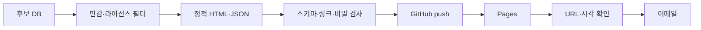

# 운영·이메일·대시보드 통합 가이드

## 1. 장 시작 전

1. 운영 호스트 시간과 `Asia/Seoul`을 확인한다.
2. KIS 토큰, App Key 환경, 모의/실전 계좌를 확인한다.
3. KIS 잔고·미체결·체결과 내부 포지션을 대조한다.
4. WebSocket과 후보 구독을 테스트한다.
5. SMTP 최근 성공 상태를 확인한다.
6. 손절·익절 버전과 위험 한도를 확인한다.
7. 중요 실패가 있으면 신규매수를 차단하고 이메일을 보낸다.

## 2. 장 마감 후

1. 일별 데이터 완전성 검사
2. 정량 후보 30개 생성
3. AI가 후보 30개 전체 등급·코멘트 검토
4. 정적 대시보드 생성과 비밀·라이선스 검사
5. GitHub Pages 배포·URL 확인
6. 후보 이메일
7. 데이터·계산·모델·프롬프트 버전 기록
8. 일일 자동화 품질 체크리스트 실행과 실전·모의 결과 대조
9. `DAILY_ASSURANCE` 보고서 생성·이메일 발송

## 3. 장중

- 사용자 지정 1~3개만 집중 감시한다.
- 하단 접근·반등 이메일은 중복 억제한다.
- 사용자 `ENTRY_MANDATE`가 없거나 만료되면 매수하지 않는다.
- 유효한 위임 안에서만 정량 진입조건과 AI 정책을 결합해 자동 타이밍을 결정한다.
- 체결 후 손절·익절·시간청산을 활성화한다.
- 열린 포지션이 있으면 운영 호스트 절전·자동 재부팅을 금지한다.

## 4. 이메일 등급

| 등급 | 사건 | 정책 |
| --- | --- | --- |
| `INFO` | 후보 30개 AI 등급 리포트·장 마감 | 1회 |
| `WATCH` | 하단 접근 | 상태별 중복 억제 |
| `ACTION` | 반등 확인·승인 필요 | 즉시, 승인 만료 포함 |
| `TRADE` | 주문·부분/완전체결·청산 | 상태 변경마다 |
| `CRITICAL` | -7% 손절·주문 실패·잔고 불일치·감시 중단 | 즉시·미해결 반복 |
| `HEARTBEAT` | 장 시작·마감 정상 확인 | 정해진 시각 |
| `DAILY_ASSURANCE` | 자동화 품질·실전/모의 대조·변경 요약 | 매 거래일 장 마감 후 1회 |

알림에는 종목, 기준시각, 가격·박스, 근거, 데이터 신선도, 주문·체결 상태를 포함한다. 계좌번호는 별칭 또는 끝 4자리만 표시하고 키·토큰·SMTP 비밀번호는 절대 포함하지 않는다.

### 발송 실패

1. DB 큐에 `PENDING` 저장
2. 지수 백오프로 제한 재시도
3. 대시보드·운영 API에 `NOTIFICATION_DEGRADED`
4. 주문 엔진은 계속 실행
5. 복구 후 중요 알림 재발송

## 5. GitHub Pages

- 코드 저장소: `https://github.com/sungha-uu/danta`
- 공개 리포트 저장소: `https://github.com/sungha-uu/danta_report`
- 공개 URL: `https://sungha-uu.github.io/danta_report/`
- 배포 기준: `danta_report`의 `main` 브랜치 루트

Pages는 정량 후보 30개 전체의 AI 등급·코멘트·수급·박스 정보를 보여주는 정적 분석 프런트엔드일 뿐 주문·계좌 서버가 아니다.

공개 가능:

- 종목명·코드, 데이터 시각
- 7·14·21일 박스와 현재 위치, 자체 생성 가격 미니차트
- 일중 진폭·저점 반등·+5%·+10%·+15% 도달·현재 가격 공간·거래대금·공개 수급
- 정량·AI 점수, 근거·위험, 공개 차트
- 공개 뉴스 링크와 비신뢰 참고용 토론 요약

공개 금지:

- 계좌·보유수량·매입금액·주문·체결
- 키·Secret·토큰·실행 호스트 네트워크 관리정보
- 이메일·SMTP 설정·승인 메시지
- 재배포 권한이 없는 원시 실시간 데이터

최초 화면과 일일 공식 후보는 14거래일 기준이다. 상단의 7·14·21일 버튼을 누르면 순위·AI 코멘트·기간수익률·박스·차트·거래량·거래대금·수급을 포함한 모든 기간형 데이터를 같은 창으로 동시에 전환한다. 기간 혼합을 검증 오류로 처리한다. Pages는 KIS·뉴스 API를 직접 호출하지 않고 운영 호스트가 정제한 공개 JSON만 사용한다.

배포 결과는 CSS·JavaScript·공개 JSON을 내장한 단일 `index.html`과 `.nojekyll`이며 GitHub Pages에서 별도 웹 애플리케이션 서버 없이 동작한다. 기간 전환·필터·선택·기본 숨김인 상단 선택창의 단일 토글·미니차트는 파일에 포함된 브라우저 JavaScript만 사용한다. 개발 중 `python -m http.server`는 로컬 확인 수단일 뿐 운영 구성요소가 아니다.

2026-07-26에는 KRX 실제 데이터로 2026-07-24 기준 후보 30개 보고서를 생성했고 KIS 모의 서버의 현재가 교차검증까지 통과했다. 그러나 `box-quant-v1+kis-quote-verified`는 일봉 종가 기반이므로 1분봉 원본·60분봉 구조 정책 확정 이후 `RESEARCH_ONLY`로 강등했다. 데이터·정적 배포 파이프라인 검증에는 보존하지만 집중 감시, `ENTRY_MANDATE`, 모의·실전 신규매수에 사용하지 않는다. 운영 후보는 `intraday-elasticity-v4.1-entry-gated` 검증과 배포 이후에만 활성화한다.

같은 날 `prefilter-balanced-v1`로 KOSPI 177개를 확정하고 최근 7거래일 1분봉 1,239개 종목-거래일 파일, 약 71.5MiB를 최초 백필했다. 168개 종목은 7일 정규장 커버리지 게이트를 전부 통과했고 9개는 일부 거래일 표본 부족으로 구조 후보에서 제외했다. 실제 1분봉을 49개 60분봉으로 집계하고 날짜별 일중 진폭·저점 이후 반등·+5%·+10%·+15% 도달·현재 가격 공간·하단 방향과 진입 위치 게이트를 계산한 후보 30개 `intraday-elasticity-v4.1-entry-gated-prefilter-balanced-v1` 보고서는 뉴스·공시 AI 검토 전이므로 `RESEARCH_ONLY`다. 14일·21일은 일별 수익률·수급만 표시하고 구조 필드는 실제 누적 전까지 `WARMING_UP`으로 둔다.

같은 날 실제 보고서를 `sungha-uu/danta_report` Pages에 배포하고 HTTP·브라우저 렌더링을 확인했으며, 설정된 수신자 2명에게 실제 보고서 링크 메일을 발송했다.

2026-07-26 데모 리포트의 최초 Pages 배포와 HTTPS 200 응답을 확인했고, 로컬 SMTP 모듈로 데모 배포 알림을 발송했다. 실제 데이터 전환 후에는 `DEMO DATA` 표시가 제거된 배포 응답을 확인한 뒤 두 번째 알림을 발송한다.



예약 작업은 운영 호스트가 수행하고 GitHub Actions는 빌드·배포에만 사용한다. 실패하면 이전 페이지를 `STALE`로 표시한다.

### 코멘트·Android Codex 원격 지시

GitHub Pages는 보고서 확인과 후보별 분석 코멘트 작성에 사용한다. 코멘트 자체는 주문 또는 감시 명령이 아니다.

1. 사용자가 Pages에서 보고서를 읽고 후보에 코멘트를 남긴다.
2. 사용자가 Android Codex 앱에서 이 PC의 에이전트에게 코멘트를 확인하고 작업하라고 지시한다.
3. PC 에이전트가 코멘트의 최신 버전·작성자·시각을 확인한다.
4. 에이전트가 내용을 `WATCH_SELECT`, `ENTRY_MANDATE`, 단순 메모로 구분한다.
5. 필수값이 있으면 로컬 FastAPI 제어 API에 명령을 기록하고, 없으면 사용자에게 확인한다.
6. 로컬 오케스트레이터가 DB·Outbox에서 명령을 받아 워커 상태를 변경한다.

Android Codex 지시는 원격 작업 개시 채널이지만, 모호한 “작업해” 문장은 매수 위임으로 확대 해석하지 않는다. 자동매수에는 대시보드가 생성한 구조화된 `ENTRY_MANDATE` 승인문이 필요하다.

대시보드의 후보 체크박스와 상단 선택창의 종목별 진입 목표가·주문가능현금 배정률은 최대 3개까지 선택하는 브라우저 로컬 값이다. 종합표에는 중복 목표가·비율 입력란을 두지 않는다. 정적 Pages는 값을 PC로 전달할 수 없으므로 사용자가 `자동매수 승인문 복사` 후 Android Codex 앱에 붙여넣는다. 공개 GitHub Issues·댓글·URL 쿼리에 목표가를 기록하지 않는다. 에이전트는 `ENTRY_MANDATE`의 종목·목표가·사용자 배정률·현재 잠긴 모드·박스 유효성을 검증하고 로컬 수신부에서 명령 ID를 부여한다.

로컬 제어 API 필수조건:

- 단일 사용자 강한 인증, 재인증 또는 2차 확인
- CSRF 방어, 허용 Origin 고정, TLS
- `command_id`, nonce, 만료시각, 재전송 멱등성
- Codex 지시 ID와 대시보드 코멘트 ID를 상관관계로 기록
- 관찰 선택과 진입 위임을 별도 명령으로 분리
- 종목·목표가·사용자 배정률·현재 계좌 모드·정책버전 표시 후 확인
- 모든 명령 원문 해시·정규화 결과·처리 상태 감사
- 비밀·계좌·주문 응답을 코멘트·브라우저 저장소·Pages 산출물에 보존 금지

PC 에이전트에서 로컬 FastAPI로의 연결은 기본적으로 loopback에서만 허용한다. 외부에 주문 API 포트를 공개하지 않는다. Android 앱은 로컬 API를 직접 호출하지 않고 Codex 사용자 지시만 전달한다.

## 6. 재시작과 장애

### 재시작

1. 신규 주문 차단
2. KIS REST 토큰·WebSocket 접속키·연결 복구
3. 미체결·주문·잔고 조회
4. KIS 잔고·주문·체결 기준으로 내부 원장 대조
5. 평균가·세대·손절가·최고가·보호선 복구
6. 현재 청산 조건 즉시 평가
7. 대조 성공 후 신규매수 허용

### WebSocket 단절

- `DEGRADED`, REST 현재가·잔고 폴링, 신규매수 차단
- 보호 매도 유지, 재연결 후 누락 구간 복구

### 주문 응답 불명확

- 동일 주문 즉시 반복 금지
- KIS 주문·미체결·체결 조회
- 주문이 없음을 확인한 뒤에만 재시도

### 잔고 불일치

- 신규매수 중단
- KIS 기준 내부 원장 재구축
- 수동 HTS 주문 조사
- 보정 내역 감사·긴급 이메일

## 7. 킬스위치

- `NEW_BUY_DISABLED`: 신규매수만 차단
- `SYSTEM_DEGRADED`: 신규매수 차단·REST 대체 감시
- `SECTOR_RISK_OFF`: 특정 업종 신규진입 차단
- `MARKET_RISK_OFF`: 전체 신규진입 차단·관망, 기존 보호 감시 유지
- `EMERGENCY_FLATTEN`: 사용자 명시 승인 또는 사전 정의 치명 장애 시 전량 청산

일반 킬스위치로 -7% 보호 매도를 끌 수 없다.

## 8. 문제 발생과 누적 학습

장애·오류를 해결할 때는 [`TROUBLESHOOTING.md`](TROUBLESHOOTING.md)의 절차와 형식을 따른다.

- 주문 영향 가능성이 있으면 먼저 신규매수를 차단한다.
- 오류코드·상관 ID·환경·시각을 수집하되 비밀은 기록하지 않는다.
- 임시 재시도로 정상화돼도 원인이 불명확하면 해결 완료로 처리하지 않는다.
- 코드·설정·운영절차를 바꿨으면 재현·회귀 테스트와 트러블슈팅 기록을 같은 변경에서 남긴다.
- 열린 포지션의 보호 감시와 -7% 손절은 조사 중에도 계속 실행한다.

## 9. AI 사용량과 예산 관리

### 두 예산을 분리한다

| 예산 | 사용처 | 측정 |
| --- | --- | --- |
| Codex Plus | 이 개발 세션, Android/PC Codex 지시, Codex 자동화 | Codex `/status`·TUI `/usage` 스냅샷 |
| OpenAI API | Python이 직접 호출하는 후보 검토·뉴스 분석 등 | 응답 usage 토큰, API 비용·예산 |

ChatGPT/Codex Plus 구독은 OpenAI API 과금과 동일한 자원이 아니다. Python 자동화가 API Key로 모델을 호출하면 Plus 사용량이 아니라 별도 API 사용량·비용으로 기록한다.

개인 Plus 잔여량을 Danta 서비스가 읽는 공식 API는 현재 공식 Codex 문서에서 확인되지 않는다. 브라우저나 앱 화면을 스크래핑하지 않는다. 사용자가 Codex의 `/status` 또는 TUI `/usage` 결과를 확인하거나 에이전트에게 알려주면 `ai_usage_snapshots`에 다음만 기록한다.

```text
observed_at, source_surface, plan, window_type, remaining_pct,
reset_at, model, notes
```

원시 계정정보·결제정보·세션 토큰은 저장하지 않는다. 정확한 기간과 초기화 시각은 화면에 표시된 값을 사용하고 주간·월간으로 추정하지 않는다. 월간 리포트는 Danta가 자체적으로 집계한 작업 횟수·API 토큰·비용·AI 폴백 횟수다.

### 확인 시점

- 장 마감 AI 후보 검토 전
- 장중 AI 정책을 새로 만들기 전
- 긴 개발 세션 시작과 종료 시
- 사용량 경고 또는 제한 메시지가 발생했을 때
- 매주 운영 리뷰와 매월 비용 리뷰

사용량 확인 자체를 AI 반복 호출로 구현하지 않는다.

### 초기 예산 상태

Plus 화면에서 잔여율을 제공할 때 사용하는 초기 운영값이며 실제 사용 패턴에 따라 조정한다.

| 상태 | Plus 잔여율 | 동작 |
| --- | ---: | --- |
| `GREEN` | 30% 이상 | 정상 운영 |
| `YELLOW` | 15% 이상 30% 미만 | 비필수 재분석·장문 보고 축소, 정량 캐시 우선 |
| `RED` | 5% 이상 15% 미만 | AI는 후보 최종검토·사용자 지시·중요 장애에 우선 배정 |
| `CRITICAL` | 5% 미만 또는 제한 도달 | 비필수 AI 중단, 정량 폴백, 사용자에게 크레딧·플랜·API 전환 판단 요청 |

잔여율만 보지 않고 `reset_at`까지의 예상 소모율을 함께 본다. 두 번 연속 현 속도로 초기화 전에 소진될 것으로 예상되면 한 단계 높은 경고를 적용한다.

OpenAI API에는 별도의 일·월 비용 소프트 한도와 하드 한도를 둔다. 금액은 사용자 확정 전 `TBD`이며, 하드 한도가 없으면 운영 자동 AI 호출을 활성화하지 않는다.

### 개입 축소 우선순위

먼저 줄이는 것:

1. 같은 데이터에 대한 반복 AI 재평가
2. 장문의 개발 설명·비필수 문서 요약
3. 뉴스 중복 요약과 저우선 사후 분석
4. 최종 후보 외 종목에 대한 AI 분석

유지하는 것:

1. 사용자 Android Codex 지시 처리
2. 하루 한 번 최종 후보 검토
3. 중대한 장애 원인 분석
4. 손절 후 시장위험 설명

AI 사용량과 관계없이 로컬 Python이 계속 수행하는 것:

- 시세 수집과 데이터 품질 검사
- -7% 손절, 익절, 시간청산
- 잔고·미체결·체결 대조
- 킬스위치와 시장위험의 결정적 1차 차단
- 일일 품질 체크리스트, 보고서 생성과 SMTP 발송

### 플랜·구조 변경 조건

다음 중 하나가 2주 연속 발생하면 Plus 크레딧 추가, 상위 플랜, 별도 API 예산 중 하나를 검토한다.

- 사용량 때문에 일일 최종 후보 검토가 누락됨
- Android Codex 지시를 처리할 여유가 부족함
- 매주 `RED` 또는 `CRITICAL`에 도달함
- 정량 폴백 비율이 목표 운영일의 20%를 초과함
- AI 사용량을 아끼기 위해 위험 분석 품질을 낮춰야 하는 상황이 발생함

개발 중 대량·반복 분석과 운영 중 정해진 형식의 AI 검토가 늘어나면, Plus 세션에 전부 의존하기보다 별도 API 예산으로 분리해 토큰·비용·실패율을 정확히 계측하는 것을 우선 검토한다.

### 공식 확인 자료

- [Codex 가격과 Plus·Pro·API Key 옵션](https://learn.chatgpt.com/docs/pricing)
- [Codex `/status`·`/usage` 명령](https://learn.chatgpt.com/docs/developer-commands.md?surface=cli)
- [OpenAI API 사용량 페이지](https://platform.openai.com/usage)

## 10. 실전 전환 후 모의투자 병행

실전 전환은 모의투자의 종료가 아니다. 운영 주기와 승격 기준은 [`QUALITY_AND_VALIDATION.md`](QUALITY_AND_VALIDATION.md)를 단일 기준으로 사용한다.

- 실전은 승인된 `LIVE_CHAMPION`만 사용한다.
- `PAPER_SHADOW`는 실전판을 매 거래일 재현해 신호·주문·체결 차이를 감시한다.
- `PAPER_CHALLENGER`는 신규 로직을 검증하며 실전 주문 권한이 없다.
- 문제는 매일 점검하지만 실전 전략을 매일 자동 변경하지 않는다.
- 치명 점검 실패 시 신규매수만 차단하고 기존 보유 포지션 보호는 유지한다.
- 장 후 일일 이메일, 주간 이상 추세 검토, 월간 승격 심사, 분기·사건 기반 전면 감사를 수행한다.
