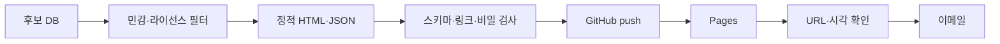

# 운영·이메일·대시보드 통합 가이드

### 2026-07-29 지정가 이메일 작업 사용량 기록

- 측정시각: 2026-07-29 08:27 KST
- Codex Plus 잔여량: 로컬 공식 조회 인터페이스가 없어 `NOT_AVAILABLE`
- 별도 OpenAI API 사용량: `0`; 지정가 산정과 이메일은 로컬 Python 경로
- 보호 원칙: 사용량 상태와 무관하게 주문 감시·자동매도·이메일 큐를 유지

### 2026-08-05 후보 누락 분석 작업 사용량 기록

- 측정시각: 2026-08-05 KST
- Codex Plus 잔여량: 로컬 공식 조회 인터페이스가 없어 `NOT_AVAILABLE`
- 별도 OpenAI API 사용량: `0`; 과거 동결 보고서·분봉·로컬 성과 요약으로 분석
- 보호 원칙: 후보 개선 작업과 무관하게 기존 포지션 보호 감시·강제 손절·체결
  알림을 유지한다.

## 1. 장 시작 전

1. 운영 호스트 시간과 `Asia/Seoul`을 확인한다.
2. KIS 토큰, App Key 환경, 모의/실전 계좌를 확인한다.
3. KIS 잔고·미체결·체결과 내부 포지션을 대조한다.
4. WebSocket과 후보 구독을 테스트한다.
5. SMTP 최근 성공 상태를 확인한다.
6. 손절·익절 버전과 위험 한도를 확인한다.
7. 중요 실패가 있으면 신규매수를 차단하고 이메일을 보낸다.

## 2. 장 마감 후

매 거래일 정규장 종료 직후 `15:31 Asia/Seoul`에 `Danta-Close-Prefetch-1531`이 기존 시총 상위 200개의 당일 1분봉을 먼저 증분 수집한다. `16:00`에는 `Danta-Daily-1600`이 KRX 당일 데이터와 변경된 시총 상위 200개를 확정하고 재무·후보·대시보드를 갱신한다. 16:00 데이터가 아직 준비되지 않았거나 네트워크가 일시 실패하면 16:10·16:20·16:30에 같은 일자를 재시도한다. 해당 거래일 성공 표식이 있으면 뒤의 재시도는 아무 작업 없이 종료한다. 토·일요일에는 실행하지 않고, 평일 휴장일은 KRX 최신 거래일이 당일과 다르면 게시하지 않는다.

1. 일별 데이터 완전성 검사와 당일 거래일 확인
2. Danta 독립 Open DART 재무 스냅샷 증분 갱신
3. 시가총액 상위 200개를 공식 주문 후보로 생성하고 정량 상위 50개를 AI 심층검토
4. AI가 공식 후보 전체를 7·14·21일별 등급·코멘트로 검토
5. 정적 대시보드 생성과 비밀·라이선스 검사
6. GitHub Pages 배포·URL 확인
7. 후보 이메일
8. 데이터·계산·모델·프롬프트 버전 기록
9. 일일 자동화 품질 체크리스트 실행과 실전·모의 결과 대조
10. `DAILY_ASSURANCE` 보고서 생성·이메일 발송
11. 당일 상위 50개 AI 판정을 동결하고 과거 스냅샷의 1·3·5거래일 추천
    성과를 갱신한다. 추천·비추천 대조 결과는 분석 모델 개선 자료로만
    사용하며 운영 추천 정책을 자동 변경하지 않는다.
12. 매 거래일 `15:35 Asia/Seoul`에 KIS 모의계좌의 당일 주문·체결,
    보유종목, 평가손익과 계좌 자산을 다시 조회해 자율 모의투자 마감
    스냅샷을 저장하고 제목 `# 자율 모의투자 현황`으로 요약 메일을
    1회 발송한다. KIS 체결·잔고가 내부 기록과 다르면 불일치를 명시하고
    신규매수는 차단하되 보호매도는 유지한다.

## 3. 장중

- 사용자 지정 1~3개만 집중 감시한다.
- 하단 접근·반등 이메일은 중복 억제한다.
- 사용자 `ENTRY_MANDATE`가 없거나 만료되면 매수하지 않는다.
- 유효한 위임 안에서만 정량 진입조건과 AI 정책을 결합해 자동 타이밍을 결정한다.
- 체결 후 손절·익절·시간청산을 활성화한다.
- 열린 포지션이 있으면 운영 호스트 절전·자동 재부팅을 금지한다.

## 4. 이메일 등급

자동진입 지정가가 산정되면 거래 알림 큐가 다음의 간결한 메일을 보낸다.

- 제목: `지정가격 산정완료.`
- 본문: `종목명 가격원`
- 여러 종목은 종목별 개행으로 표현하며 계좌번호·주문번호·비밀정보는 넣지
  않는다.
- 발송 실패나 지연이 주문 제출, 체결 감시, `-7%` 손절을 지연시키지 않는다.
- `HARD_STOP_MINUS_7` 전량 체결 시 제목 `자동손절 체결완료.`, 본문
  `종목명 평균매도가 실현수익률` 형식으로 즉시 알린다.
- 장중 30분 주기 상태 메일은 보내지 않는다. `WAIT_PRICE`,
  `WAIT_SELL_PRESSURE`, `WAIT_STABILIZATION`, 지정가 산정, 주문·체결·취소
  같은 상태 전환과 런타임·시세·주문 이상만 사건 기반으로 알린다.
- 상세 AI 분석은 모든 틱에서 호출하지 않는다. 사용자가 Codex에 확인을
  요청하거나 특이사항 이벤트가 기록된 경우에만 에이전트가 로컬 감사 로그와
  상태 스냅샷을 읽어 설명한다.

| 등급 | 사건 | 정책 |
| --- | --- | --- |
| `INFO` | 적격 후보 전체 AI 등급 리포트·장 마감 | 1회 |
| `WATCH` | 하단 접근 | 상태별 중복 억제 |
| `ACTION` | 반등 확인·승인 필요 | 즉시, 승인 만료 포함 |
| `TRADE` | 주문·부분/완전체결·청산 | 상태 변경마다 |
| `CRITICAL` | -7% 손절·주문 실패·잔고 불일치·감시 중단 | 즉시·미해결 반복 |
| `HEARTBEAT` | 장 시작·마감 정상 확인 | 정해진 시각 |
| `DAILY_ASSURANCE` | 자동화 품질·실전/모의 대조·변경 요약 | 매 거래일 장 마감 후 1회 |
| `PAPER_DAILY_CLOSE` | 자율 모의투자 매수·매도·보유·수익률 요약 | 매 거래일 15:35 1회 |

알림에는 종목, 기준시각, 가격·박스, 근거, 데이터 신선도, 주문·체결 상태를 포함한다. 계좌번호는 별칭 또는 끝 4자리만 표시하고 키·토큰·SMTP 비밀번호는 절대 포함하지 않는다.

### 자율 모의투자 마감 메일

- 모의 자율 캠페인이 활성화된 거래일에만 발송하며 실계좌에서는
  무조건 거부한다.
- 제목은 정확히 `# 자율 모의투자 현황`이다.
- 본문에는 기준일시, 당일 매수·매도 체결내역, 미체결 주문, 현재
  보유종목의 수량·평균매입가·현재가·평가손익률, 주문가능현금,
  보유주식 평가손익, 계좌 순자산과 최초 원금 50,000,000원 대비 누적손익·누적수익률을
  포함한다.
- 당일 주문이 없거나 보유종목이 없어도 각각 `없음`으로 명시한다.
- 같은 거래일 성공 표식이 있으면 중복 발송하지 않는다. 조회나 발송이
  실패하면 성공 표식을 만들지 않고 제한 재시도하며, 실패 자체는
  주문 감시와 보호매도를 중단시키지 않는다.
- 첫 성공 스냅샷이나 캠페인 승인시점 평가액을 별도 기준점으로 만들지 않는다.
  KIS가 제공하는 당일 자산증감률·보유주식 평가손익률과 최초 원금 기준 누적
  수익률을 혼합하지 않고 구분해 표시한다.

### 발송 실패

1. DB 큐에 `PENDING` 저장
2. 지수 백오프로 제한 재시도
3. 대시보드·운영 API에 `NOTIFICATION_DEGRADED`
4. 주문 엔진은 계속 실행
5. 복구 후 중요 알림 재발송

## 5. GitHub Pages

- 코드 저장소: `https://github.com/sungha-uu/danta`
- 공개 리포트 저장소: `https://github.com/sungha-uu/danta_report`
- 공개 URL: `https://sungha-uu.github.io/danta_report/`
- 배포 기준: `danta_report`의 `main` 브랜치 루트

Pages는 공식 주문 후보 200개의 정량 정보와 상위 50개의 AI 등급·코멘트·수급·박스 근거를 보여주는 정적 분석 프런트엔드일 뿐 주문·계좌 서버가 아니다.

공개 가능:

- 종목명·코드, 데이터 시각
- 7·14·21일 박스와 현재 위치, 자체 생성 가격 미니차트
- 일중 진폭·저점 반등·+5%·+10%·+15% 도달·현재 가격 공간·거래대금·공개 수급
- 정량·AI 점수, 근거·위험, 공개 차트
- 공개 뉴스 링크와 비신뢰 참고용 토론 요약

공개 금지:

- 계좌·보유수량·매입금액·주문·체결
- 키·Secret·토큰·실행 호스트 네트워크 관리정보
- 이메일·SMTP 설정·승인 메시지
- 재배포 권한이 없는 원시 실시간 데이터

최초 화면과 일일 공식 후보는 14거래일 기준이다. 상단의 7·14·21일 버튼을 누르면 순위·AI 코멘트·기간수익률·박스·차트·거래량·거래대금·수급을 포함한 모든 기간형 데이터를 같은 창으로 동시에 전환한다. 기간 혼합을 검증 오류로 처리한다. Pages는 KIS·뉴스 API를 직접 호출하지 않고 운영 호스트가 정제한 공개 JSON만 사용한다.

배포 결과는 CSS·JavaScript·공개 JSON을 내장한 단일 `index.html`과 `.nojekyll`이며 GitHub Pages에서 별도 웹 애플리케이션 서버 없이 동작한다. 기간 전환·필터·선택·기본 숨김인 상단 선택창의 단일 토글·미니차트는 파일에 포함된 브라우저 JavaScript만 사용한다. 개발 중 `python -m http.server`는 로컬 확인 수단일 뿐 운영 구성요소가 아니다.

2026-07-26에는 KRX 실제 데이터로 2026-07-24 기준 후보 30개 보고서를 생성했고 KIS 모의 서버의 현재가 교차검증까지 통과했다. 그러나 `box-quant-v1+kis-quote-verified`는 일봉 종가 기반이므로 1분봉 원본·60분봉 구조 정책 확정 이후 `RESEARCH_ONLY`로 강등했다. 데이터·정적 배포 파이프라인 검증에는 보존하지만 집중 감시, `ENTRY_MANDATE`, 모의·실전 신규매수에 사용하지 않는다. 운영 후보는 `intraday-elasticity-v4.1-entry-gated` 검증과 배포 이후에만 활성화한다.

같은 날 `prefilter-balanced-v1`로 KOSPI 177개를 확정하고 최근 7거래일 1분봉 1,239개 종목-거래일 파일, 약 71.5MiB를 최초 백필했다. 168개 종목은 7일 정규장 커버리지 게이트를 전부 통과했고 9개는 일부 거래일 표본 부족으로 구조 후보에서 제외했다. 실제 1분봉을 49개 60분봉으로 집계하고 날짜별 일중 진폭·저점 이후 반등·+5%·+10%·+15% 도달·현재 가격 공간·하단 방향과 진입 위치 게이트를 계산한 후보 30개 `intraday-elasticity-v4.1-entry-gated-prefilter-balanced-v1` 보고서는 뉴스·공시 AI 검토 전이므로 `RESEARCH_ONLY`다. 14일·21일은 일별 수익률·수급만 표시하고 구조 필드는 실제 누적 전까지 `WARMING_UP`으로 둔다.

같은 날 실제 보고서를 `sungha-uu/danta_report` Pages에 배포하고 HTTP·브라우저 렌더링을 확인했으며, 설정된 수신자 2명에게 실제 보고서 링크 메일을 발송했다.

2026-07-26 데모 리포트의 최초 Pages 배포와 HTTPS 200 응답을 확인했고, 로컬 SMTP 모듈로 데모 배포 알림을 발송했다. 실제 데이터 전환 후에는 `DEMO DATA` 표시가 제거된 배포 응답을 확인한 뒤 두 번째 알림을 발송한다.

같은 날 정량 상위 50종목 감사 풀의 14·21거래일 1분봉 백필을 완료했다. 적격 후보 3개는 7·14·21일 모두 `READY`이며 차트는 각각 49·98·147개 60분봉을 갖는다. 14일·21일 단계별 Pages 배포와 설정 수신자 2명 메일 발송을 확인했다. 이후 `candidate-review-v1-quant-flow-news-20260726` AI 리뷰에서 현대모비스는 세 기간 `추천`, 두산로보틱스·에코프로머티는 긴 기간 하락 추세와 약한 수급 때문에 `비추천·적극 비추천`으로 평가했다.

AI 사용량 확인 시각은 2026-07-26 13:56 KST다. 이번 리뷰는 현재 Codex Plus 세션에서 공식 후보 3개만 대상으로 수행했고 별도 유료 AI API 호출은 사용하지 않았다. Codex Plus 잔여 주간·월간 수치는 로컬 자동화에서 조회할 공식 인터페이스가 없어 `측정 불가`로 기록한다. 잔여량을 확인할 수 없다는 이유로 등급을 추정해 채우지 않았으며, 3개 전체 리뷰가 완료된 뒤에만 AI 보고서를 게시했다.

### 2026-07-28 독립 재무·16시 자동화 작업 사용량 기록

- 측정시각: 2026-07-28 20:36 KST
- Codex Plus 잔여량: 로컬에서 공식 잔여량을 읽을 수 있는 인터페이스가 없어 `NOT_AVAILABLE`
- 별도 유료 AI API: 이번 구현·로컬 정량 실행에서는 사용하지 않음
- 폴백 원칙: 사용량을 추정해 기록하지 않으며 후보 산출·손절·잔고대조·일일 이메일은 외부 LLM 할당량과 무관한 로컬 Python 경로를 유지한다.

### 2026-07-28 독립 재무·16시 갱신 최초 운영 검증

- Open DART 독립 재무 스냅샷: 시총 상위 200개 요청, 198개 저장, 기업 매핑·보고서 미확보 2개, 공급자 오류 0개
- 분봉 백본: 상위 200개 × 21거래일 = 4,200 종목-거래일 완료
- 공식 후보: 14일 자격 게이트 통과 30개, 자격 위반 0개, 7·14·21일 고정 순번 일치
- 자동검증: Ruff·mypy 통과, pytest 139개 통과
- Pages 커밋: `3a9989835fc94d8c920306259373c7b078238db8`
- 브라우저 검증: 기준시각 2026-07-28 15:30 KST, 후보 30/30, 7일 탭 전환, 14일·21일 60분봉 팝업, 21거래일 첫·마지막 날짜, 뉴스·공시·토론 표시, 콘솔 오류 0건 확인
- 이메일: 최초 검증 배포 성공 후 설정된 수신자에게 완료 알림 발송

### 2026-07-28 KIS 모의투자 활성화

- 활성 범위: KIS 모의계좌만 `PAPER_ACTIVE`, 실계좌 주문은 계속 차단
- 사전 보증: 사용자 승인, -7% 무확인 자동손절, 실계좌 잠금, 모의환경, 진입·청산 정책 승인, 모의주문 게이트, KIS 비밀파일, DB `0002_execution_runtime`, 런타임 회귀 테스트 모두 `PASS`
- KIS 실연결: 모의 토큰, 삼성전자 현재가, 잔고 0종목, WebSocket 승인키 모두 `PASS`
- 주문 절차: Pages에서 1~3개·최대 매수가·배정률 선택 → `ENTRY_MANDATE` 복사 → 사용자가 Codex에 전달 → 로컬 검증 → `paper-trade --execute`
- 보호 규칙: 목표가는 최대 매수가이며 추격매수 금지, 부분체결 즉시 보호, 평균 체결가 대비 -7% 전량 시장가 손절, 실계좌 게이트 `false`
- 활성 Pages 커밋: `da16475a24fad0cd90e45d8394795ce56b39e417`
- 공개 검증 URL: `https://sungha-uu.github.io/danta_report/?verify=da16475a24fad0cd90e45d8394795ce56b39e417`
- 브라우저 검증: `60분봉 운영 후보`, 후보 30/30, 활성 체크박스, 선택 즉시 14일 기간 최저가 105,800원 자동 입력, 1종목 배정률 100.0%, 승인문 복사 완료 알림, 선택 초기화, 콘솔 경고·오류 0건을 확인했다.
- 계좌 상태: 활성화 직전 KIS 모의 잔고 0종목. 활성화와 화면 검증만 수행했으며 사용자 종목 지정과 `ENTRY_MANDATE` 전달 전에는 주문을 제출하지 않았다.

### 사용자의 수동 실계좌 미러링

- 사용자가 실계좌에서 모의 엔진과 같은 종목을 직접 보유하고 모의 자동매도
  신호를 따라 수동 대응할 수 있다.
- Danta는 현재 실계좌 주문을 제출하지 않는다. 자동손절·수익보호·익절로
  모의 포지션의 전량 매도가 체결되면 각각 `자동손절 체결완료.` 또는
  `자동매도 체결완료.` 메일을 반드시 발송한다.
- 사용자는 이 메일을 실계좌 HTS/MTS에서 직접 판단·주문하기 위한 알림으로
  사용한다. 모의 체결과 실계좌 체결가·수량은 동일하다고 가정하지 않는다.
- 사용자가 알려준 실계좌 수량과 평균가는 공개 문서·Git·Pages에 기록하지
  않고 Git 제외 로컬 운영 파일에만 보관한다.

### 2026-07-28 실제 기간 최저가·최고가 표시 교정

- 원인: 사용자 열 `기간 최저가·기간 최고가`에 실제 원본 극값이 아니라 내부
  10·90분위 박스 경계를 노출했다.
- 교정: 표·차트 기준선·현재 위치·선택창 자동 목표가는 실제 원본 1분봉
  최저가·최고가로 통일하고, 분위값 경계는 과거 반복 반등 자격 내부값으로 분리했다.
- 계산 버전: `intraday-actual-10pct-gate-v13-visible-extrema-top200-official30-all-reviewed-kospi-market-cap-top200-v1`
- 전수 검증: 공식 후보 30개 × 7·14·21일 READY 창 90개의 표시 고저가와 차트
  실제 극값, 현재가 범위, 마지막 종가, 최저가 × 1.10 목표가 불일치 0건.
- 하이닉스 14일: 현재가·기간 최저가 1,550,000원, +10% 목표가
  1,705,000원, 기간 최고가 2,329,000원, 현재 위치 0.0%, 공식 순위 4위.
- Pages 커밋: `474330036b0c5b3c1e9976c50574f6281f7d7d84`
- 공개 브라우저 검증: 하이닉스 행의 네 가격·현재 위치, 선택 시 목표가
  1,550,000원·배정률 100.0% 자동 입력, 30개 행, 콘솔 경고·오류 0건 확인.



예약 작업은 운영 호스트가 수행하고 GitHub Actions는 빌드·배포에만 사용한다. 설치 명령은 `scripts/install_daily_refresh_task.ps1`, 16시 실행 진입점은 `scripts/run_daily_refresh.ps1`이다. 실행 로그와 성공 표식은 `data/daily-runs`에 보존한다. 실패하면 이전 페이지를 덮어쓰지 않고 다음 예약 시각에 재시도한다.

### 16:00 일일 갱신 원자성

1. 당일 KRX 데이터와 21거래일 1분봉 증분이 모두 준비되기 전에는 공개 보고서를 교체하지 않는다.
2. 재무 스냅샷 수집 실패는 후보 가격 계산을 망가뜨리지 않으며 해당 종목에 `FINANCIAL_DATA_UNAVAILABLE`을 남긴다.
3. 정적 HTML을 임시 경로에서 완성하고 비밀검사를 통과한 뒤에만 `danta_report`로 복사한다.
4. Git 커밋·푸시가 실패하면 성공 표식을 만들지 않고 기존 Pages를 유지한다.
5. Pages의 새 `data_as_of`가 당일 거래일과 일치하는지 HTTP와 브라우저에서 확인한 뒤 완료 이메일을 보낸다.

### 코멘트·Android Codex 원격 지시

GitHub Pages는 보고서 확인과 후보별 분석 코멘트 작성에 사용한다. 코멘트 자체는 주문 또는 감시 명령이 아니다.

1. 사용자가 Pages에서 보고서를 읽고 후보에 코멘트를 남긴다.
2. 사용자가 Android Codex 앱에서 이 PC의 에이전트에게 코멘트를 확인하고 작업하라고 지시한다.
3. PC 에이전트가 코멘트의 최신 버전·작성자·시각을 확인한다.
4. 에이전트가 내용을 `WATCH_SELECT`, `ENTRY_MANDATE`, 단순 메모로 구분한다.
5. 필수값이 있으면 로컬 FastAPI 제어 API에 명령을 기록하고, 없으면 사용자에게 확인한다.
6. 로컬 오케스트레이터가 DB·Outbox에서 명령을 받아 워커 상태를 변경한다.

Android Codex 지시는 원격 작업 개시 채널이지만, 모호한 “작업해” 문장은 매수 위임으로 확대 해석하지 않는다. 자동매수에는 대시보드가 생성한 구조화된 `ENTRY_MANDATE` 승인문이 필요하다.

예외적으로 사용자가 `PAPER_AUTONOMOUS_CAMPAIGN`을 승인하고 비공개 캠페인 파일을
활성화한 기간에는 KIS 모의계좌가 완전 유휴일 때 추천 후보의 내부 승인문을 자동
생성할 수 있다. 캠페인 파일과 상태는 `private/`에만 두고 Git에 올리지 않는다.
`private/PAPER_AUTONOMY_STOP` 파일 생성은 신규매수 kill switch이며, 제거해도
캠페인 만료·환경·계좌·시장·일일 신규 배치 검사를 우회하지 않는다. 캠페인 중지나
만료는 기존 포지션의 보호 감시와 자동매도를 중단하지 않는다.

2026-07-31 사용자 승인으로 `paper-auto-1f084b9350d44e8f` 캠페인을
2026-10-29 10:04 KST까지 활성화했다. 첫 자동 배치는 최신 에이전트 심층검토
보고서의 14일 순위와 등급으로 생성되었고, KIS 모의 주문가능금액 조회
52,857,251원 및 내부 명령 활성화를 확인했다. 실제 주문접수·체결·취소·청산은
진입 엔진 조건이 발생하는 대로 감사 로그에 계속 누적한다.

자율 캠페인은 내부 승인문을 제출한 직후 먼저
`자율 모의투자 종목 선정완료.` 메일을 보내고, 이어서 해당 배치의 최대 매수가를
`지정가격 산정완료.` 메일로 발송한다. 종목 선정 메일은 종목마다
`종목명 AI등급 현재가 박스위치`를 한 줄로 표시한다. 이후 실시간 안정화 조건을 통과해 실제
주문 직전 지정가가 결정되면 기존 주문 단계 메일도 발송한다. 매수·매도 메일은
KIS 체결조회에서 전체 체결이 확인된 뒤 발송한다.

자율 캠페인은 공개 Pages JSON을 실시간 원본으로 사용하지 않는다. 16:00 기준
보고서는 종목·AI 등급·과거 7·14·21일 구조를 제공하고, 배치 생성 직전 상위
심층검토 후보의 KIS 현재가를 다시 조회해
`private/paper_autonomous_live_overlay.json`에 저장한다. 전일 기준 보고서가 직전
평일보다 오래되면 `REPORT_STALE`로 신규매수를 차단한다. 공개 대시보드는 정적
기준 보고서로 유지하고 주문 판단용 실시간 오버레이는 비공개로 유지한다.

16시 일일 파이프라인과 자율 캠페인은
`data/candidate_intraday_ai_report.json`을 단일 기준 보고서로 사용한다.
`candidate_intraday_public_report.json`은 과거 정량 전용 산출물이며 자율매매
입력으로 사용하지 않는다.

2026-07-31 확인 결과 예약 작업이 설치되어 있지 않아 보고서가 2026-07-29에서
멈춰 있었다. `Danta-Close-Prefetch-1531`, `Danta-Daily-1600`을 현재 사용자
Windows 작업 스케줄러에 설치했고, 오래된 첫 자율 배치는 주문·포지션 0건 상태에서
취소했다.

대시보드의 후보 체크박스와 상단 선택창의 종목별 진입 목표가·주문가능현금 배정률은 최대 3개까지 선택하는 브라우저 로컬 값이다. 종합표에는 중복 목표가·비율 입력란을 두지 않는다. 정적 Pages는 값을 PC로 전달할 수 없으므로 사용자가 `자동매수 승인문 복사` 후 Android Codex 앱에 붙여넣는다. 공개 GitHub Issues·댓글·URL 쿼리에 목표가를 기록하지 않는다. 에이전트는 `ENTRY_MANDATE`의 종목·목표가·사용자 배정률·현재 잠긴 모드·박스 유효성을 검증하고 로컬 수신부에서 명령 ID를 부여한다.

로컬 제어 API 필수조건:

- 단일 사용자 강한 인증, 재인증 또는 2차 확인
- CSRF 방어, 허용 Origin 고정, TLS
- `command_id`, nonce, 만료시각, 재전송 멱등성
- Codex 지시 ID와 대시보드 코멘트 ID를 상관관계로 기록
- 관찰 선택과 진입 위임을 별도 명령으로 분리
- 종목·목표가·사용자 배정률·현재 계좌 모드·정책버전 표시 후 확인
- 모든 명령 원문 해시·정규화 결과·처리 상태 감사
- 비밀·계좌·주문 응답을 코멘트·브라우저 저장소·Pages 산출물에 보존 금지

PC 에이전트에서 로컬 FastAPI로의 연결은 기본적으로 loopback에서만 허용한다. 외부에 주문 API 포트를 공개하지 않는다. Android 앱은 로컬 API를 직접 호출하지 않고 Codex 사용자 지시만 전달한다.

## 6. 재시작과 장애

### 재시작

1. 신규 주문 차단
2. KIS REST 토큰·WebSocket 접속키·연결 복구
3. 미체결·주문·잔고 조회
4. KIS 잔고·주문·체결 기준으로 내부 원장 대조
5. 평균가·세대·손절가·최고가·보호선 복구
6. 현재 청산 조건 즉시 평가
7. 대조 성공 후 신규매수 허용

### WebSocket 단절

- `DEGRADED`, REST 현재가·잔고 폴링, 신규매수 차단
- 보호 매도 유지, 재연결 후 누락 구간 복구

### 주문 응답 불명확

- 동일 주문 즉시 반복 금지
- KIS 주문·미체결·체결 조회
- 주문이 없음을 확인한 뒤에만 재시도

### 잔고 불일치

- 신규매수 중단
- KIS 기준 내부 원장 재구축
- 수동 HTS 주문 조사
- 보정 내역 감사·긴급 이메일

## 7. 킬스위치

- `NEW_BUY_DISABLED`: 신규매수만 차단
- `SYSTEM_DEGRADED`: 신규매수 차단·REST 대체 감시
- `SECTOR_RISK_OFF`: 특정 업종 신규진입 차단
- `MARKET_RISK_OFF`: 전체 신규진입 차단·관망, 기존 보호 감시 유지
- `EMERGENCY_FLATTEN`: 사용자 명시 승인 또는 사전 정의 치명 장애 시 전량 청산

일반 킬스위치로 -7% 보호 매도를 끌 수 없다.

## 8. 문제 발생과 누적 학습

장애·오류를 해결할 때는 [`TROUBLESHOOTING.md`](TROUBLESHOOTING.md)의 절차와 형식을 따른다.

- 주문 영향 가능성이 있으면 먼저 신규매수를 차단한다.
- 오류코드·상관 ID·환경·시각을 수집하되 비밀은 기록하지 않는다.
- 임시 재시도로 정상화돼도 원인이 불명확하면 해결 완료로 처리하지 않는다.
- 코드·설정·운영절차를 바꿨으면 재현·회귀 테스트와 트러블슈팅 기록을 같은 변경에서 남긴다.
- 열린 포지션의 보호 감시와 -7% 손절은 조사 중에도 계속 실행한다.

## 9. AI 사용량과 예산 관리

### 두 예산을 분리한다

| 예산 | 사용처 | 측정 |
| --- | --- | --- |
| Codex Plus | 이 개발 세션, Android/PC Codex 지시, Codex 자동화 | Codex `/status`·TUI `/usage` 스냅샷 |
| OpenAI API | Python이 직접 호출하는 후보 검토·뉴스 분석 등 | 응답 usage 토큰, API 비용·예산 |

ChatGPT/Codex Plus 구독은 OpenAI API 과금과 동일한 자원이 아니다. Python 자동화가 API Key로 모델을 호출하면 Plus 사용량이 아니라 별도 API 사용량·비용으로 기록한다.

개인 Plus 잔여량을 Danta 서비스가 읽는 공식 API는 현재 공식 Codex 문서에서 확인되지 않는다. 브라우저나 앱 화면을 스크래핑하지 않는다. 사용자가 Codex의 `/status` 또는 TUI `/usage` 결과를 확인하거나 에이전트에게 알려주면 `ai_usage_snapshots`에 다음만 기록한다.

```text
observed_at, source_surface, plan, window_type, remaining_pct,
reset_at, model, notes
```

원시 계정정보·결제정보·세션 토큰은 저장하지 않는다. 정확한 기간과 초기화 시각은 화면에 표시된 값을 사용하고 주간·월간으로 추정하지 않는다. 월간 리포트는 Danta가 자체적으로 집계한 작업 횟수·API 토큰·비용·AI 폴백 횟수다.

### 확인 시점

- 장 마감 AI 후보 검토 전
- 장중 AI 정책을 새로 만들기 전
- 긴 개발 세션 시작과 종료 시
- 사용량 경고 또는 제한 메시지가 발생했을 때
- 매주 운영 리뷰와 매월 비용 리뷰

사용량 확인 자체를 AI 반복 호출로 구현하지 않는다.

### 초기 예산 상태

Plus 화면에서 잔여율을 제공할 때 사용하는 초기 운영값이며 실제 사용 패턴에 따라 조정한다.

| 상태 | Plus 잔여율 | 동작 |
| --- | ---: | --- |
| `GREEN` | 30% 이상 | 정상 운영 |
| `YELLOW` | 15% 이상 30% 미만 | 비필수 재분석·장문 보고 축소, 정량 캐시 우선 |
| `RED` | 5% 이상 15% 미만 | AI는 후보 최종검토·사용자 지시·중요 장애에 우선 배정 |
| `CRITICAL` | 5% 미만 또는 제한 도달 | 비필수 AI 중단, 정량 폴백, 사용자에게 크레딧·플랜·API 전환 판단 요청 |

잔여율만 보지 않고 `reset_at`까지의 예상 소모율을 함께 본다. 두 번 연속 현 속도로 초기화 전에 소진될 것으로 예상되면 한 단계 높은 경고를 적용한다.

OpenAI API에는 별도의 일·월 비용 소프트 한도와 하드 한도를 둔다. 금액은 사용자 확정 전 `TBD`이며, 하드 한도가 없으면 운영 자동 AI 호출을 활성화하지 않는다.

2026-07-26 09:58 KST 개발 재개 시점에는 현재 Codex 데스크톱 환경에서 Plus 잔여율을 직접 읽는 공식 도구가 제공되지 않아 `source_surface=Codex Desktop`, `plan=Plus`, `window_type=unknown`, `remaining_pct=unknown`으로 기록했다. 제한 경고는 관찰되지 않았으며 별도 OpenAI API 호출은 수행하지 않았다. 사용자가 앱의 사용량 화면 값을 제공하면 실제 수치로 갱신한다.

### 개입 축소 우선순위

먼저 줄이는 것:

1. 같은 데이터에 대한 반복 AI 재평가
2. 장문의 개발 설명·비필수 문서 요약
3. 뉴스 중복 요약과 저우선 사후 분석
4. 최종 후보 외 종목에 대한 AI 분석

유지하는 것:

1. 사용자 Android Codex 지시 처리
2. 하루 한 번 최종 후보 검토
3. 중대한 장애 원인 분석
4. 손절 후 시장위험 설명

AI 사용량과 관계없이 로컬 Python이 계속 수행하는 것:

- 시세 수집과 데이터 품질 검사
- -7% 손절, 익절, 시간청산
- 잔고·미체결·체결 대조
- 킬스위치와 시장위험의 결정적 1차 차단
- 일일 품질 체크리스트, 보고서 생성과 SMTP 발송

### 플랜·구조 변경 조건

다음 중 하나가 2주 연속 발생하면 Plus 크레딧 추가, 상위 플랜, 별도 API 예산 중 하나를 검토한다.

- 사용량 때문에 일일 최종 후보 검토가 누락됨
- Android Codex 지시를 처리할 여유가 부족함
- 매주 `RED` 또는 `CRITICAL`에 도달함
- 정량 폴백 비율이 목표 운영일의 20%를 초과함
- AI 사용량을 아끼기 위해 위험 분석 품질을 낮춰야 하는 상황이 발생함

개발 중 대량·반복 분석과 운영 중 정해진 형식의 AI 검토가 늘어나면, Plus 세션에 전부 의존하기보다 별도 API 예산으로 분리해 토큰·비용·실패율을 정확히 계측하는 것을 우선 검토한다.

### 공식 확인 자료

- [Codex 가격과 Plus·Pro·API Key 옵션](https://learn.chatgpt.com/docs/pricing)
- [Codex `/status`·`/usage` 명령](https://learn.chatgpt.com/docs/developer-commands.md?surface=cli)
- [OpenAI API 사용량 페이지](https://platform.openai.com/usage)

## 10. GitHub Pages 실제 브라우저 배포 검증

2026-07-26 `danta_report` 커밋 `806f53c` 배포를 Chrome에서 직접 검증했다.

- 후보 행 3개와 `적격 후보 3` 제목 표시
- 14일·21일 전환 시 활성 기간과 기간 데이터 변경
- 현대모비스 21일 60분봉 상세 팝업의 제목·차트·기준선 범례·시간대별 표 표시
- 현재 배포 URL 기준 JavaScript 콘솔 오류 없음
- 검증 URL: `https://sungha-uu.github.io/danta_report/?verify=806f53c-2`

최초 확인에서는 GitHub Pages 배포 지연으로 이전 파일이 제공되었다. 이후 배포 완료 판정은 커밋 푸시나 HTTP 200만으로 하지 않고, 배포된 파일 버전과 실제 브라우저 렌더링을 함께 확인한다.

같은 날 `danta_report` 커밋 `52c7c5d`의 50개 공개 검토군 배포도 실제 브라우저로 검증했다.

- 기본 필터가 해제된 상태에서 7·14·21일 모두 `50 / 50` 행 표시
- 기간별 1위가 7일 SK하이닉스, 14일 가온전선, 21일 케이씨텍으로 달라져 기간별 순위 재계산 확인
- 14·21일 분봉이 부족한 종목만 구조 칸에 `수집 중`으로 표시되고 다른 종목은 READY 차트 유지
- 케이씨텍 21일 60분봉 팝업에서 제목·21개 거래일 축·기준선 범례·시간대별 OHLCV 표 표시
- 화면의 종목명·한글 문구·50개 행 렌더링에 깨짐이나 공백이 없음을 시각 확인

## 11. 실전 전환 후 모의투자 병행

실전 전환은 모의투자의 종료가 아니다. 운영 주기와 승격 기준은 [`QUALITY_AND_VALIDATION.md`](QUALITY_AND_VALIDATION.md)를 단일 기준으로 사용한다.

- 실전은 승인된 `LIVE_CHAMPION`만 사용한다.
- `PAPER_SHADOW`는 실전판을 매 거래일 재현해 신호·주문·체결 차이를 감시한다.
- `PAPER_CHALLENGER`는 신규 로직을 검증하며 실전 주문 권한이 없다.
- 문제는 매일 점검하지만 실전 전략을 매일 자동 변경하지 않는다.
- 치명 점검 실패 시 신규매수만 차단하고 기존 보유 포지션 보호는 유지한다.
- 장 후 일일 이메일, 주간 이상 추세 검토, 월간 승격 심사, 분기·사건 기반 전면 감사를 수행한다.

## 12. 2026-07-26 공개 컨텍스트 검토 실행 기록

- 입력: 실제 KOSPI 정량 후보 50개, 동일 비교군의 7·14·21일 창
- 검토 엔진: `agent-context-review-v1`
- 규칙 버전: `decline-opportunity-flow-news-discussion-v1-20260726`
- 공개 컨텍스트: Google News RSS 234건, 네이버 금융 종목토론 링크 50개
- 수집 상태: `READY` 50, `PARTIAL` 0, `FAILED` 0
- 구조 상태: 7일 READY 50, 14일 READY 38·WARMING_UP 12, 21일 READY 34·WARMING_UP 16
- 등급은 각 기간의 정량 구조·외국인/기관 수급·뉴스 제목 맥락을 합쳐 산정했다.
- 종목토론은 최신 실제 제목 10건과 원문 확인 링크를 제공하며 점수에는 직접 가산하지 않는다.
- 캐시는 `data/public-context`에 두며 Git과 Pages에는 계좌·주문·비밀정보를 포함하지 않는다.

### Pages 배포 검증

- 보고서 커밋: `ed0fe25`
- 검증 URL: `https://sungha-uu.github.io/danta_report/?verify=ed0fe25`

### 2026-07-26 활성 박스 v1 배포 검증

- 계산판: `intraday-elasticity-v7-active-box-v1-public-review-50-prefilter-balanced-v1`
- 코드 커밋: `c97f15f`
- Pages 커밋: `ff61f90`
- 검증 URL: `https://sungha-uu.github.io/danta_report/?verify=ff61f90-2`
- 실제 브라우저 확인: 후보 50개, 활성 하단권·상단권·후향 관측 재도달/손절·활성 신뢰 열, 7·14·21일 각 50행, 21일 워밍업 표시, 60분봉 팝업을 확인했다.
- 산출물 검사: 활성 구조 무효화선 아래 추천 0개, `LOW` 신뢰 적극 추천 0개.
- 실제 브라우저에서 후보 50개, 에이전트 등급, 뉴스 링크 99개, 토론 링크 50개를 확인했다.
- 케이씨텍 21일 팝업에서 21개 거래일을 확인하고 마지막 07.24·15시까지 가로·세로 스크롤한 상태에서 날짜 열의 `left`가 스크롤 컨테이너의 `left`와 같고 `visibility=visible`, `z-index=2`인 것을 확인했다.

### 2026-07-26 활성 박스 우선순위·워크포워드 v1 검증

- 프로젝트 정의: 튼튼하고 거래 가능한 KOSPI 종목을 먼저 거른 뒤, 현재 유효한 활성 박스를 보유하고 활성 하단권에 있으면서 외국인·기관 자금이 순유입되는 숨은 반등 후보를 찾는다.
- 코드 커밋: `072a633`
- Pages 커밋: `71f9b9a`
- 검증 URL: `https://sungha-uu.github.io/danta_report/?verify=71f9b9a`
- 실제 브라우저에서 7·14·21일 버튼을 각각 눌러 기간별 50행과 서로 다른 1위 종목을 확인했다.
- 21일 60분봉 팝업에서 거래일 21개와 날짜 `06.25`, `06.26`, `06.29`, `06.30`, `07.01` 표시를 확인했고 브라우저 오류 로그는 0건이었다.
- 최초 워크포워드: 177종목 중 평가 가능 52종목, 504개 절단시점. 활성 박스판 35거래의 목표 도달률 31.43%, 거래당 평균 순수익률 -1.92%, 이익계수 0.59였고 기간 박스 기준판은 8.57%, -3.58%, 0.32였다.
- 활성 박스판이 기준판보다 개선됐지만 아직 손실이므로 수익성이 입증된 것으로 보지 않는다. 다음 검증은 신호시점 기준 외국인·기관 과거 수급과 하단 안정화 조건을 누수 없이 추가한다.

### 2026-07-26 실제 +10% 자격 게이트 셀프힐링 검증

- 코드 커밋: `163323d`
- Pages 커밋: `343f543`
- 검증 URL: `https://sungha-uu.github.io/danta_report/?verify=343f543`
- 사용자 표에서 내부 연구용 `활성 하단권·활성 상단권·재도달/손절·활성 신뢰` 네 열을 제거하고 `진입 기준가·+10% 목표가·기간 최고가·+10% 이력`으로 교체했다.
- 7·14·21일의 분봉 준비 완료 후보 112개를 전수 감사했다. 추천 자격 위반 0건, 목표가 불일치 0건, 기간 최고가 대비 산식 불일치 0건, 자격 미달 종목의 선순위 배치 0건이었다.
- 공개 페이지에서 7일 차트 50개, 14일 차트 33개, 21일 차트 29개를 실제로 열고 팝업 제목·차트·날짜 행을 확인했다. 브라우저 오류는 0건이었다.
- 미스토홀딩스는 7일 현재가 44,450원, 진입 기준가 44,560원, +10% 목표가 49,016원, 실제 기간 최고가 48,600원, 성공 0회로 확인되어 에이전트 비추천·24위로 교정됐다.
- 이후 `actual-10pct-gate` 계산판은 같은 전수 감사에 실패하면 정적 HTML 생성과 Pages 배포를 중단한다.

### 2026-07-26 기간 하단 진입 게이트 v9 재검증

- 코드 커밋: `e4b9c2a`
- Pages 커밋: `e43cf4b`
- 검증 URL: `https://sungha-uu.github.io/danta_report/?verify=e43cf4b`
- 이전 점검은 차트 렌더링과 +10% 최고가 조건만 검사하고 기간 박스 경계와 표시 위치가 같은 기준인지 확인하지 않아 아모레퍼시픽 21일 오추천을 놓쳤다.
- v9는 후보 자격·점수·등급·순위·표시 위치를 선택 기간 전체 박스 하단·상단으로 통일하고, 하단 기준 +10% 목표가가 현재가 이하이면 추천을 차단한다.
- 공개 Pages의 READY 후보 120개를 전수 대조했다. 기간 위치 불일치 0건, 추천 자격 위반 0건, 목표가가 현재가 이하인 추천 0건, 자격 미달 선순위 0건이었다.
- 실제 공개 페이지에서 7일 차트 50개, 14일 차트 37개, 21일 차트 33개를 모두 열어 팝업 제목·차트·날짜 행을 확인했고 브라우저 오류는 0건이었다.
- 아모레퍼시픽은 7일 공식 후보 50개 선정 단계에서 제외되어 7·14·21일 공통 비교군에 포함되지 않는다.

### 2026-07-26 원시세 복귀형 급등 소멸 게이트 v5 검증

- 코드 커밋: `8bec3b5`
- Pages 커밋: `2ee633d`
- 검증 URL: `https://sungha-uu.github.io/danta_report/?verify=2ee633d`
- 사용자 승인 표 열은 `기간 최저가 → +10% 목표가 → 기간 최고가` 순서로 확인했고 `진입 기준가·+10% 이력` 열이 없음을 확인했다.
- 21일 `첫 종가≈현재가 + 전반부 25% 이상 급등 + 전반부 최고가 + 최근 상단 10% 이상 하락` 결합 조건을 `원시세 복귀형 급등 소멸`로 적용했다.
- 가온전선과 케이씨텍은 7·14·21일 모두 `에이전트 적극 비추천`으로 제한되고 각 READY 비교군의 최하단으로 이동했다.
- 공개 페이지에서 7일 50행·차트 50개, 14일 50행·차트 37개, 21일 50행·차트 33개를 확인했다. READY 차트 120개를 모두 열어 제목·SVG·날짜 행을 검사했고 실패와 브라우저 오류 로그는 0건이었다.

## 13. 2026-07-27 시총 상위 200개 백필·상위 50개 심층검토

- 모집단: KOSPI 보통주 시가총액 상위 200개
- 분봉 백필: 200개 × 21거래일 = 4,200/4,200 슬롯 완료
- 원본: KIS 모의투자 `1분봉`, 분석봉 `60분봉`
- 계산 버전: `intraday-elasticity-v10-top200-good-pullback-v1-public-review-50-kospi-market-cap-top200-v1`
- 복합 순위: 7일 50%·14일 30%·21일 20%
- 핵심 구분:
  - `GOOD_PULLBACK`: 반복 진폭과 반등폭을 유지하면서 현재가가 하단으로 내려온 눌림
  - `STRUCTURAL_DECLINE`: 상단·하단이 함께 낮아지고 반등폭도 줄어드는 구조적 붕괴
- 공개 검토군: 동일한 50개 종목을 7·14·21일에서 비교
- 심층 컨텍스트: 뉴스·Open DART 공시·네이버 종목토론·투자자 수급 `READY` 50/50
- 7일 에이전트 등급: 적극 추천 4, 추천 8, 비추천 30, 적극 비추천 8
- 구조적 붕괴 추천 이상: 7·14·21일 모두 0건
- 현재가+10% 과거 미접점: 7일 10개이며 전부 추천 미만, 14·21일 0개

### 공개 Pages 검증

- 코드 커밋: `bd89cbb`
- 보고서 커밋: `7831574`
- URL: `https://sungha-uu.github.io/danta_report/?verify=7831574`
- 기본 14일 버튼과 첫 표·차트 기간 동기화 확인
- 7·14·21일 각각 50개 행, 세 기간 종목 집합 동일
- 차트 팝업 150개 전수 클릭: 제목·SVG·정확한 거래일 행·상단/하단/현재가 기준선 실패 0
- 뉴스 표시 50/50, 토론 표시 50/50, 긍정·부정·중립 태그 확인
- 브라우저 콘솔 오류 0

### 통지와 사용량

- SMTP 완료 메일을 설정된 수신자 2명에게 발송
- 단계: `TOP200_21D_AI_REVIEW_COMPLETE`
- Codex Plus 잔여량: 이 실행 환경에서 계정 잔여량을 읽는 공식 로컬 인터페이스가 없어 `NOT_AVAILABLE`로 기록한다. 보호 주문·잔고 대조·일일 이메일은 AI 할당량과 무관한 로컬 Python 경로를 유지한다.

## 14. 2026-07-27 반복 상승 v11·200개 공개·14일 고정 순위

- 계산 버전: `intraday-repeat-rise-v11-top200-fixed14-public-200-ai-review-50-kospi-market-cap-top200-v1`
- 공개 정량 데이터: KOSPI 시총 상위 200개 전부
- 고정 순위: 14일의 `6% 이상 비중복 상승 횟수 → 평균 상승폭 → 평균 6% 도달시간`
- 탭 동작: 7·14·21일 모두 같은 1~200 순번, 기간별 값만 변경
- AI 심층검토: 14일 상위 50개만 뉴스·공시·토론·수급 결합
- AI 미검토: 51~200위 150개는 AI 등급·뉴스·토론 요약을 생성하지 않음
- 실데이터 확인: 후보 200개, 세 기간 순서 불일치 0건, AI 검토 50개, AI 미검토 150개
- 사용량 상태: Codex Plus 계정 잔여량은 로컬 공식 조회 인터페이스가 없어 `NOT_AVAILABLE`; 150개 컨텍스트 수집을 생략해 네트워크·AI 사용량을 제한
- 코드 커밋: `b3c2d55`
- 보고서 커밋: `5221017`
- 검증 URL: `https://sungha-uu.github.io/danta_report/?verify=5221017`
- 로컬 생성 페이지에서 7·14·21일 차트 팝업 600개를 전수 클릭해 제목·반복 상승 요약·SVG·날짜 행 실패 0건을 확인
- 공개 Pages에서 기간별 200행, 세 기간 종목·순번 완전 일치, 삼성전자 이름·코드 검색, 21일 팝업 21개 거래일과 반복 상승 요약을 확인
- SMTP 단계 `REPEAT_RISE_V11_TOP200_FIXED14_COMPLETE` 완료 메일을 설정된 수신자 2명에게 발송

## 15. 2026-07-27 사용자 정렬·60분봉 팝업 축소 배포

- 코드 커밋: `b989e10`
- 보고서 커밋: `56f3fbf`
- 검증 URL: `https://sungha-uu.github.io/danta_report/?verify=56f3fbf`
- 화면의 `하단 방향` 제목을 `상승세`로 바꾸되 계산값은 첫 거래일 저가 대비 마지막 거래일 저가 변화율로 유지했다.
- 정렬 대상은 `상승세·반복 상승폭·반복 횟수·외국인+기관 수급강도·정량점수·에이전트 점수` 여섯 열로 제한했다.
- 공개 Pages에서 여섯 열 모두 `오름차순 → 내림차순 → 해제` 순환을 확인했고, 해제와 순위 버튼에서 1~5위가 다시 `1,2,3,4,5`로 복원됨을 확인했다.
- 21일 탭 전환 뒤 활성 정렬의 `aria-sort=ascending` 유지와 새 기간 값 재정렬을 확인했다.
- 공개 Pages는 200행·정렬 열 6개이며, 21일 팝업에서 거래일 21행·종가 147셀·상세 보조값 0개를 확인했다.
- 동적 표 재렌더링 뒤 가격 흐름 클릭이 끊길 수 있는 구조를 상위 본문 이벤트 위임으로 교체하고 재발 방지 기록을 추가했다.

## 16. 2026-07-29 강한 하락장 조기 방어 정책 변경

- 적용 정책: `exit-defense-profit-paper-v3-trading-minutes`
- 변경: `-5%` 무조건 전량 시장가 방어, `-3%` 종목 자체 매도압력·약세 기반
  조기 방어, REST 감시의 `-5%` 이중 보호
- 적용 범위: 모의투자 개선판. 열린 포지션과 활성 런타임이 없는 상태에서 변경했으며
  과거 `ENTRY_MANDATE`는 자동 재가동하지 않는다.
- Codex Plus 잔여량: 공식 로컬 조회 인터페이스가 없어 `NOT_AVAILABLE`
- 별도 OpenAI API 사용량: 이번 로컬 정책·테스트 변경 `0`
- 측정시각: 2026-07-29 Asia/Seoul
# 장중 시장 전체 모니터링 운영

- KIS REST 수집 기본 주기: 30초
- DB 저장: 매 표본
- 시장 상태전환 SMTP는 사용자 요청으로 비활성화한다. 시장 상태는 계속
  수집해 DB와 대시보드에 기록하고 주문 위험 게이트에도 적용하지만
  `정상·주의·신규매수 중단·시장 비상` 전환 메일은 보내지 않는다.
- 자동매매 SMTP는 `지정가격 산정완료.`, `자동매수 체결완료.`,
  `자동손절 체결완료.` 또는 `자동매도 체결완료.` 단계만 발송한다.
  매도 완료 본문에는 실제 모의 체결가와 평균 매입가 대비 수익률을 포함한다.
- 독립 `market-monitor`의 시장 SMTP는 비활성화한다. 주문 런타임의 내장
  시장 감시는 신규매수 차단·감사 로그·DB·대시보드 갱신을 계속하지만
  시장 상태 메일을 발송하지 않는다.
- 매수·매도 최종체결 메일은 SMTP 호출 전에 `private/notifications/pending`에
  원자적으로 기록한다. 발송 성공 뒤에만 `sent`로 이동하며, 프로세스가 종료되면
  다음 시작에서 pending 항목을 자동 재생한다. 전달 보장은 유실 방지를 우선하는
  at-least-once이므로 SMTP 성공 직후 로컬 완료 기록 전에 PC가 꺼지는 극단적
  경우에는 같은 메일이 한 번 중복될 수 있다.
- 프로세스가 outbox 기록 전 종료된 경우에도 시작 복구가 ACTIVE 승인문의 KIS
  최종체결, SQL 주문 intent·포지션 평균가, `*_FILL_EMAIL_SENT` 감사 로그를
  대조한다. 체결은 존재하지만 발송 로그가 없으면 누락 메일을 outbox에 재구성한다.
- GitHub Pages 요약 JSON: 기본 5분 주기
- 뉴스 수집: 주문 보호 경로와 분리하며 추후 2~5분 캐시 주기로 연결
- 공개 파일: `danta_report/data/market-status.json`

Pages 게시 작업은 별도 비동기 작업으로 수행한다. 게시·Git 오류는 감사 로그에 남기고 다음 주기에 재시도하되 주문 런타임을 종료하지 않는다. 보고서 저장소에 다른 staged 변경이 있으면 자동 커밋을 거부한다.

시장 데이터 수집 오류 또는 `RISK_OFF/PANIC` 확정 시 신규매수 잠금 파일
`private/MARKET_ENTRY_RESUME_REQUIRED`를 생성한다. 시장 수치가 정상으로 돌아와도
자동 해제하지 않는다. 사용자가 시장 현황을 확인한 뒤
`danta market-entry-gate resume --execute`를 실행해야 신규매수가 다시 가능하다.
위험이 남아 있으면 다음 30초 폴링에서 즉시 다시 잠긴다. 잠금 중에도 종목 실시간
감시, 주문 체결 대조, -3%·-5% 방어와 -7% 강제손절은 계속 실행한다.

# 통합 종목 모니터링 운영

- `paper-trade --execute`는 장 종료로 끝나지 않는 단일 장기 실행
  `UnifiedTradingMonitor`를 포함한다.
- 평일 08:00 NXT, 08:30 KRX 예상체결 병행, 09:00 KRX 정규장,
  15:30 NXT 장후, 20:00 무주문 대기 상태로 같은 프로세스 안에서 전환한다.
- 세션 전환은 새 위임이나 새 포지션을 만들지 않는다. 평균체결가·수량·세대,
  주문 큐와 멱등키는 유지한다.
- NXT 이벤트는 장외 보호계획 입력으로만 사용하며 장외 BUY/SELL 주문 의도를
  직접 만들지 않는다. 09시 보호계획 전달 전 KIS 잔고를 다시 대조한다.
- PC 종료·절전·프로세스 종료 시 감시는 중단된다. 실전 승격 전에는 Windows
  시작 시 자동기동·절전 해제·단일 인스턴스·heartbeat 감시를 별도로 통과해야
  한다.
- 사용자는 PC 재부팅 뒤 같은 `trading-runtime --execute`만 수동으로
  실행한다. 일반/복구 시작을 선택하지 않으며 런타임이 항상 KIS와 DB를 먼저
  대조한다.
- 승인문은 `private/commands/inbox`에 원자적으로 투입한다. 런타임은 파일
  변경 이벤트와 5초 안전 폴링으로 감지하고, 진행 중에는 `active`, 완전
  청산·취소·거부 뒤에는 `archive`에 상태 메타데이터와 함께 보관한다.
- 승인문이 없어도 프로세스·heartbeat·시장 세션 전환은 유지한다. 구독할
  종목과 보유 포지션이 없으면 WebSocket을 열지 않고 저부하 `IDLE`로 대기한다.
- 미체결 주문이 없으면 KIS 주문내역 REST를 반복 호출하지 않는다.
- 20:00~08:00 `DORMANT`에는 시세 REST 손절 감시를 호출하지 않는다. 주문 불가
  시간대의 마지막 가격으로 매도를 잘못 제출하지 않으며 08:00 NXT 관찰과
  09:00 KRX 보호 경로로 재개한다.
# 2026-07-30 별도 KOSPI 시장 현황판 운영

- 공개 저장소: `sungha-uu/danta_market_status`
- 공개 URL: `https://sungha-uu.github.io/danta_market_status/`
- 공개 파일: `data/market-status.json`
- 실행 시간: 평일 08:50~15:30
- 로컬 KIS REST 수집: 기본 30초
- 공개 JSON 커밋·푸시: 기본 5분
- Windows 예약 작업: `Danta-Market-Monitor-0850`
- 이메일: 고정 간격으로 반복하지 않고 `NORMAL·CAUTION·RISK_OFF·PANIC` 상태 전환이나 정책이 정의한 의미 있는 수급 급변 시에만 변동 근거와 시장 현황판 URL을 발송한다.
- KIS 일시 호출한도·전송 오류는 해당 표본만 실패로 기록하고 기본 30초 뒤
  재수집한다. 이 오류만으로 예약 작업을 종료하지 않는다.
- Pages 커밋·푸시 실패도 시장 DB 수집과 주문 위험 게이트를 종료하지 않으며,
  다음 게시 주기에 다시 시도한다.

대시보드는 `3-1 후보 danta_report`, `3-2 시장 danta_market_status`, `3-3 계좌·자율매매 실적`으로 분리한다. 3-1과 3-2는 공개 가능 정보만 담은 별도 Pages로 유지한다. 3-3은 계좌·체결·손익을 포함하므로 공개 GitHub Pages에 올리지 않고 인증된 비공개 서버 또는 로컬 화면으로 구현한다.
# 2026-08-05 실계좌 전환 사전 점검 기록

- 점검 시각: 2026-08-05 KST
- Codex Plus 잔여량: 로컬 환경에서 공식 잔여량 수치를 조회할 수 없어 미확인
- 별도 AI API 사용량: 이번 점검은 로컬 코드·DB·KIS 모의계좌 조회만 사용하여 0
- KIS 모의계좌 자율매매 최초 원금: 50,000,000원
- 2026-08-05 순자산 52,728,048원, 누적손익 +2,728,048원, 누적수익률 +5.46%
- 별도의 2026-07-31 캠페인 기준자산·구간 수익률은 폐기하고 이후 보고서에 병기하지 않는다.
- 판정: 추천 성과 표본 부족, 최근 복구 결함, 체결 원장 미기록 때문에 실계좌 전자동 승격 보류

## 17. 2026-08-05 운영 구조·사용량 기록

- 번호 체계: `1 시장 센싱`, `2 자율매매`, `3-1 후보`, `3-2 시장`,
  `3-3 비공개 계좌 실적`, `4 안전·감사 기반`
- 현재 `trading-runtime --execute`가 실행 중이며 내장 시장 센싱은 30초 주기로
  `market_wide_snapshots`와 감사 로그를 갱신한다.
- Codex Plus 잔여량: Codex Desktop에서 공식 잔여율 조회 수단이 없어 `NOT_AVAILABLE`
- 별도 OpenAI API 사용량: 이번 로컬 문서·코드·테스트 변경 `0`
- 측정시각: 2026-08-05 Asia/Seoul
