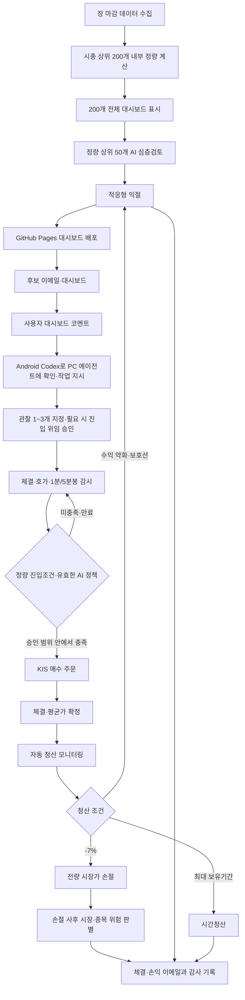

# 제품 목적과 전체 운영 흐름

- 문서 등급: 제품 기준
- 활성 증권사: 한국투자증권 Open API(KIS)

## 1. 목적과 계좌 역할

기존 장기보유 계좌와 분리된 신규 1,000만 원 단기매매 계좌에서 반복 가능한 실현수익을 만드는 자동화 시스템을 구축한다.

프로젝트의 한 문장 정의:

> 튼튼하고 거래 가능한 KOSPI 종목을 먼저 걸러낸 뒤, 1분봉에서 단기간 6% 이상 상승을 반복한 종목을 찾고, 그중 수급·뉴스·공시까지 양호한 단기 변동성 후보를 발굴한다.

여기서 “튼튼함”은 수익 보장이나 장기 우량주 판정이 아니라 시가총액·가격·거래대금·거래상태·주문 안전성으로 1차 필터를 통과했다는 의미다. “숨은 후보”는 이미 급등한 종목이 아니라 현재 하단에 있고, 과거 같은 하단 접촉 뒤 3거래일 안에 실제 `+10%`에 도달한 표본과 수급 확인이 있는 종목이다.

후보 우선순위는 `1차 적격성 → 6% 이상 비중복 상승 횟수 → 평균 반복 상승폭 → 평균 6% 도달시간` 순서다. 외국인·기관 수급과 뉴스·공시는 +10% 자격 게이트를 통과한 공식 후보 전체의 AI 심층 검토에 사용하며 1차 정량 순위를 뒤섞지 않는다.

| 구분 | 기존 계좌 | 신규 단기매매 계좌 |
| --- | --- | --- |
| 목적 | 기존 보유자산 회복·관리 | 단기 실현수익 창출 |
| 시스템 적용 | 하지 않음 | 후보·감시·주문·청산 적용 |
| 보유기간 | 기존 판단 | 당일~수일 |
| 금지 | 별도 정책 | 물타기, 무기한 보유, 장기투자 전환 |

신규 계좌는 기존 계좌 손실액과 독립적으로 평가한다. 기존 손실 만회를 이유로 주문금액이나 위험 한도를 높이지 않는다.

## 2. 핵심 원칙

- 후보 생성과 감시는 자동화한다.
- 사용자는 관찰 종목 선택과 진입 위임 범위를 승인한다.
- AI·정량 엔진은 승인된 종목·목표가·사용자 배정률·알고리즘과 시장·데이터·계좌 안전조건 안에서 진입 시점을 결정할 수 있다. 박스 이탈은 참고 신호이며 승인을 취소하지 않는다.
- 사용자 승인 없는 자율 매수와 물타기는 금지한다.
- 평균 체결가 대비 -7% 손절은 사용자 재확인 없이 실행한다.
- 익절은 상승 지속성을 반영하는 적응형 엔진으로 관리한다.
- 최대 보유기간이 끝나면 장기보유로 넘기지 않고 시간청산한다.
- 수익금의 기존 계좌 이전은 초기 버전에서 자동화하지 않는다.

## 3. 전체 시퀀스



실시간 감시 이후에는 [`TRADING_ORCHESTRATOR.md`](TRADING_ORCHESTRATOR.md)의 중앙 코어가 승인된 종목별 actor를 관리한다. 자동매수·자동매도 엔진은 종목별 결정을 반환하고, 중앙 코어가 계좌 자금 예약·시장 위험·주문 우선순위를 조정한다. 중앙 코어는 사용자 승인 범위를 넓힐 수 없고 `-7%` 강제 손절을 지연할 수 없다.

## 4. 단계별 계약

### 장 마감 배치

1. KOSPI 종목군·거래대금·수급·공시와 정규장 1분봉 OHLCV를 수집하고 품질을 검사한다. 박스 구조는 1분봉에서 재현한 기본 60분봉으로 계산한다.
2. 결정적 정량 엔진이 KOSPI 시총 상위 200개의 7·14·21일 1분봉에서 반복 상승 구조를 내부 계산한다.
3. 시총 상위 200개를 14일 정량 순위로 모두 표시하고 상위 50개의 수급·뉴스·공시·토론·재무 위험을 AI가 심층 검토한다.
4. 14일 기준 현재 박스 하단 35% 이내이고 하단 접촉 후 3거래일 이내 실제 +10% 도달 이력이 있는 종목만 공식 주문 후보로 선택하며 최대 30개로 제한한다.
5. 배포 성공 여부와 페이지 링크를 이메일로 보낸다.

AI 실패 시 정량 결과를 보존하고 `AI_REVIEW_MISSING`을 표시한다. 부분 데이터나 이전 결과를 오늘 결과로 위장하지 않는다.

### 사용자 관찰

- 사용자는 검색 가능한 단일 공식 후보 종합표에서 1~3개를 고르고, 표 위 상단 선택창에서 현재 기간의 박스 하단가가 자동 입력된 종목별 진입 목표가를 수정할 수 있다. 상단 선택창은 기본 숨김이며 최상단 날짜 옆 단일 토글로 표시·숨김을 전환한다.
- 정적 Pages의 선택·목표가는 해당 브라우저의 로컬 값이며 버튼 자체는 PC 에이전트에게 직접 전송하지 않는다.
- `자동매수 승인문 복사`가 보고서 시각·분석기간·종목·진입 목표가·주문가능현금 배정률·AI 등급과 내부 실행정책을 `ENTRY_MANDATE`로 구조화하고, 사용자가 이를 Android Codex 앱에 붙여넣으면 현재 잠긴 계좌 모드에서 자동 진입 승인이 성립한다.
- 위임은 전량 체결 또는 사용자 취소까지 유효하다. 박스 하단 이탈만으로 위임을
  취소하지 않는다. 거래일 종료 등 브로커 주문 수명이 끝나면 로컬 엔진이
  시장·데이터·계좌 안전조건과 가격 안정화를 다시 검증한 뒤 필요한 주문만 재제출한다.
- 미지정 종목은 집중 WebSocket 구독과 진입 이메일 대상이 아니다.
- 하단 접근은 매수 신호가 아니며 반등 근거와 무효화 가격을 함께 제공한다.
- GitHub Pages의 코멘트는 분석 메모이며 원격 명령이 아니다.
- 사용자는 Android Codex 앱에서 이 PC의 에이전트에게 코멘트 확인과 작업을 지시한다.
- 에이전트는 코멘트를 읽고 `WATCH_SELECT` 또는 `ENTRY_MANDATE`로 정규화해 로컬 제어 API에 기록한다.
- 코멘트나 종목 선택만으로는 매수 승인이 성립하지 않는다. 대시보드가 생성한 `ENTRY_MANDATE` 승인문을 사용자가 Codex에 전달해야 한다.
- 종목별 수동 주문금액·수량 입력은 받지 않는다. UI는 선택 종목 수에 따른 균등 배정률을 기본값으로 넣고 사용자가 비율을 소수점 한 자리까지 수정할 수 있다. 로컬 엔진은 KIS 주문가능현금에 승인된 비율을 적용해 목표가 기준 최대 정수 수량을 계산한다.

## 5. 사용자 승인형 진입 위임과 자동 타이밍

사용자는 대시보드에서 최대 3개 종목과 목표가를 정한 뒤 `ENTRY_MANDATE` 승인문을 Android Codex에 붙여넣는다. 에이전트가 스키마·현재 잠긴 계좌 모드·데이터 신선도·박스 유효성을 검증해 로컬 제어 API에 기록하면 자동 진입 위임이 성립한다. 목표가는 즉시 체결가가 아니라 절대 초과할 수 없는 최대 매수가이며, 가격 도달 후에도 매도 압력·하락 안정·매수세 회복을 로컬 엔진이 확인한 뒤 같은 가격 이하의 지정가 주문만 제출한다. 선택만 있고 승인문 전달이 없으면 주문하지 않는다. 세부 기준은 [`ENTRY_AND_BUY.md`](ENTRY_AND_BUY.md)를 따른다.

배정 정책:

```text
allocation_fraction = user_allocation_pct / 100
allocated_cash = KIS_orderable_cash × allocation_fraction
order_qty = broker_max_buyable_qty(symbol, normalized_target_price, allocated_cash)
```

- 1종목 100.0%, 2종목 각 50.0%, 3종목 각 33.3%를 기본 입력한다. 3종목 기본값의 합계는 99.9%이며 0.1%는 현금으로 남는다. 사용자는 예를 들어 3종목을 40.0%·40.0%·20.0%로 수정할 수 있다.
- 배정률은 종목마다 0%보다 커야 하고 합계는 100% 이하여야 한다. 100% 미만인 나머지는 현금으로 유지한다.
- 가격·수량 정규화와 비용 때문에 잔여현금이 생길 수 있으며 이를 다른 종목 몫으로 임의 이전하지 않는다.
- 부분체결분은 즉시 포지션으로 등록해 -7% 보호 감시를 시작한다.
- 미체결분은 체결까지 유지하되 매도 압력 강화, 시장 위험, 데이터·계좌 품질 악화
  때에는 주문만 취소하고 승인은 유지한다.
- 동일 승인문의 내부 명령 ID와 종목별 주문 멱등키는 로컬 수신부가 생성·보관한다.

외부 AI를 매 틱마다 호출하지 않는다. AI는 최신 시장·수급·뉴스와 정량 상태를 바탕으로 유효기간이 있는 진입 정책 또는 `ALLOW/BLOCK` 판단을 만든다. 실제 틱에서의 주문은 다음을 모두 만족할 때 로컬 결정 엔진이 실행한다.

- 유효한 사용자 `ENTRY_MANDATE`
- 박스 하단·반등·유동성·시장 국면의 결정적 정량 조건
- 유효기간 안의 AI `ALLOW` 또는 승인된 알고리즘 정책
- 최신 데이터, 계좌·호출한도·위험 한도 정상

AI 응답이 없거나 오래됐거나 구조 검증에 실패하면 기본 동작은 `주문하지 않음`이다. AI는 승인 범위를 확대할 수 없다.

자연어 승인은 다음 구조로 정규화한다.

```yaml
action: ENTRY_MANDATE
authority: ENTRY_APPROVAL
execution_mode: USE_LOCKED_ACTIVE_MODE
allocation_policy: USER_DEFINED_ORDERABLE_CASH_PERCENT
selected_symbol_count: 2
hard_stop_pct: -7.0
profit_policy: ACTIVE_VERSIONED_LOCAL_ENGINE
validity_policy: UNTIL_FILLED_OR_USER_CANCELLED
entry_policy_version: "entry-v1"
selections:
  - symbol: "005930"
    entry_target_price_krw: 240000
    allocation_pct: 50.0
  - symbol: "000660"
    entry_target_price_krw: 1700000
    allocation_pct: 50.0
```

필수값이 빠지거나 종목이 모호하면 주문하지 않고 부족한 값만 요청한다.

로컬 수신부는 첫 줄이 정확히 `DANTA ENTRY_MANDATE`인 문서만 승인문으로 해석한다. 구조 파서는 모든 YAML 스칼라를 문자열로 읽어 `005930` 같은 앞자리 0이 사라지지 않게 하고, 다음 불변조건을 검사한다.

- 권한·계좌범위·배정·진입 트리거·유효성·부분체결·중복방지·손절·익절 정책이 현재 활성 상수와 정확히 일치
- 1~3개 종목, 6자 영문대문자·숫자 종목코드 중복 없음
- 개별 배정률은 0% 초과, 합계는 100% 이하, 표시 합계·미배정 현금과 산술적으로 일치
- 목표가는 양수이며 보고서 시각에는 시간대가 포함
- `hard_stop_pct`는 정확히 `-7.0`

검증된 전체 승인문을 정규화한 뒤 SHA-256 기반 내부 명령 ID를 만든다. 같은 승인문을 다시 전달하면 같은 명령 ID가 나와야 하며, 영속 저장소에 이미 있으면 주문을 새로 만들지 않는다. 종목별 목표 금액은 주문가능현금과 사용자 배정률로 계산하고 목표가로 나눈 최대 정수 수량만 계획한다. 수량이 0인 종목이 하나라도 있으면 승인 전체를 실행 대기 상태로 등록하지 않는다.

### 주문 전 검증

- 등록된 사용자 승인과 일회용 승인 ID
- 승인된 진입정책 버전과 최대 시도 횟수
- 승인 만료 전이며 관찰 목록에 포함
- 현재 매도 1호가가 최대 허용가격 이하이며 지정가 정규화 후에도 상한을 초과하지 않음
- 매도 압력 강화가 멈추고 승인된 진입정책의 하락 안정·매수세 회복 조건 충족
- 현금, 포지션 수, 일·주·월 위험 한도 충족
- 동일 종목 미보유와 당일 재진입 금지 미적용
- KIS 실전/모의 환경·토큰·계좌·장 상태 정상
- 실시간 데이터가 신선도 기준 이내

실패 조건이 하나라도 있으면 주문하지 않고 이유를 통지한다.

### 실행

1. 승인 ID로 주문 멱등키를 만든다.
2. 최대 매수가 이하의 지정가로 KIS 주문 API를 호출한다.
3. 타임아웃이면 재주문 전에 주문·체결 내역을 조회한다.
4. 부분체결과 미체결을 추적한다.
5. 평균 체결가가 확정되면 손절·익절·시간청산을 활성화한다.
6. 주문번호, 수량, 평균가, 손절가, 최대 보유기간을 이메일로 보낸다.

사용자는 진입 위임 취소, 미체결 취소와 조기 전량 매도를 언제든 명령할 수 있으나 이미 발동한 -7% 손절 취소와 물타기는 허용하지 않는다.

## 6. 실패 흐름

| 실패 | 동작 |
| --- | --- |
| 일별 데이터 불완전 | 후보 배치 실패·이전 결과 `STALE`·긴급 이메일 |
| AI 실패 | 정량 결과 보존·AI 미검토 표시 |
| GitHub 배포 실패 | 이메일에 로컬 요약과 실패 상태 포함 |
| SMTP 실패 | 큐 재시도, 주문 엔진은 계속 작동 |
| WebSocket 단절 | REST 폴링, 신규매수 차단, 보호 매도 유지 |
| 잔고 불일치 | 신규매수 차단, KIS 잔고·체결 기준 복구 |
| 주문 결과 불명확 | 주문·체결 조회 후에만 재시도 |
| Codex Plus 사용량 경고 | 정량 후보 유지, 비필수 AI 분석 축소, 사용량 스냅샷·사용자 알림 |
| AI API 예산 초과 | 신규 AI 호출 차단, 정량 폴백·기존 유효 정책만 사용 |

AI 사용량 부족으로 공식 후보 전체 검토가 완료되지 않으면 미검토 종목에 `AI_REVIEW_QUOTA_DEGRADED`를 표시하고 등급을 추정해 채우지 않는다. AI 정책이 필요한 자동 진입은 새 AI 판단 없이 실행하지 않으며, 기존 포지션의 손절·익절은 로컬 엔진이 계속 수행한다.

## 7. 비목적

- 수익 보장, 장기투자 종목 추천, 초저지연 HFT
- 신용·미수·대주·고배율 레버리지
- AI가 사용자 승인 없이 매수하는 완전자율 트레이딩
- 손실 종목의 물타기 또는 장기보유 전환
