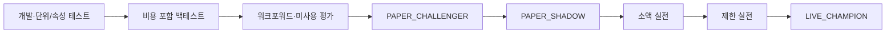

# 자동화 품질·검증·지속 개선 기준

- 상태: 활성 품질 게이트
- 적용 대상: Python 수집·분석·감시·주문·위험·알림 모듈과 전략 버전
- 원칙: 매 거래일 점검하되, 매 거래일 실전 알고리즘을 변경하지 않는다.

## 1. 목적과 운영 결론

실전 계좌가 안정화된 뒤에도 모의투자를 종료하지 않는다. 실전은 검증된 안정판을 운용하고, 모의 환경은 동일 전략의 그림자 검증과 신규 전략의 개선 실험에 계속 사용한다.

| 트랙 | 환경 | 역할 | 변경 정책 |
| --- | --- | --- | --- |
| `LIVE_CHAMPION` | 실전 | 승인된 안정판으로 실제 주문 | 사용자 승인 없는 전략·위험 로직 변경 금지 |
| `PAPER_SHADOW` | 모의 또는 체결 시뮬레이터 | 실전 안정판과 같은 입력·신호를 재생해 불일치 감시 | 실전판과 동일 버전 유지 |
| `PAPER_CHALLENGER` | 모의 | 신규 산식·필터·익절 로직 실험 | 실전 주문 권한 없음 |

`PAPER_SHADOW`와 실제 주문을 같은 KIS 계좌·주문번호로 섞지 않는다. KIS 모의체결이 실전의 대기열 순위, 부분체결, 지연, 호가 충격을 완전히 재현한다고 가정하지 않는다. 따라서 모의 수익은 필요조건이지 실전 수익의 충분조건이 아니다.

## 2. 변경 권한과 자동 보완 범위

에이전트는 아래 항목을 테스트 통과 후 자율 보완할 수 있다.

- 문서·테스트·로그·메트릭·대시보드의 명백한 결함
- 주문에 영향을 주지 않는 개발 도구와 진단 기능
- 안전한 재시도, 알림 중복 억제, 비밀 마스킹의 결함
- 기존 명세와 코드가 불일치할 때 명세를 지키는 회귀 수정

다음 변경은 자동으로 실전에 배포하지 않는다. `PAPER_CHALLENGER` 버전, 근거, 검증 결과, 예상 영향과 롤백 계획을 만들고 사용자 승인을 받는다.

- 후보·진입·익절 산식과 임계값
- 주문 유형·가격·수량·재시도 정책
- 손절, 포지션 한도, 일일 손실 한도, 킬스위치
- KIS 실전 주문 경로와 자격증명
- AI 모델·프롬프트가 주문 가능 여부에 영향을 주는 변경

`-7%` 손절 완화, 사용자 승인 없는 매수, 물타기는 개선안으로도 허용하지 않는다.

## 3. 자동화 모듈 완료 체크리스트

모든 항목은 `PASS`, `WARN`, `FAIL`, `BLOCKED`, `NOT_APPLICABLE` 중 하나와 증거 링크·실행시각·코드 및 설정 버전을 남긴다. `CRITICAL` 항목의 `FAIL` 또는 `BLOCKED`는 신규매수를 차단한다. 이때 보유 포지션 감시와 보호매도는 계속 실행한다.

### 2026-07-28 구현·KIS 모의주문 증거

로컬 코드·가상 브로커 검증과 실제 KIS 모의계좌 검증을 구분한다.

- `PASS`: 유효한 `ENTRY_MANDATE`의 최대 매수가 이하 지정가만 생성
- `PASS`: 1·2·3종목 배정 상한을 중앙 `CapitalAllocator`에서 원자 예약
- `PASS`: `HARD_STOP_EXIT`가 매수보다 높은 큐 우선순위
- `PASS`: 평균 체결가 대비 경계 `-7%`와 하회 가격에서 시장가 전량 매도 의도
- `PASS`: WebSocket 없이 REST 가격만으로 동일 `-7%` 의도 생성
- `PASS`: 부분체결 수량을 즉시 포지션에 반영하고 미체결 잔량 취소 판단
- `PASS`: 같은 주문·취소 키의 중복 제출 차단
- `PASS`: SQL 주문 원장과 포지션 저장·시작 시 KIS 잔고 대조 경로
- `PASS`: KIS 모의계좌에서 삼성전자·SK하이닉스 각 1주, 현재가 및
  `-0.1%`부터 `-1.0%`까지 0.1% 간격의 총 22단계 지정가 매수 캠페인
- `PASS`: 22단계 중 왕복 체결 6건, 과거 캠페인 관찰시간 만료 후 취소 16건,
  실시간 체결 이벤트 3,984건 처리
- `PASS`: 체결 6건 모두 30초 감시 후 시장가 전량 매도, 종료 후 보유 0주·미체결 0건
- `PASS`: KOSPI 호가단위 하향 정규화와 캠페인 체결·취소 분기 자동 회귀 테스트
- `PASS`: 시간제한 제거 후 현재가~`-0.3%` 8단계가 실제 KIS 모의계좌에서 모두
  왕복 체결됐고, 하이닉스 `-0.3%`는 약 30분 대기 후 체결되어 임의 시간 취소가
  제거됐음을 확인
- `WARN`: 하이닉스 `-0.4%` 미체결 주문은 15:20 동시호가 시작을 장 종료로 잘못
  판단한 운영 개입으로 취소했다. 구현 경계는 실제 정규장 종료인 15:30으로 교정했다.
  최종 계좌 대조 결과는 보유 0주·미체결 0건
- `PASS`: 전체 122개 로컬 테스트, Ruff, strict mypy 59개 소스,
  Alembic 최신 스키마와 diff 형식 검사
- `WARN`: 왕복 매매차익 단순합은 비용 전 7,500원이며 계좌 현금 변화에는
  수수료·세금 등 모의환경 비용이 반영되므로 전략 수익률 증거로 사용하지 않음
- `NOT_APPLICABLE`: 이번 캠페인의 매도는 테스트 진행을 위한 30초 후 강제 청산이며
  적응형 익절 성능 검증이 아님
- `BLOCKED`: 실제 KIS 모의가격에서 -7% 도달에 의한 자동 손절 발동
- `PASS`: 시간제한 제거 뒤 실제 KIS 모의계좌의 장시간 미체결 유지
- `BLOCKED`: 15:30 실제 정규장 종료에 의한 자동 취소 실증
- `BLOCKED`: 실제 KIS 모의계좌에서 진입조건 악화 취소와 더 낮은 가격 재진입의 연속 검증
- `BLOCKED`: 실제 KIS 모의 주문 응답 유실 후 주문조회 기반 안전 재개
- `BLOCKED`: KIS 모의 부분체결·거부·거래정지·하한가·PC 강제종료 복구
- `BLOCKED`: 시장위험 가드용 공식 KOSPI·시장 폭 실시간 입력 연결
- `BLOCKED`: 일일·주간·월간 계좌 손실 한도 사용자 확정

위 `BLOCKED` 중 하나라도 남으면 실전 신규매수 승격은 금지한다.

실행 증거 원본은 비공개·Git 제외 경로
`data/paper-campaign/20260728-sk-hynix-samsung.jsonl`에 보관한다. 주문번호와 계좌
상태가 포함될 수 있으므로 공개 저장소나 Pages로 복사하지 않는다.
시간제한 제거 캠페인은
`data/paper-campaign/20260728-no-timeout-0-to-0.5.jsonl`에 보관하며, 장 마감으로
실행하지 못한 하이닉스 `-0.4%` 이후 4단계는 다음 거래일 재개 대상이다.

### A. 설정·환경·비밀

- [ ] `CRITICAL` 모의·실전 키, 계좌, DB, 주문 플래그가 물리적·논리적으로 분리되었다.
- [ ] `CRITICAL` 실전 주문 잠금과 사용자 승인 필수 정책을 시작 시 검증한다.
- [ ] 비밀·토큰·전체 계좌번호가 로그, 이메일, Pages, 테스트 산출물에 없다.
- [ ] 운영 시간대가 `Asia/Seoul`이고 거래일·휴장일 판정이 검증됐다.
- [ ] 코드·설정·스키마·전략·프롬프트 체크섬을 기록한다.

### B. 데이터 무결성

- [ ] `CRITICAL` 시세의 기준시각, 수신시각, 신선도, 중복, 누락, 순서 역전을 검사한다.
- [ ] 정규장 1분봉의 시간 순서, 중복, 결측, 거래량·거래대금과 장 구분을 검사한다.
- [ ] 동일 1분봉에서 생성한 10·30·60분봉의 시가·고가·저가·종가·거래량이 원본과 대조된다.
- [ ] 구조 지표가 기본 60분봉 OHLCV를 사용하고 일봉 종가 또는 60분봉 종가만으로 폴백하지 않는다.
- [ ] 수정주가, 액면분할, 배당락, 거래정지, 관리·상장폐지 상태를 처리한다.
- [ ] 생존편향, 미래 데이터 누수, 후보 선정 후 데이터의 역삽입이 없다.
- [ ] 수급·뉴스·공시의 `as_of`와 출처를 보존한다.
- [ ] 공식 후보 전체의 Open DART 고유번호 매핑과 최근 30일 공시가 공식 접수번호·원문 링크에 연결되고, DART 실패가 별도 상태로 남는다.
- [ ] 뉴스·토론 수집 성공, 실제 빈 결과, 공급자 오류를 서로 다른 상태로 기록한다.
- [ ] 공식 후보 전체에 뉴스 링크와 토론 최신 제목 목록이 적용되고 기사·게시물의 지시문이 에이전트 명령으로 해석되지 않는다.
- [ ] 21일 차트 팝업을 표 마지막 행과 오른쪽 끝까지 스크롤해도 거래일 열이 계속 표시된다.

### C. KIS 연동

- [ ] `CRITICAL` 토큰 만료·재발급, REST 호출 제한, WebSocket 재연결을 검증한다.
- [ ] TR ID, URL, 모의·실전 구분과 응답 스키마를 공식 문서·실제 진단으로 확인한다.
- [ ] 체결·호가 구독 누락과 재연결 공백을 복구하거나 명시적으로 표시한다.
- [ ] 알 수 없는 응답·오류코드는 성공으로 간주하지 않는다.
- [ ] 주문·잔고·미체결·체결 대조 경로가 조회 API 장애와 독립적으로 실패를 드러낸다.

### D. 비동기·동시성

- [ ] 종목별 `SymbolActor`의 상태 변경은 직렬화되고 공유 가변상태를 직접 수정하지 않는다.
- [ ] 중앙 OMS와 위험 엔진만 주문 권한을 가지며 종목 워커가 KIS 주문을 직접 호출하지 않는다.
- [ ] 큐 크기·백프레셔·우선순위를 두고 보호 이벤트가 분석 이벤트에 밀리지 않는다.
- [ ] 중복·지연·순서 역전 이벤트에서도 주문 멱등성이 유지된다.
- [ ] 취소·타임아웃·예외·워커 재시작 시 작업과 잠금이 누수되지 않는다.
- [ ] 교착, 경쟁조건, 이벤트 루프 블로킹, 느린 외부 호출 격리를 테스트한다.
- [ ] 1·2·3·10개 가상 종목에서 actor 상태가 독립적으로 진행되고 검증 용량 초과는 명시적으로 거부된다.
- [ ] 동시 매수 신호에서도 중앙 자금 예약 합계가 KIS 주문가능현금과 사용자 배정 상한을 초과하지 않는다.
- [ ] `HARD_STOP_EXIT`가 매수·분석·알림 큐보다 항상 먼저 처리되고 중앙 오케스트레이터가 이를 거부·지연하지 못한다.
- [ ] 중앙 오케스트레이터 heartbeat 중단 시 매도 전용 P0 안전 큐가 같은 멱등키로 강제 손절을 한 번만 실행하며 매수는 우회시키지 않는다.
- [ ] 한 actor의 예외·지연·큐 포화가 다른 보유종목의 보호 감시를 중단시키지 않는다.

### E. 후보·신호·AI

- [ ] 같은 입력·버전으로 같은 정량 결과를 재현한다.
- [ ] 활성 박스 레짐 이동은 이동일 이후 최소 4거래일, 이동 직후 지속성, 1분봉 정렬을 검증하고 급락 전·후 구간을 잘못 혼합하지 않는다.
- [ ] 활성 하단 접촉 후 상단 재도달·-7% 손절 선행·5거래일 시간초과의 합과 미완료 표본이 전체 접촉 수와 일치한다.
- [ ] 같은 1분봉에서 목표와 손절이 모두 가능한 경우 손절 선행으로 처리하며, 독립 사건 재무장 없이 접촉 수를 중복 증가시키지 않는다.
- [ ] 활성 박스 재도달률은 설명 통계로 표시하고 워크포워드 예측 확률이나 보장 수익률로 오인시키지 않는다.
- [ ] 구조 무효화 가격이 평균 체결가 대비 -7% 불변 손절을 대체하거나 주문 경로를 지연하지 않는다.
- [ ] `CRITICAL` 7·14·21일의 모든 공개 후보에서 추천 등급은 박스 하단 접촉 뒤 3거래일 내 실제 `+10%` 도달 1회 이상이고, 원본 분봉 기간 최고가가 현재가 `×1.10` 이상이어야 한다.
- [ ] `CRITICAL` `+10%` 증거 미충족 종목은 모든 충족 종목보다 뒤에 위치하며, 위반 시 정적 대시보드 생성과 Pages 배포를 중단한다.
- [ ] `CRITICAL` READY 창의 기간 최저가·기간 최고가는 같은 창 원본 분봉의 실제 저가 최솟값·고가 최댓값과 일치하고 `기간 최저가 ≤ 현재가 ≤ 기간 최고가`를 만족한다. 위반 시 후보 산출·주문 승인·Pages 배포를 중단한다.
- [ ] 대시보드의 기간 최저가·`+10%` 목표가·기간 최고가·기간고점 대비 값은 같은 원본 분봉과 산식에서 생성되고 허용 오차 안에서 일치한다.
- [ ] `CRITICAL` 현재 위치는 선택한 7·14·21일의 기간 박스 하단·상단으로 계산하며 활성 박스 위치를 후보 자격·등급·순위·표시에 사용하지 않는다.
- [ ] `CRITICAL` 추천 종목의 `진입 기준가 × 1.10`은 현재가보다 높아야 하며 이미 목표가를 지난 종목은 비추천·후순위로 처리한다.
- [ ] 현재가가 활성 구조 무효화선 아래인 종목은 낮은 위치 점수로 보상받거나 추천 등급을 받지 않는다.
- [ ] 해결 표본이 부족한 `LOW` 신뢰도는 적극 추천으로 승격되지 않고 화면에 후향 관측값임을 명시한다.
- [ ] 계산 시점에 이용 가능했던 데이터만 사용한다.
- [ ] 거래비용·세금·슬리피지를 성과에 포함한다.
- [ ] AI 출력은 구조화 스키마, 근거, 입력 해시, 모델·프롬프트 버전을 가진다.
- [ ] AI 실패·할당량 소진 시 정량 폴백이 작동하며 보호 주문은 영향을 받지 않는다.
- [ ] 학습·검증·최종평가 기간과 종목 집합을 분리한다.

### F. 사용자 승인과 진입 위임

- [ ] `CRITICAL` 유효한 `ENTRY_MANDATE` 없이는 매수 주문 의도가 0건이다.
- [ ] 종목·목표가·주문가능현금 배정률·현재 잠긴 계좌모드·정책 버전을 모두 검증하고 박스 이탈만으로 승인을 취소하지 않는다.
- [ ] 만료·취소·재전송·부분 사용 시 남은 위임 범위를 정확히 계산한다.
- [ ] Pages 코멘트나 관찰 종목 선택만으로 위임을 생성하지 않는다.
- [ ] Pages 배포 완료 판정은 HTTP 200만으로 하지 않는다. 실제 브라우저에서 콘솔 오류 0건, 후보 행 수 일치, 7·14·21일 전환, 차트 팝업 표시를 검증한다.
- [ ] 승인 원문 해시, 정규화 결과, 사용자 확인, 처리 이력을 감사한다.

### G. 주문·체결·포지션

- [ ] `CRITICAL` 제출·접수·거부·부분체결·완전체결·정정·취소·타임아웃 상태 전이를 검증한다.
- [ ] 주문 응답 유실 시 동일 주문을 즉시 반복하지 않고 KIS 상태를 먼저 대조한다.
- [ ] 평균 체결가·가용수량·수수료·세금·호가단위 계산이 정확하다.
- [ ] 프로세스 재시작 후 KIS를 기준으로 미체결·체결·잔고를 복구한다.
- [ ] 수동 HTS 주문과 외부 잔고 변화를 감지하고 신규매수를 차단한다.
- [ ] 주문 키와 포지션 세대로 중복 매수·중복 청산을 방지한다.

### H. 손절·익절·계좌 위험

- [ ] `CRITICAL` 평균 체결가 대비 정확히 `-7%` 경계에서 확인 없이 가용수량 전부의 시장가 손절을 시도한다.
- [ ] `CRITICAL` 갭 하락, 거래정지, 상·하한가, 주문 거부, 부분체결 시 보호 절차를 검증한다.
- [ ] 익절·최고가·수익보호선은 손절을 무력화하지 않고 보호선은 뒤로 낮아지지 않는다.
- [ ] 종목·업종·계좌 노출, 일일 손실, 연속손실, 주문 빈도 한도를 검사한다.
- [ ] 한 종목 손절 후 신규진입만 동결하고 다른 보유종목의 보호 감시는 유지한다.
- [ ] `NEW_BUY_DISABLED`, `MARKET_RISK_OFF`, `EMERGENCY_FLATTEN`의 권한과 복구 조건을 검증한다.

### I. 장애·복구·지속성

- [ ] `CRITICAL` 프로세스·PC·DB·네트워크 재시작 후 열린 포지션을 복구한다.
- [ ] 이벤트·Outbox 재처리에도 효과가 정확히 한 번만 발생한다.
- [ ] DB 마이그레이션, 백업, 복구, 이전 버전 롤백을 연습한다.
- [ ] WebSocket, REST, SMTP, AI, GitHub 장애가 서로 전파되지 않는다.
- [ ] 보호 감시 heartbeat 상실을 즉시 감지하고 대체 감시로 전환한다.

### J. 관측·알림·감사

- [ ] `CRITICAL` 손절·주문실패·잔고불일치·감시중단은 즉시 알림한다.
- [ ] SMTP 실패 큐, 제한 재시도, 중복 억제, 복구 후 중요 알림 재발송을 검증한다.
- [ ] 주요 결정에 상관 ID, 입력, 버전, 결과, 원인이 남는다.
- [ ] 일일 보고서가 AI 없이도 Python만으로 생성·발송된다.
- [ ] `CRITICAL` 16:00 예약 실행은 당일 KRX 거래일과 일치하는 완성 보고서만 원자적으로 게시하며 실패 시 이전 Pages를 보존한다.
- [ ] 16:00·16:10·16:20·16:30 재시도는 거래일별 성공 표식과 실행 잠금으로 중복 커밋·중복 이메일을 만들지 않는다.
- [ ] Open DART 재무 스냅샷은 공식 고유번호·접수번호·사업연도·보고서 코드·연결/별도 구분과 `fundamental-snapshot-v1` 산식 버전을 기록한다.
- [ ] 기존 `financial_statement_analysis-main` Excel·HTML·Python 모듈이 Danta 일일 실행의 필수 입력이나 폴백이 아님을 의존성 검사로 확인한다.
- [ ] 부채비율·유동비율·영업이익률·순이익률은 분모 0·음수·결측을 명시적으로 처리하고, 재무 결측이 가격·분봉 값으로 대체되지 않는다.
- [ ] 메트릭 시간대와 수치가 원장·KIS 결과와 대조된다.
- [ ] 대시보드 7·14·21일 전환 시 동일 공식 후보의 14일 고정 순번은 유지하고 반복 상승·수익률·박스·차트·수급 값만 같은 기간을 사용한다.
- [ ] `READY` 기간수익률은 팝업 차트 첫 60분봉 종가 대비 현재가 변화율과 일치하고, `WARMING_UP` 참고 수익률은 첫 거래일 수정종가 기준임을 구분하며 구조 점수 입력과 혼용하지 않는다.
- [ ] 내부 계산은 시총 상위 200개를 보존하고 공개 보고서는 14일 +10% 자격 게이트 통과 종목만 최대 30개 포함하며 부적격 종목으로 채우지 않는다.
- [ ] 공식 후보 전부에 뉴스·공시·토론·재무 AI 심층검토를 수행하고 미검토 등급을 추정해 채우지 않는다.
- [ ] 7·14·21일 탭은 동일 공식 후보·동일 순번을 유지하고 기간별 반복 상승 지표·가격·수급만 해당 기간 데이터와 일치한다.
- [ ] 종목명·종목코드 검색창과 검색 버튼이 공식 후보 전체에서 동작하고, 하위 탭은 없다.
- [ ] 선택창은 선택 수·배정 합계·현금 비율만 카드 위 한 줄에 표시하고, 카드가 왼쪽부터 시작하며 3개 카드가 작업영역 안에서 잘리지 않고 목표가·비율 입력 높이가 같다.
- [ ] 표를 가로로 스크롤해도 선택·순위·종목명 헤더와 본문 열의 화면상 왼쪽 좌표가 변하지 않는다.
- [ ] 일평균 거래대금·거래량 배율·위험·무효화 조건은 AI 입력과 공개 DTO에 유지하되 사용자 종합표의 별도 열로 노출하지 않고, 치명적 사용자 확인사항만 AI 코멘트에 요약한다.
- [ ] 수급 헤더에는 기간 숫자를 중복 표시하지 않고 각 값을 순매수 억원 또는 외국인+기관 수급강도 백분율로 명시한다.
- [ ] 개인·외국인·기관·금융투자·연기금 순매수 금액은 정수 값도 포함해 항상 소수점 한 자리를 표시한다.
- [ ] 백분율과 투자자별 순매수 금액의 양수는 빨간색이며 `+`가 없고, 음수만 파란색과 `-`를 표시한다.
- [ ] 반복 상승폭·횟수·도달시간은 시간순 1분봉 종가에서 계산하고 같은 상승 경로를 중복 집계하지 않는다.
- [ ] 6% 상승 후 6% 하락으로 다음 구간이 분리되며, 기간 끝의 진행 중 상승은 이미 6%에 도달한 경우에만 1회로 센다.
- [ ] 도달시간은 저점 시각부터 최초 6% 도달 시각까지 실제 거래 분 수이며 장 마감 이후 시간을 포함하지 않는다.
- [ ] 기간고점 대비 현재가는 `(현재가/기간고점-1)×100`의 음수·파란색으로 표시하며 손실률·예측 확률·보장 수익률로 표현하지 않는다.
- [ ] 화면의 `상승세`는 첫 거래일 저가 대비 마지막 거래일 저가의 변화율과 일치하며 계산 필드 의미는 바뀌지 않는다.
- [ ] 정량 정렬은 6% 이상 반복 상승 횟수 내림차순, 평균 상승폭 내림차순, 평균 도달시간 오름차순과 정확히 일치한다.
- [ ] 유동성·현재 위치·좋은 눌림·구조적 붕괴는 1차 정량 순위의 가중치나 선행 정렬키로 사용하지 않는다.
- [ ] 공개 공식 후보 순위는 14일 기준으로 고정되고 7·14·21일 탭 전환 후에도 종목 행 순서와 순위 숫자가 변하지 않는다.
- [ ] 미니차트 클릭 팝업은 날짜를 세로, 09~15시를 가로로 배치하고 사용자 셀에는 종가만 표시하며 숨긴 시가·고가·저가·거래량은 보고서 DTO에 보존한다.
- [ ] 사용자 정렬은 `상승세·반복 상승폭·반복 횟수·외국인+기관 수급강도·정량점수·에이전트 점수` 여섯 열에만 존재하고 오름차순·내림차순·해제 순으로 순환한다.
- [ ] 활성 정렬은 기간 탭 전환 뒤에도 유지되어 새 기간 값으로 재정렬되고, `순위`를 누르면 모든 정렬이 해제되어 14일 고정 공식 순위 1위부터 복원된다.
- [ ] 정렬값이 없는 행은 오름차순과 내림차순 모두 유효값 뒤에 놓이고 동률은 공식 순위로 안정 정렬된다.
- [ ] `source_bar_interval`, `analysis_bar_interval`, 원본 해시, 집계 버전과 데이터 완성도를 결과에 기록한다.
- [ ] `box-quant-v1` 일봉 종가 기준선은 `RESEARCH_ONLY`이며 감시·승인문·신규매수 경로에서 거부된다.
- [ ] 60·30·10분봉 실험은 동일 1분봉 원본·평가구간·비용 가정으로 비교되고 자동 승격되지 않는다.
- [x] 최초 백필은 KOSPI 시총 상위 200개의 정확한 21거래일을 수집하고 중단 후 종목·거래일 체크포인트에서 재개된다. (2026-07-27: 4,200/4,200 완료)
- [x] 1분봉 완료 게이트는 KIS가 무체결 분을 생략할 수 있음을 반영해 최소 180개 실제 분봉, 첫 봉 09:10 이전, 마지막 봉 15:19 이후를 확인하며 종가 단일가의 별도 분봉 생성을 강제하지 않는다. (연속 380봉·희소 191봉 회귀 테스트)
- [x] 상위 200개 모두 7·14·21일 `READY`일 때만 14일 고정 순위를 만들고 세 탭의 200개 종목·순번이 동일하다. (2026-07-27 실데이터 검증)
- [ ] 매일 증분 수집은 이미 저장된 1분봉을 중복 삽입하지 않으며 수정·누락 구간만 명시적으로 보정한다.
- [ ] 7·14·21일 버튼은 항상 동작하고 일별 기간수익률·수급을 표시하되, 분봉이 부족한 구조 필드만 `분봉 수집 중 N/M거래일`로 비활성화한다.
- [ ] 신규 사전필터 편입 종목은 고정 7일이 아니라 `coverage_epoch_start`부터 현재까지 누락 거래일 전체를 백필한다.
- [ ] 신규 상장은 상장일로 목표 시작일을 제한하고, 재편입 종목은 기존 저장분을 재사용해 누락분만 요청한다.
- [ ] 따라잡기 완료 전 종목은 구조 점수·집중 감시·진입 승인 대상에서 제외된다.
- [ ] `prefilter_version`과 종목별 포함·제외 사유를 저장하고 제외 감사 표본으로 후보 누락률을 측정한다.
- [ ] 공개 산출물에 비밀·계좌·주문정보가 없고 외부 링크는 안전한 새 창 정책을 사용한다.
- [ ] 후보 선택은 최대 3개로 제한되고 목표가는 양의 원 단위이며 공개 저장소·URL·Pages JSON에 기록되지 않는다.
- [ ] 종목 선택 시 현재 기간 박스 하단가가 진입 목표가로 자동 입력되며, 입력 중 DOM 재생성으로 포커스가 끊기지 않고 연속 숫자 입력이 가능하다.
- [ ] 기간 변경은 자동 입력 목표가만 새 박스 하단으로 갱신하고 사용자가 수정한 목표가는 덮어쓰지 않는다.
- [ ] 비율은 종목마다 0%보다 크고 합계 100% 이하이며 초과 시 복사를 차단하고 미만 잔여분은 현금으로 명시한다. 3종목 기본값은 각 33.3%, 합계 99.9%, 현금 0.1%다.
- [ ] 복사된 자동매수 승인문에는 보고서 시각·기간·종목코드·진입 목표가·값 출처·주문가능현금 배정률·미배정률·AI 등급과 `ENTRY_MANDATE`, `ENTRY_APPROVAL`이 명시된다.
- [ ] 주문서·전체 해제·자동매수 승인문 복사 아이콘 버튼은 툴팁과 접근성 이름을 가지며 키보드로 조작할 수 있다.
- [ ] 승인문 복사 버튼은 중복 클릭을 막는 약 1초 진행 표시, 성공 체크·팝업과 권한 실패 팝업을 제공하며 복사 결과를 접근성 상태 메시지로도 알린다.
- [ ] 정적 표 셀을 클릭해도 입력 캐럿이 나타나지 않으며 체크박스·링크·진입 목표가 입력창의 조작과 포커스 표시는 유지된다.
- [ ] 후보 요약·필터 문구와 선택 카드의 정적 텍스트에도 캐럿이 나타나지 않는다.
- [ ] 사용자 필터는 `추천 이상`과 `박스 하단 35% 이하`만 제공하며 외국인·기관 단순 합산 필터로 후보를 숨기지 않는다.
- [ ] 선택 카드와 Codex 전달문의 종목은 순위가 아니라 사용자가 체크한 순서를 유지하며, 해제 후 재선택한 종목은 마지막으로 이동한다.
- [ ] 표의 모든 열 제목은 고정 열을 포함해 중앙 정렬되고 본문 종목명 정렬에는 영향을 주지 않는다.

### K. 전략 성과·모델 위험

- [ ] [`PROFITABILITY_IMPROVEMENT.md`](PROFITABILITY_IMPROVEMENT.md)의 개선 포인트와 실험 등록부가 거래 데이터·버전·판정 증거에 연결된다.
- [ ] 워크포워드 신호일의 활성 박스 경계는 그 시점까지의 1분봉으로 고정되고 미래 평가봉으로 다시 계산되지 않는다.
- [ ] 같은 1분봉의 목표·손절 동시 접촉은 손절 우선이며, 겹치는 신호를 독립 거래로 중복 계산하지 않는다.
- [ ] 현재 수급 집계값을 과거 신호일 수급으로 복제하지 않고 과거 시점별 원본이 없으면 `NOT_AVAILABLE`로 기록한다.
- [ ] 워크포워드와 미사용 최종평가에서 성과를 재검증한다.
- [ ] 기대값, 최대낙폭, 연속손실, 승률뿐 아니라 손익비와 최고수익 반납률을 본다.
- [ ] 변동성·추세·하락·저유동성 등 시장 국면별 결과를 분리한다.
- [ ] 표본 수, 신뢰구간, 다중검정·과최적화 위험을 기록한다.
- [ ] 실전과 모의의 신호·주문·체결·슬리피지 차이를 매일 대조한다.
- [ ] 익절 활성 수익률을 불변값으로 고정하지 않고 승인된 `profit_engine_version`의 조건과 성과를 기록한다.
- [ ] AI 개선 제안이 장중 외부 LLM 의존이나 실전 전략 자동변경으로 이어지지 않는다.

### L. 배포·버전·AI 예산

- [ ] 배포 아티팩트, 설정, 전략 버전과 롤백 대상을 식별할 수 있다.
- [ ] 배포 중 신규매수는 차단하고 기존 보호매도는 유지한다.
- [ ] 실전 안정판과 모의 개선판의 DB·계좌·프로세스·권한이 분리됐다.
- [ ] Codex Plus와 자동화용 AI API 사용량·비용을 별도로 기록한다.
- [ ] AI 예산 소진 시에도 체크리스트·일일 이메일·보호 주문이 작동한다.

## 4. 일일·주간·월간·분기 운영 주기

### 매 거래일

- 장 전: 시간·휴장일, KIS 인증, 잔고 대조, 시세 연결, SMTP, 버전, 위험 한도를 검사한다.
- 장중: 워커·큐·시세 신선도·주문 대조·보호 감시 heartbeat를 지속 검사한다.
- 장 후: 데이터 완전성, 후보 산출, 거래·손익·비용, 장애, 실전-모의 차이와 전체 체크리스트를 확정한다.
- 장 후 보고서와 이메일은 Python이 자동 생성한다. AI는 특이사항 분석을 덧붙일 수 있으나 발송의 필수 의존성이 아니다.

### 매주

- 실패·경고 추세, 손절 사례, 기회 누락, 체결 오차, 데이터 드리프트를 검토한다.
- 개선 항목을 결함 수정과 전략 변경으로 분류하고 담당·기한을 정한다.
- AI 사용량, API 비용, 정량 폴백 횟수를 검토한다.

### 매월

- `LIVE_CHAMPION`과 `PAPER_CHALLENGER`를 동일 기간·비용 가정으로 비교한다.
- 승격·유지·폐기 결정을 기록하고 위험 한도와 슬리피지 가정을 재검토한다.
- 단기 성과 한 번으로 승격하지 않고 최소 표본과 여러 시장 국면을 요구한다.

### 매분기와 사건 발생 시

- 보안·권한·백업·재해복구·KIS 변경·아키텍처·모델 위험을 전면 감사한다.
- 손절 주문 실패, 잔고 불일치, 큰 실전-모의 괴리, 시장 구조 변화가 있으면 분기를 기다리지 않고 즉시 재검증한다.

## 5. 일일 품질 이메일

제목 예시:

```text
[DANTA][DAILY_ASSURANCE][2026-07-26][WARN] 실전 안정판 v1.2 / 모의 개선판 v1.3
```

본문 필수 항목:

1. 전체 판정과 신규매수 허용 여부
2. 코드·설정·전략·데이터·프롬프트 버전
3. KIS 인증·REST·WebSocket·잔고 대조 결과
4. 데이터 누락·지연·중복과 워커·큐·heartbeat 상태
5. 주문·체결·포지션·손절·익절 점검 결과
6. 실전·모의 손익, 비용, 낙폭과 양 환경의 불일치
7. `FAIL/WARN` 항목, 특이사항, 장애·트러블슈팅 링크
8. 자동 보완한 비거래 결함과 사용자 승인이 필요한 변경안
9. Codex Plus 스냅샷과 AI API 토큰·비용·폴백 횟수
10. 다음 거래일 조치

치명 장애는 일일 메일까지 기다리지 않고 즉시 `CRITICAL`로 발송한다. 이메일에는 키·토큰·전체 계좌번호·민감 주문 원문을 넣지 않는다.

## 6. 전략 승격과 중단 기준



승격은 자동화하지 않는다. 사용자 승인, 버전 고정, 검증 증거, 위험 한도, 롤백 계획이 모두 있어야 한다. 승격 후에도 이전 안정판을 즉시 롤백 대상으로 보존한다.

다음 경우 개선판 평가 또는 실전 신규매수를 중단한다.

- 핵심 안전 체크 실패
- 성과 기준 미달이나 최대낙폭·연속손실 한도 초과
- 실전-모의 신호 또는 체결 차이의 원인 불명
- 데이터 드리프트·KIS 사양 변경·시장 구조 변화
- 표본 부족, 미래 데이터 누수, 과최적화 발견

## 7. 구현 산출물

향후 구현할 `DailyAssuranceRunner`는 체크 정의를 코드에 중복 작성하지 않고 버전된 레지스트리에서 읽는다.

```text
assurance_run_id, trade_date, environment, started_at, completed_at,
code_version, config_version, strategy_version, overall_status,
new_buy_allowed, report_uri, email_status

check_id, severity, status, measured_value, threshold,
evidence_uri, observed_at, owner, remediation_id
```

최소 이벤트:

```text
ASSURANCE_RUN_STARTED, ASSURANCE_CHECK_FAILED, NEW_BUY_DISABLED,
ASSURANCE_REPORT_CREATED, DAILY_ASSURANCE_SENT,
LIVE_PAPER_DIVERGENCE_DETECTED, CHALLENGER_PROMOTION_PROPOSED,
STRATEGY_VERSION_APPROVED, STRATEGY_VERSION_ROLLED_BACK
```

## 8. 근거 원칙

이 문서는 법적 의무를 직접 적용하는 문서가 아니라, 알고리즘 매매의 개발·변경·검증·위험통제에 관한 보수적 공학 기준이다. 외부 기준은 코드 변경 추적, 다중 검증, 배포 후 모니터링, 사전 위험 한도, 지속적인 모델 성과 감시라는 공통 원칙을 참고한다.

- [FINRA Regulatory Notice 15-09](https://www.finra.org/rules-guidance/notices/15-09): 알고리즘 개발·변경관리, 테스트·시스템 검증, 운영 후 감시
- [SEC Rule 15c3-5 개요](https://www.sec.gov/rules-regulations/2011/06/risk-management-controls-brokers-or-dealers-market-access): 사전 설정된 재무 한도와 오류 주문 방지 통제
- [Federal Reserve SR 26-2](https://www.federalreserve.gov/frrs/guidance/supervisory-guidance-on-model-risk-management.htm): 모델의 최초 검증, 결과 분석, 지속 모니터링, 성능 저하 시 조정·재개발

### 뉴스·토론 렌더링 점검

- 긍정 뉴스는 파란 태그, 부정 뉴스는 빨간 태그, 중립 뉴스는 회색 태그로 렌더링한다.
- 기사별 제목과 링크가 서로 뒤섞이지 않고 수집 순서를 유지한다.
- 토론 제목은 최대 10건까지 실제 수집 제목과 동일한 순서로 각각 개행한다.
- HTML 특수문자는 이스케이프하며 뉴스·토론 텍스트를 코드나 명령으로 실행하지 않는다.
# 2026-07-28 NXT 익일 보호 추가 체크

- [x] `PASS` 2026-07-28 NXT 애프터마켓에서 삼성전자 `H0NXCNT0` 실제 수신 프레임을 `TradeTick/NXT`로 파싱했다.
- [ ] `BLOCKED` NXT `H0NXASP0`와 KRX 예상체결 `H0STANC0`의 실제 수신 프레임 검증은 해당 데이터가 발생하는 거래시간에 수행한다.
- [ ] `CRITICAL` 장전 보호 모듈이 어떤 조건에서도 BUY 의도를 만들지 않으며 NXT 단독 약세로 `-3%·-5%` 조기매도를 확정하지 않는다.
- [ ] `CRITICAL` 08:50 계획 잠금, 09:00 이전 주문 금지, 09:05 계획 만료, 재시작 잔고 대조를 검증한다.
- [ ] NXT 미지원 종목·수신 단절·KRX 예상체결 누락은 데이터 부족으로 기록하고 신규매수만 차단한다.
- [x] `PASS` 로컬 계약·도메인 테스트는 자동화한다.
- [ ] `BLOCKED` 실제 KIS 모의 08시 장전 NXT 수신과 09시 주문·체결·잔고 대조는 다음 거래일 해당 시간에 별도 검증한다.
