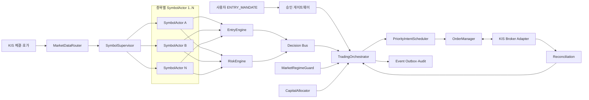

# 다종목 자동매매 오케스트레이터 설계

- 문서 등급: 활성 실행 코어 설계
- 기준 모듈명: `TradingOrchestrator`
- 현재 운용 한도: 사용자 승인 종목 최대 3개
- 확장 목표: 동일 계좌에서 설정·검증된 임의 개수 `N`개 종목
- 현재 단계: 모의 실행 후보판 구현 완료, KIS 모의 장애 검증 전

구현 매핑은 다음과 같다.

- 중앙 코어: `src/danta/services/trading_orchestrator.py`
- 실시간 실행: `src/danta/services/trading_runtime.py`
- KIS 모의 조립: `src/danta/services/paper_trading_application.py`
- 종목 actor: `src/danta/services/symbol_actor.py`
- 자금·우선순위: `capital_allocator.py`, `priority_intent_scheduler.py`
- 주문·영속성·복구: `order_manager.py`, `sql_order_journal.py`,
  `runtime_repository.py`, `reconciliation.py`

아직 실제 KIS 모의계좌에서 주문 응답 유실, PC 강제종료, 거래정지, 하한가,
부분체결 후 재시작을 통과하지 않았으므로 실전 승격 상태가 아니다.

## 1. 역할

`TradingOrchestrator`는 종목별 자동매수·자동매도 알고리즘을 직접 대체하지 않는다. 각 엔진의 결정을 받아 계좌 전체 관점에서 충돌을 해결하고, 자금·주문·시장 위험·복구 상태를 확인한 뒤 주문 관리자에 최종 실행 의도를 전달하는 중앙 코어다.

```text
종목별 판단 = EntryEngine / RiskEngine
계좌 전체 조정 = TradingOrchestrator
브로커 주문·체결 = OrderManager / KisBrokerAdapter
```

“최종 결정”의 의미는 다음과 같다.

- 매수: 오케스트레이터는 승인된 매수 결정을 **허용·대기·거부**할 수 있지만 승인에 없는 매수를 새로 만들 수 없다.
- 매도: 이익보호·시간청산 등의 결정을 계좌 상태와 함께 실행한다.
- `-7%` 강제 손절: 오케스트레이터는 거부·지연·합치기·취소할 수 없고 최우선으로 주문 관리자에 전달한다.
- 같은 종목의 매수와 매도가 충돌하면 매수 주문을 먼저 취소하고 이미 체결된 수량의 보호 매도를 우선한다.

## 2. 설계 원칙

1. 종목 수를 코드에 `3`으로 고정하지 않는다. 현재 3개 제한은 설정과 사용자 승인 정책으로 둔다.
2. 종목마다 독립된 `SymbolActor`를 두고 상태 변경을 직렬화한다.
3. 종목 워커는 KIS 주문 API를 직접 호출하지 않는다.
4. 계좌 자금과 주문가능수량은 중앙에서 원자적으로 예약한다.
5. 외부 AI 없이 로컬 Python만으로 상시 진입·보호·복구가 가능해야 한다.
6. 한 종목의 장애가 다른 종목의 보호 감시를 중단시키지 않아야 한다.
7. 신규매수는 차단할 수 있어도 열린 포지션의 손절·익절 감시는 항상 유지한다.
8. 이벤트는 중복·지연·순서 역전을 전제로 하며 멱등 처리한다.
9. 재시작 시 내부 저장값을 맹신하지 않고 KIS 주문·체결·잔고와 대조한다.
10. 실전 한도 확대는 모의 부하·장애·위험 검증과 사용자 승인 후에만 가능하다.

## 3. 전체 구조



## 4. 컴포넌트 책임

| 컴포넌트 | 책임 | 하지 않는 일 |
| --- | --- | --- |
| `TradingOrchestrator` | 전체 세션, 결정 조정, 전역 게이트, 우선순위, 종료·복구 | 매수세·익절 산식 계산, KIS 직접 호출 |
| `SymbolSupervisor` | `SymbolActor` 생성·중지·재시작·heartbeat·격리 | 주문 판단 |
| `SymbolActor` | 한 종목 이벤트 직렬 처리, 상태·세대·시간창 유지 | 공유 자금 수정, KIS 주문 |
| `EntryEngine` | [`ENTRY_AND_BUY.md`](ENTRY_AND_BUY.md)의 진입 판단 | 계좌 전체 자금 배분 |
| `RiskEngine` | [`EXIT_AND_RISK.md`](EXIT_AND_RISK.md)의 손절·익절 판단 | 다른 종목 판단 |
| `CapitalAllocator` | 주문가능현금 예약·해제·배정률·수량 상한 | 임의 재배분 |
| `MarketRegimeGuard` | 시장·업종 위험과 신규매수 차단 상태 | 열린 포지션 보호 중단 |
| `PriorityIntentScheduler` | 매도 우선 주문 큐, 호출 제한, 공정성 | 전략 결정 수정 |
| `OrderManager` | 멱등 주문·정정·취소·부분체결·상태 대조 | 진입·청산 사유 생성 |
| `ReconciliationService` | KIS 주문·체결·잔고와 내부 원장 대조·복구 | 불일치를 임의 성공 처리 |
| `EventOutbox` | 내구성 있는 이벤트·재처리·감사 | 실시간 주문 판단 |

## 5. 다종목 실행 모델

### 5.1 현재 한도와 미래 확장

```yaml
execution_limits:
  max_approved_symbols: 3
  max_open_positions: 3
  max_pending_entry_orders: 3
  max_symbols_per_market_stream: provider_verified
```

- 자료구조와 API는 `list[SymbolSession]`으로 만들며 3개 전용 필드를 만들지 않는다.
- 현재 대시보드·승인 스키마·계좌 위험 한도는 최대 3개를 유지한다.
- 종목 수를 늘리는 것은 단순 설정 변경이 아니다. KIS 구독·호출 한도, 계좌 집중도, 주문 처리 지연과 장애 시험을 통과하고 사용자가 승인해야 한다.
- 사용자가 선택한 감시 종목 수와 실제 열린 포지션 수를 구분한다. 감시 목록에서 빠진 종목이라도 보유 중이면 보호 워커를 종료하지 않는다.

### 5.2 비동기 방식

- 종목당 OS 스레드를 만들지 않고 기본적으로 하나의 `asyncio` 이벤트 루프와 종목별 bounded mailbox를 사용한다.
- 체결·호가 WebSocket은 가능한 범위에서 공유하고 `MarketDataRouter`가 종목별 actor로 분배한다.
- 각 `SymbolActor` 안에서는 이벤트를 한 번에 하나씩 처리해 같은 종목의 경쟁조건을 막는다.
- 계좌 자금 예약, 주문 제출과 포지션 세대 변경만 짧은 원자적 트랜잭션으로 보호한다.
- 뉴스·AI·이메일·대시보드 같은 느린 작업은 주문 이벤트 루프와 별도 큐에서 실행한다.
- 향후 한 프로세스의 검증된 용량을 넘으면 actor를 임의 스레드로 늘리지 않고 프로세스 샤딩과 단일 계좌 리더 임대를 설계한다.

## 6. 상태 모델

### 6.1 오케스트레이터 상태

| 상태 | 의미 | 신규매수 | 기존 포지션 보호 |
| --- | --- | --- | --- |
| `BOOTING` | 설정·비밀·DB·KIS 진단 중 | 차단 | 복구 준비 |
| `RECONCILING` | KIS와 내부 원장 대조 중 | 차단 | 발견 즉시 활성화 |
| `RUNNING` | 정상 운용 | 승인 범위 내 허용 | 활성 |
| `ENTRY_BLOCKED` | 시장·계좌·품질 위험 | 차단 | 활성 |
| `DEGRADED` | 일부 데이터·서비스 장애 | 기본 차단 | 대체 경로로 활성 |
| `STOPPING` | 정상 종료·인계 | 차단 | 인계 완료까지 활성 |

### 6.2 종목 세션 상태

```text
IDLE
  -> WATCHING_ENTRY
  -> BUY_PENDING
  -> PARTIALLY_FILLED
  -> POSITION_OPEN
  -> SELL_PENDING
  -> CLOSED

어느 상태에서든:
  -> INVALIDATED
  -> QUARANTINED
```

- `WATCHING_ENTRY`: 승인된 최대 매수가와 진입정책을 감시한다.
- `BUY_PENDING`: 지정가 주문·정정·취소를 추적한다.
- `PARTIALLY_FILLED`: 체결분은 `POSITION_OPEN`과 동일한 보호를 받고 잔량은 별도 추적한다.
- `POSITION_OPEN`: 진입 엔진을 끄고 위험 엔진을 활성화한다.
- `SELL_PENDING`: 신규매수와 추가 매도를 막고 청산 체결을 대조한다.
- `CLOSED`: 잔고 0과 주문 종료를 확인한 뒤 세션 세대를 닫는다.
- `QUARANTINED`: 종목 데이터·주문 불일치로 격리하되 보유 수량 보호는 유지한다.

## 7. 결정 계약과 중앙 판정

종목 엔진은 주문을 실행하지 않고 불변 DTO만 반환한다.

```python
EntryDecision(
    symbol,
    generation,
    action,
    max_price,
    requested_qty,
    policy_version,
    reason_codes,
    market_data_as_of,
)

ExitDecision(
    symbol,
    generation,
    action,
    urgency,
    sellable_qty,
    policy_version,
    reason_codes,
    market_data_as_of,
)
```

오케스트레이터 결과:

```python
OrchestrationDecision(
    source_decision_id,
    disposition,  # ROUTE, DEFER, VETO, CANCEL_CONFLICT
    priority,
    reservation_id,
    reason_codes,
)
```

### 중앙 판정 순서

1. 이벤트·결정 스키마와 정책 버전을 검증한다.
2. 종목·포지션 `generation`과 최신 순번을 검사한다.
3. `ExitDecision`이면 매수 주문 충돌을 먼저 제거한다.
4. 시장·계좌·품질 전역 게이트를 적용한다.
5. 매수라면 사용자 위임과 자금 예약을 원자적으로 검증한다.
6. 우선순위 큐에 멱등 `OrderIntent`를 기록한다.
7. 주문 관리자 결과를 종목 actor와 원장에 되돌린다.

## 8. 주문 우선순위

| 우선순위 | 의도 | 규칙 |
| --- | --- | --- |
| P0 | `HARD_STOP_EXIT` | 즉시 처리, 신규매수·분석보다 항상 우선 |
| P1 | `PROTECTIVE_EXIT`, 수동 긴급매도 | P0 다음, 매수 호출 예산 사용 금지 |
| P2 | `PROFIT_EXIT`, `TIME_EXIT` | 동일 종목 매수보다 우선 |
| P3 | 위험·불일치에 따른 주문 취소 | 새 매수 제출보다 우선 |
| P4 | 잔고·주문 대조와 복구 | 불명확 상태에서 재주문 방지 |
| P5 | 승인된 신규매수 | 남은 주문 용량에서 처리 |
| P6 | 분석·알림·대시보드 | 주문 경로 밖에서 처리 |

KIS 호출 제한기는 매수 요청이 모든 호출 용량을 소비하지 못하게 보호 주문·대조용 용량을 별도로 예약한다. 실제 수치는 KIS 공식 한도와 `provider-doctor` 측정값으로 설정한다.

### P0 보호 우회 경로

중앙 코어가 단일 장애점이 되어서는 안 된다. `RiskEngine`이 확정한 `HARD_STOP_EXIT`는 내구성 있는 P0 안전 큐에도 기록한다.

- 정상 상태에서는 `TradingOrchestrator`가 P0를 즉시 `OrderManager`로 전달한다.
- 오케스트레이터 heartbeat가 허용 시간보다 오래 끊기면 `OrderManager`의 보호 소비자가 P0 안전 큐를 직접 처리한다.
- 보호 소비자는 정책을 새로 판단하지 않고 승인된 위험정책 버전·포지션 세대·실제 매도가능수량·멱등키만 검증한다.
- 우회 경로는 매도 전용이며 매수에는 절대 사용할 수 없다.
- 정상 경로와 우회 경로가 동시에 처리해도 같은 멱등키로 주문은 한 번만 생성돼야 한다.

초기 모의 버전이 한 프로세스라면 이 경로도 같은 프로세스 안에서 먼저 계약 테스트하되, 실전 전에는 별도 watchdog 프로세스 또는 별도 서비스 장애 시험을 통과해야 한다.

## 9. 자금 예약과 종목 간 경합

동시에 여러 종목이 매수 조건을 충족할 수 있으므로 화면 배정률만 믿고 각각 주문가능현금을 조회하면 초과 주문이 발생할 수 있다.

```text
account_budget = reconciled_KIS_orderable_cash
symbol_cap = mandate_snapshot_cash × allocation_pct
available_for_symbol = symbol_cap - fills - active_reservations
```

- `ENTRY_MANDATE`를 수락할 때 계좌·승인 기준 현금 스냅샷과 종목별 상한을 고정한다.
- 주문 의도 생성과 동시에 `capital_reservation`을 원자적으로 만든다.
- 같은 현금을 두 종목에 중복 예약하지 않는다.
- 가격 개선·호가단위·부분체결로 남은 금액을 다른 종목에 임의 이전하지 않는다.
- 주문 취소·위임 무효화·세션 종료 후에만 해당 예약을 해제한다.
- HTS 수동 주문·출금·수수료로 현금이 줄면 신규매수를 차단하고 다시 대조한다.
- 여러 매수 결정이 같은 시각에 들어오면 사용자 배정 상한 안에서 처리하며 도착 순서가 장기적으로 한 종목을 굶기지 않도록 공정 큐를 사용한다.

## 10. 이벤트 순서·멱등성

모든 이벤트는 다음 식별자를 가진다.

```text
event_id
account_id_alias
symbol
position_generation
symbol_sequence
account_sequence
correlation_id
causation_id
occurred_at
recorded_at
schema_version
```

- 종목 내부에서는 `symbol_sequence`로 순서를 정렬하고 이미 적용한 순번은 무시한다.
- 계좌 자금·잔고 사건은 `account_sequence`와 DB 트랜잭션으로 직렬화한다.
- 주문 키는 `account + symbol + generation + action + cause`를 사용한다.
- 전달 보장은 `at-least-once`로 가정하고 소비자가 멱등해야 한다.
- 늦게 도착한 과거 매수 신호가 이미 열린 포지션이나 종료된 세대를 다시 열 수 없다.

## 11. 시장 전체 위험 처리

`MarketRegimeGuard`가 위험을 감지하면 중앙에서 모든 actor에 같은 의미의 방송 이벤트를 전달한다.

```text
MARKET_RISK_OFF
  - 모든 신규매수·미체결 잔량 차단 또는 취소
  - 열린 포지션 위험 엔진은 계속 실행
  - P0/P1/P2 매도 큐는 계속 처리
  - 정상화 전 자동 재개 금지
```

한 종목의 손절이 곧바로 다른 보유종목의 감시 중단을 뜻하지 않는다. 손절 원인을 시장·업종·종목·시스템으로 분류하고, 시장·업종 위험이면 신규매수 범위를 넓게 막되 각 보유 포지션은 독립적으로 보호한다.

## 12. 장애 격리와 복구

| 장애 | 중앙 동작 |
| --- | --- |
| 한 종목 데이터 지연 | 해당 actor 신규매수만 차단, 보유 시 REST·잔고 보호 경로 활성화 |
| 한 actor 예외 | Supervisor가 격리·재시작, 다른 actor 유지 |
| WebSocket 단절 | 신규매수 전역 차단, REST 폴링과 주문·잔고 대조 |
| DB 지연·Outbox 적체 | 신규매수 차단, 이미 제출된 주문과 포지션을 KIS 기준으로 보호 |
| 주문 응답 유실 | 같은 주문 재전송 전 KIS 주문·미체결·체결 조회 |
| PC·프로세스 재시작 | `BOOTING -> RECONCILING`; KIS 잔고를 먼저 복구한 뒤 actor 재생성 |
| 내부와 KIS 잔고 불일치 | 계좌 `ENTRY_BLOCKED`, 열린 수량 보호, 운영자 알림 |
| AI·메일·Pages 장애 | 주문·보호 경로 영향 없음 |

정상 종료도 열린 포지션 보호 책임을 없애지 않는다. 실전 환경에서는 다음 프로세스나 호스트로 보호 상태가 인계됐음을 확인한 뒤 종료해야 한다.

## 13. 영속 데이터

기존 주문·포지션 테이블에 다음 개념을 추가한다.

| 데이터 | 핵심 필드 |
| --- | --- |
| `orchestrator_runs` | instance, mode, state, policy bundle, 시작·종료·heartbeat |
| `symbol_sessions` | symbol, generation, actor state, checkpoint, last sequence |
| `capital_reservations` | mandate, symbol, reserved, consumed, released, version |
| `orchestration_decisions` | source decision, disposition, priority, reason, input hash |
| `worker_health` | actor, queue depth, lag, restart count, data freshness |

정책 번들은 최소 `entry_policy_version`, `exit_policy_version`, `market_regime_version`, `allocation_policy_version`, `orchestrator_version`을 함께 기록한다.

## 14. 관측과 알림

필수 지표:

- 활성·대기·보유·격리 actor 수
- 종목별 mailbox 깊이와 처리 지연
- 시세 최신성, WebSocket 재연결, REST 폴백 상태
- P0~P6 큐 깊이와 주문 제출 지연
- 예약·사용·가용 현금과 KIS 대조 차이
- 주문 거부·부분체결·취소·재시도·중복 억제 건수
- actor 재시작 횟수와 마지막 heartbeat
- 열린 포지션 중 보호 감시가 없는 종목 수

`보호 감시 없는 열린 포지션`, `P0 주문 지연`, `잔고 불일치`, `중복 주문 위험`은 즉시 `CRITICAL` 알림을 보낸다.

## 15. 필수 시험

### 기능

- 1·2·3·10개 가상 종목에서 독립 상태전이
- 세 종목 동시 매수 신호와 100% 자금 예약
- 한 종목 부분체결 중 다른 종목 진입·청산
- 동일 종목 매수 대기 중 손절·수동매도 충돌
- 사용자 위임 취소와 미체결 잔량 취소

### 안전

- P0 손절이 대량 매수·알림 이벤트보다 먼저 처리됨
- 중앙 오케스트레이터 중단 시 P0 안전 큐의 매도 전용 우회 경로가 중복 없이 작동함
- 시장 위험 시 신규매수만 차단되고 모든 보유종목 보호 유지
- 한 actor 고장·느린 actor·큐 포화가 다른 actor에 전파되지 않음
- 중복·지연·순서 역전 이벤트에서 주문 횟수 불변
- HTS 수동 주문과 현금 감소 시 초과 매수 차단

### 복구·부하

- 주문 응답 유실, WebSocket 단절, DB 재시작, 프로세스 강제 종료
- KIS 잔고에만 존재하는 포지션을 발견해 보호 actor 생성
- 종목 수 증가에 따른 이벤트 지연·메모리·호출량·heartbeat 측정
- 검증된 최대 용량을 넘으면 조용히 누락하지 않고 신규 등록 거부

## 16. 권장 코드 구조

```text
src/danta/
  domain/
    entry.py
    risk.py
    trading_session.py
    order_intent.py
  services/
    trading_orchestrator.py
    symbol_supervisor.py
    symbol_actor.py
    capital_allocator.py
    priority_intent_scheduler.py
    entry_engine.py
    risk_engine.py
    order_manager.py
    reconciliation.py
    market_regime_guard.py
  adapters/
    kis/
      realtime.py
      orders.py
    persistence/
      outbox.py
      repositories.py
```

의존 방향은 `domain <- services <- adapters/entrypoints`를 유지한다. 오케스트레이터가 커지면 전략 수식을 흡수하지 말고 조정 정책과 입출력 포트만 분리한다.

## 17. 구현 순서

1. `SymbolSession`, `OrchestrationDecision`, 우선순위와 상태전이를 순수 도메인으로 구현
2. 가짜 `EntryEngine`, `RiskEngine`, `OrderManager`로 다종목 결정·충돌 단위 테스트
3. `CapitalAllocator`의 원자 예약·부분체결·해제 구현
4. `asyncio` `SymbolActor`·Supervisor·bounded queue와 heartbeat 구현
5. 영속 Outbox·checkpoint·KIS 대조 기반 재시작 복구 구현
6. KIS 모의계좌에서 1~3종목 그림자 운용 후 주문 활성화
7. 장애·동시성·부하 시험과 일일 품질 보고 연결
8. 향후 종목 수 확대는 측정된 안전 용량과 사용자 승인으로 별도 승격

초기 구현의 완료 기준은 “여러 종목을 동시에 감시한다”가 아니라 **동시 사건에서도 자금 초과·중복 주문·보호 공백이 없고 재시작 후 KIS 상태로 복구된다**는 증거다.
# NXT 장전 보호 연동

전일 보유종목 보호는
[`NXT_OVERNIGHT_PROTECTION.md`](NXT_OVERNIGHT_PROTECTION.md)를 따른다.
장전 모듈은 주문을 직접 전송하지 않고 09시 이후 `ExitDecision`만 기존
우선순위 큐에 전달한다. `HARD_STOP`은 P0, `EARLY_DEFENSE/STRONG_DEFENSE`는
보호매도 우선순위이며 BUY 의도는 허용하지 않는다.
